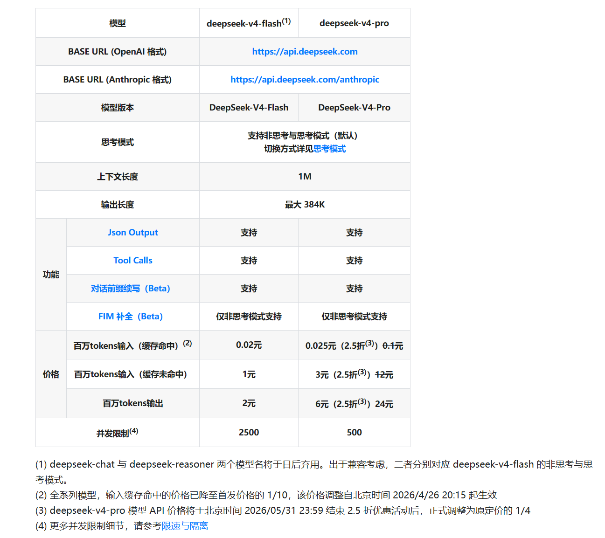

- 2026-05-23 DeepSeek-V4-Pro 正式宣布其永久定价：**百万输入3￥，百万输出6￥，百万输入缓存命中0.025￥**

让我们一起回到 2024 年初，AI 圈硝烟弥漫：OpenAI 的 GPT 系列一骑绝尘，Meta 的 LLaMA 系列统治开源社区，大多数团队都在微调现有模型，而真正敢**从零预训练**大模型的团队寥寥无几——高昂的成本、未知的风险，让大多数人望而却步。DeepSeek 团队正选择了一条艰难的路。

本文将系统梳理 DeepSeek 从 V1 到 V4 的完整技术演进路线，近可能的把每一次架构突破的**动机**、**方案**和**效果**讲清楚。

---

## 背景：梁文峰与幻方科技
故事的主角是梁文峰，1985 年生，来自广东湛江，父母都是老师。他从小在数学上展露出过人天赋——初中就自学完高中数学，开始钻研大学微积分。2002 年，17 岁的他以当地高考状元的身份考入浙江大学。

转折点出现在 2008 年全球金融危机。正在攻读硕士的梁文峰敏锐地察觉到：传统投资策略的失效，恰恰是机器学习可以切入的机会。他带领团队探索用 AI 预测市场走向，开发出国内较早的量化交易模型。2010 年毕业时，这个模型已经为他赚到了人生的第一桶金。

后来他创办了**幻方科技**，这家公司逐步成为量化投资界的知名机构。当 2023 年 ChatGPT 火爆全球时，梁文峰做了一个决定——将目光投向通用人工智能，创立了 **DeepSeek**。

幻方手中握着一张关键的王牌：

- **萤火一号**（2019 年）：耗资约 2 亿元，自主研发的超算集群
- **萤火二号**（2021 年）：投入约 10 亿元建造，规模相当于一个篮球场，搭载约 **1 万张英伟达 A100 显卡**

> 这套原本用于量化交易的算力系统，后来成为 DeepSeek 最坚实的后盾。量化出身的团队对**成本**和**效率**有着天然的敏感——这种基因贯穿了 DeepSeek 所有技术决策。

---

## DeepSeek V1：从缩放定律开始
### 核心问题：数据、模型、算力的关系
幻方决定从头训练，要亲自验证开源模型的上限到底在哪里。于是 **DeepSeek LLM**（V1 版本）诞生了，其论文标题里甚至带着一个关键的字眼：**长期主义**。

V1 做了一件非常硬核的事：没有盲目堆数据，而是先研究**缩放定律(`Scaling Laws`)**——即 **模型大小**、**数据量**、**计算力** 三者之间的关系。

此前学界的研究结论并不统一，有的说数据更重要，有的说模型更大更好。DeepSeek 团队决定亲自算一遍。通过大量实验，他们发现：

- **不同数据集的缩放定律表现不同。`高质量的数据`能让模型更小，但性能更强。**

基于这个发现，他们构建了 **2 万亿 token 的高质量数据集**。

### V1 的模型规模：7B 与 67B
V1 同时推出了 **7B 和 67B** 两个版本的基座模型。67B 在当时是一个关键的选择：当时开源社区的王者 LLaMA 2 正好就是 70B，DeepSeek 67B 敢不敢碰一碰？结果令人惊喜：
DeepSeek 67B 在代码能力 **超越** LLaMA 2 70B，在数学推理也能 **取得优势**

### V1 的对话能力：SFT + DPO
光有基座模型还不够，用户需要能对话的助手。V1 进行了**监督微调(`SFT`)**，还引入了 **`DPO`(Direct Preference Optimization，直接偏好优化)**，让模型更懂人类的意图。

在开放式评测中，DeepSeek 67B 聊天版本的表现甚至超过了 GPT-3.5。但 V1 团队清楚：架构上还是传统的 Transformer，**随着模型变大，推理成本会急剧上升，显存占用越来越大，速度越来越慢**。要让大模型真正普及，必须解决效率问题。于是他们把目光投向了更深层的架构创新。

---

## DeepSeek V2：架构革命—— `MoE` + `MLA`
2024 年中，大模型竞赛进入白热化。DeepSeek 团队发现：**单纯堆参数的边际效应在递减，而且推理成本高到普通开发者根本用不起**。他们给出的版本答案是 **MoE（混合专家模型）**。

### MoE 的核心思想
`MoE` 的核心是**术业有专攻**：
- **传统模型**：处理每个 token 都要动用所有参数，就像一家公司不管遇到什么小事，都要所有员工一起开会决定——效率极低
- **MoE 模型**：把模型分成很多个"专家"，每次来一个任务，通过**路由网络**去判断需要哪几个专家处理，只有少部分参数被激活，大部分在"休息"

> `MoE`混合专家模型的好处显而易见：在总参数量很大（保证知识容量）的同时，每次计算激活的参数量较少（保证推理速度）。

但传统 MoE 也有两个缺点：
1. **通信开销大**：专家可能分布在不同显卡上，数据传来传去，时间浪费在路上
2. **负载不均衡**：有的专家累死，有的专家闲死

DeepSeek V2 正是为解决这些问题而来的。
### V2 的参数规模
| 指标 | 数值 |
|:---|:---|
| 总参数数量 | **2360亿(236B)** |
| 平均每次激活参数量 | **210亿(21B)** |
| 效果 | 拥有千亿模型的智力，却只有百亿模型的计算成本 |

### 创新一：细粒度 MoE (`DeepSeekMoE`)
传统 MoE 的专家粒度比较粗，V2 就把专家切分得更细。**细粒度的专家能更精准地捕捉知识**。同时他们也会隔离出一部分**共享的通用专家**——这些通用专家每次都会被激活，保证模型的基础能力不会丢失。
为了解决负载不均衡，V2 设计了**设备限制路由（Device-Limited Routing）**：限制每个 token 只能发送到有限数量的设备上，既保证了专家的专业性，又控制了通信成本。

### 创新二：MLA (`Multi-head Latent Attention`)
这是 V2 最亮眼的创新之一。
**问题**：Transformer 模型在生成文本时需要缓存 Key 和 Value 矩阵（即 KV Cache）。随着生成长度增加，`KV Cache` 会占用大量显存，限制了上下文长度和并发量。传统优化方法（GQA、MQA）虽然减少了 KV Cache，但往往也伴随着性能的牺牲。
**MLA 的做法**：对 Key 和 Value 进行**低秩联合压缩**。简单说，就是把庞大的 KV 矩阵压缩成一个很小的**潜在向量(`Latent Vector`)**，推理时只缓存这个潜在向量，等到需要计算注意力时再还原回来。
| 指标 | 变化 |
|:---|:---|
| KV Cache 大小 | 减少 **93.3%** |
| 性能 | 不仅没有损失，多项基准测试中甚至**优于**标准 MHA 架构 |

同样的显存，可以处理更长的上下文，或服务更多的用户。

### V2 综合效果
- 在两项数学测试中超越 LLaMA 3 70B
- 训练成本降低 **42.5%**
- 生成吞吐量提升 **5.76 倍**
- 训练数据：**8.1T** 高质量 token，中文数据比例有所提升

这对开源社区是个巨大的福音：高性能不再意味着高门槛。

---

## DeepSeek V3：突破 6710 亿参数
V2 虽然高效，但面对 GPT-4 这样的闭源巨头，开源模型需要更强的底气。于是 V3 的目标是 **6710 亿参数**，全面对标顶尖闭源模型。

但如果只是简单放大，训练成本将是天文数字。DeepSeek 必须在有限预算内完成这个庞然大物的训练。

### 技术突破一：FP8 混合精度训练
传统大模型训练主要用 BF16 或 FP32 精度。FP8 计算更快、显存占用更少，但动态范围小，容易导致训练不稳定，很多团队尝试过、但往往以失败告终。

**V3 攻克了这个难题**，设计了一套**细粒度量化策略**：
- **激活值**：按 `1×128` 的 tile 进行分组缩放
- **权重**：按 `128×128` 的 block 进行分组缩放
- **累加精度提升**：在 Tensor Core 进行矩阵乘法时，中间结果用低精度，但累加时 promotion 到**高精度**在 CUDA Core 进行，解决了低精度累加带来的误差累积问题

得益于 FP8 训练，V3 的训练速度大幅提升，显存占用显著降低，使得训练 6710 亿参数的模型成为可能。

### 技术突破二：多 Token 预测（MTP）
传统语言模型一次只预测下一个 token。V3 在训练时**不仅预测下一个 token，还预测下下个 token**，增加了训练信号的密度，模型能更好地规划未来的表示。

推理时，这个多 token 预测模块可以用于**投机采样（Speculative Decoding）**，进一步加速推理。实测显示解码速度提升了 **1.8 倍**。

### 技术突破三：无辅助损失的负载均衡
传统 MoE 的负载均衡方法是用**辅助损失函数**强迫模型平衡负载，但这会干扰主任务的学习，影响性能。

V3 提出了一种新方法：给每个专家引入一个**偏置项(Bias)**：
- 如果某个专家过载 → 减少偏置
- 如果某个专家欠载 → 增加偏置

不需要辅助损失，就能实现负载均衡。实验证明，这种策略比传统辅助损失方法性能更好。

### 工程创新：DualPipe 并行
在基础设施方面，V3 设计了 **`DualPipe`算法**，一种双向流水线并行策略，能更好地重叠计算和通信。对于跨节点的 AllToAll 通信，他们定制了更高效的 Kernel，充分利用了 InfiniBand 和 NVLink 的带宽。

这些工程优化使得 V3 的训练**极其稳定**——整个训练过程中没有出现不可恢复的 Loss 尖峰，也没有进行过任何回滚。

### V3 的训练成本
| 指标 | 数值 |
|:---|:---|
| 总算力消耗 | **2.788M H800 GPU 小时** |
| 折合成本 | 约 **557.6 万美元** |
| 对比 GPT-4 训练成本 | 据传 GPT-4 训练成本高达 **1 亿美元** |

### V3 性能表现
| 基准 | 结果 |
|:---|:---|
| MMLU | **88.5 分**，超越所有开源模型 |
| LiveCodeBench | 表现最好的开源模型 |
| 代码与数学 | 表现出色，中文能力展现本土优势 |

V3 的发布标志着开源模型进入了新阶段：通过架构创新和工程优化，开源模型可以在性能上媲美闭源模型，同时保持**极高的性价比**。

---

## DeepSeek R1：强化学习激活推理能力
V3 很强，但有个核心痛点：面对复杂的数学题或代码调试，模型倾向于"直觉反应"，缺乏深度思考过程，无法像人类专家一样一步步推导、自我验证。

### 从 SFT 到强化学习
以前的方法是靠**监督微调(SFT)**：人类写好推理步骤，让模型模仿。但这种方法有局限：
- 人类的推理步骤未必是最优的
- 标注成本太高

**R1 选择了完全不同的路**：使用强化学习，直接激励模型自发产生推理能力。

### R1-Zero：纯强化学习的涌现
这是一个实验性模型，没有任何 SFT，直接基于基座模型进行**纯强化学习训练**。奖励信号非常简单：

> **模型怎么思考我不管，只要答案对就给奖励。**

神奇的事情发生了。随着训练的进行，模型**自发地产生了复杂的推理行为**：（详见PPO章节的讲解）
- 学会了**自我反思**
- 学会了**验证步骤**
- 学会了遇到死胡同时**回溯并尝试新路径**

在训练日志中，研究人员观察到了一个"顿悟时刻"：模型开始频繁使用"等等，让我重新检查一下"这样的词汇——这标志着模型内部形成了某种**监督机制**。

**AIME 2024 数学竞赛测试结果**：
| 方法 | 通过率 |
|:---|:---|
| R1-Zero | 77.9%（从 15.6% 飙升） |
| R1-Zero + 自一致解码 | **86.7%** |
| 大多数人类参赛者 | 低于此水平 |

### 完整版 R1：多阶段训练
DeepSeek 推出了完整的 **DeepSeek R1**，采用多阶段训练：
1. **冷启动数据**：收集少量包含人类思维链的数据，让模型学会基本的对话格式
2. **强化学习训练**：使用 **`GRPO`算法**（一种高效的强化学习算法）
   - 准确性奖励：答案正确给奖励
   - 格式奖励：推理过程必须放在特定标签内，方便后续分析
3. **SFT 扩展通用能力**：加入非推理数据（写作、问答等），让模型不仅会做题，还会聊天

### R1 的性能表现
| 基准 | 成绩 |
|:---|:---|
| AIME 2024 | **79.8%** 通过率 |
| Codeforces 编程竞赛 | 超越 **96.3%** 的人类选手 |
| 数学、代码、科学推理 | 达到业界顶尖水平 |

### 知识蒸馏：让小模型也会深度推理
R1 的推理能力可以"传递"。DeepSeek 团队利用 R1 生成的数据，训练了一系列小模型：
- 蒸馏的 1.5B、7B 版本，性能**远超**同尺寸的传统模型
- **强大的推理能力不再需要巨大的算力**，手机端、边缘端都有可能运行具备深度思考能力的模型

R1 验证了一个重要假设：
> **推理能力是可以被激励出来的(RL强化学习)。不需要人类手把手教，只要给对奖励，模型自己能找到最优的解题路径。**

---

## DeepSeek V3.2：面向 Agent 的全面进化
站在 V3 和 R1 的肩膀上，DeepSeek V3.2 应运而生。V3.1 主要验证了长上下文扩展能力，而 V3.2 不仅仅是语言模型的升级——**它是面向 Agent、面向复杂任务处理的全面进化**。

### 架构创新：DSA 稀疏注意力
随着上下文变长，注意力机制的计算复杂度是**平方级增长**，这限制了长文本处理。

- **`DSA`(DeepSeek Sparse Attention)** 通过高效的稀疏机制，大幅降低了计算复杂度：保留对关键 token 的关注，忽略无关信息，使得模型在长上下文场景下依然保持高效。

V3.2 的上下文长度稳定支持 **128K**，意味着它可以一次性处理整本书或长达数小时的会议记录——而且由于 DSA 的优化，推理成本并没有显著增加。

### 强化学习扩展到 Agent 任务
V3.2 继承了 R1 的强化学习成果，并将其扩展到了 **Agent 任务**：让模型使用工具——搜索互联网、运行代码、操作数据库。
以前的模型调用工具往往不稳定，容易死循环或参数错误。V3.2 建立了一个**大规模任务合成流水线**：
- 生成超过 **1800 个**不同的环境
- **8.5 万个**复杂提示词
- 涵盖搜索代码、工程代码解释等多种场景

通过在这些数据上进行强化学习，V3.2 学会了在多步骤任务中如何规划、何时调用工具、何时进行思考、在工具返回错误时如何调整策略。

### V3.2 性能表现
| 基准 | 成绩 |
|:---|:---|
| TerminalBench 2.0 | **46.4%** 准确率 |
| SWE-bench Verified | **73.1 分** |

这些成绩显著超越了其他开源模型，在某些指标上甚至超越了闭源模型。

### V3.2 Special：奥林匹克金牌水平
`DeepSeek V3.2 Special` 是一个高计算量变体，放松了长度限制，允许模型进行更长时间的思考：
- **2025 年国际数学奥林匹克（IMO）**：获得金牌成绩
- **国际信息学奥林匹克（IOI）**：同样获得金牌

这标志着开源模型在顶级智力竞赛中已经具备了夺牌的实力。

---

## DeepSeek V4：Agent 时代的王者归来
今年2026年最热的 AI 方向毫无疑问是 **Agent**。在 V4 之前，DeepSeek 就已经默默发表了很多论文——包括 M-man 记忆系统、提升吞吐量的多泡（Multi-Head Latent Batching）、还有 MoE 2.0——本质上都在为**长上下文、高吞吐、高并发 Agent** 做准备。

### 双版本王炸
V4 直接甩出双版本：
| 版本 | 参数规模 | 激活参数 | 特点 |
|:---|:---|:---|:---|
| **V4 Pro** | **1.6T（1.6万亿）** | 49B | Agent 能力拉满，编程竞赛、数学推理碾压开源 |
| **V4 Flash** | 轻量级 | — | 速度快、成本低，推理能力接近 Pro |

两个版本均支持 **100 万 token** 的 **1M** 超长上下文，并同时支持**思考模式**与**非思考模式**，其中思考模式支持通过 `budget_tokens` 参数设计思考强度。

### V4 Pro 的核心表现
在 `agentic coding`（Agent 编程）评测中，V4 Pro 已达到当前开源模型的**最佳水平**，并在其他 Agent 相关评测中同样表现优异。
目前 V4 已经成为 DeepSeek 内部员工使用的 **Agent 与 Agentic Coding** 首选模型，据内部评测反馈：
- 使用体验**优于 Claude Sonnet 4.5**
- 交付质量**接近 OpenAI O4.6 的非思考模式**

| 评测维度 | V4 Pro 表现 |
|:---|:---|
| 世界知识 | 大幅领先其他开源模型，仅稍逊于 Gemini Pro 3.1 |
| 数学/STEM/竞赛型代码 | 超越当前所有已公开评测的开源模型 |
| agentic coding | 当前开源模型最佳水平 |

### Agent 生态适配
V4 针对主流 Agent 产品进行了专项适配和优化：
- **Claude Code**
- **Open Codeinterpreter**
- **Cursor**、**Windsurf** 等主流 AI 编程产品
在代码任务、文档生成等方面均有明显提升。V4 API 支持 OpenAI 兼容接口与 native 接口，方便无缝迁移。
> **对于复杂 Agent 场景，建议使用思考模式并将 `budget_tokens` 设置为 max。**

---

## 总结：技术路线的成功
DeepSeek 的成功不仅仅是技术的成功，更是**路线的成功**：
- **坚持开源**：每一个版本都开源权重，推动整个社区进步
- **坚持效率**：不是靠堆算力，而是靠架构创新实现性能突破
- **坚持长期主义**：从 V1 的缩放定律研究，到 V4 的 Agent 生态，每一步都有明确的技术逻辑
从 V1 的 2T token 高质量预训练，到 V2 的 MLA + 细粒度 MoE，到 V3 的 FP8 训练 + DualPipe，再到 R1 的纯强化学习涌现推理，再到 V4 的 1.6T 参数 Agent 王者——DeepSeek 走出了一条属于自己的路。

他们没有盲目跟随闭源模型的脚步，而是在每个技术决策点上都做出了更具创造性的选择。这不只是 DeepSeek 的发展历程，更是中国 AI 开源史上最重要的篇章之一。

---

## 技术关键词索引

| 术语 | 含义 | 首次出现版本 |
|:---|:---|:---|
| MoE（混合专家模型） | 只激活部分专家参数，降低推理成本 | V2 |
| MLA（多头潜在注意力） | 对 KV Cache 进行低秩压缩，减少 93.3% 显存 | V2 |
| DeepSeekMoE | 细粒度专家 + 共享专家的 MoE 改进架构 | V2 |
| 设备限制路由 | 限制 token 只发送到有限设备，控制通信成本 | V2 |
| FP8 混合精度训练 | 细粒度量化 + 高精度累加，稳定 FP8 训练 | V3 |
| MTP（多 Token 预测） | 同时预测多个 token，增加训练信号密度 | V3 |
| 无辅助损失负载均衡 | 用偏置项动态调整专家负载，无需辅助 Loss | V3 |
| DualPipe | 双向流水线并行，重叠计算与通信 | V3 |
| GRPO | Group Relative Policy Optimization，高效 RL 算法 | R1 |
| 冷启动数据 | R1 训练的第一阶段：少量思维链数据引导格式 | R1 |
| DSA（稀疏注意力） | 降低长上下文注意力计算复杂度 | V3.2 |
| budget_tokens | V4 思考模式中控制思考强度的参数 | V4 |

---

*参考视频：[真王回归！！！DeepSeek系列最全回顾！无缝衔接V4！](https://www.bilibili.com/video/BV1FWoGByEyU)*
