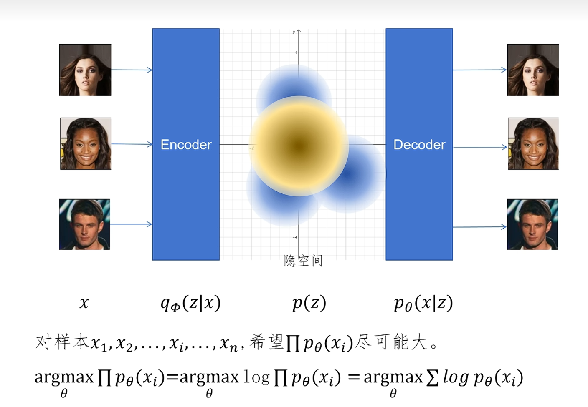

# 一、深入浅出生成算法数学基础：从凸函数到 KL 散度

## 1. 一切的起点：凸函数 (Convex Function)
**直观理解：**
在数学中，凸函数最直观的几何特征就是“**弦在弧上**”。如果你在函数图像上任取两点连成一条线段（弦），这条线段上的每一个点都会高于（或等于）对应位置的函数曲线（弧）。

**数学公式：**
对于定义域内的任意两点 $x_1$ 和 $x_2$，以及任意比例参数 $\lambda \in [0, 1]$，(下凸)凸函数 $f(x)$ 满足：
$$
f(\lambda x_1 + (1-\lambda)x_2) \le \lambda f(x_1) + (1-\lambda)f(x_2)
$$

## 2. Jensen 不等式
**数学公式：**
对于任意一个**凸函数** $f(x)$，假设有一组参数 $x_1, x_2, \dots, x_M$，以及对应的权重 $\lambda_1, \lambda_2, \dots, \lambda_M$。（这些权重满足 $\lambda_i \ge 0$ 且 $\sum_{i=1}^M \lambda_i = 1$），那么必然满足以下不等式：

$$
f\left(\sum_{i=1}^M \lambda_i x_i\right) \le \sum_{i=1}^M \lambda_i f(x_i)
$$

**直观理解：**
- **等式左边 $f\left(\sum \lambda_i x_i\right)$：【先加权，后映射】**
    我们先把所有的输入参数 $x_i$ 按照权重 $\lambda_i$ 混合起来（求加权平均值/重心），得到一个新的点，然后再把这个混合后的点代入函数 $f$ 中求值。
    - *👉 几何意义：先在 x 轴上找到这群点的“重心”，然后看这个重心对应的“函数曲线上的点”。*
- **等式右边 $\sum \lambda_i f(x_i)$：【先映射，后加权】**
    我们先分别算出每个输入参数对应的函数值 $f(x_1), f(x_2)...$，然后再对这些**函数值（即 Y 轴上的高度）**按照同样的权重求加权平均。
    - *👉 几何意义：找到这群点在函数曲线上的位置，然后直接在空间中求这些点的“重心”。这个重心必然悬空落在连接这些点的“多边形弦（割线面）上”。*

将权重 $\lambda_i$ 视为 **概率 $P(x_i)$**，数学期望 $\mathbb{E}[X] = \sum P(x_i) x_i$，而函数值 $f(x)$ 按概率加权求和 $\sum P(x_i) f(x_i)$ 即为 $\mathbb{E}[f(X)]$。

此时，对于随机变量 $X$，有：
$$
f(\mathbb{E}[X]) \le \mathbb{E}[f(X)]
$$
*(口诀：期望的函数 小于等于 函数的期望)*

### Jensen 不等式 在**生成模型**中的意义
在 AI 领域，我们经常需要最大化数据的对数似然 $\log P(X)$。但很多时候 $P(X)$ 的直接计算极其困难（包含复杂的积分）。

> 比如：
> $$ \log P(X) = \log \left( \int P(X|Z) P(Z) dZ \right) $$
>   > $$ \nabla_\theta \log P(X) = \frac{1}{\int P(X|Z)P(Z) dZ} \cdot \nabla_\theta \left( \int P(X|Z) P(Z) dZ \right) $$
> 
> 分母上的 $\int P(X|Z)P(Z) dZ$ 是一个极其高维的积分。假如隐变量 $Z$ 是 256 维的向量，你要对 256 维空间做连续积分，这会导致**维度灾难**，就算是超级计算机算到宇宙毁灭也算不出来精确值（x
> 
> 而且它也**无法使用蒙特卡洛采样(Monte Carlo)**：“积分算不出，那我随机采样几个 $Z$ 近似代替不就行了吗？”的思路并不可取，因为在茫茫的高维 $Z$ 空间里，随便盲抽一个 $Z$（比如瞎猜一组猫的特征），它能解码出像现实图片 $X$ 的 **似然概率** $P(X|Z)$ 几乎为 0。（我十连出金都没见过几次说是.jpg）

利用对于对数函数的 Jensen 不等式，我们可以把 $\log$ 移到期望的外面，从而将复杂的极大似然估计转化为优化一个**下界 (Lower Bound)**。这就是 VAE（变分自编码器）中著名的 **`ELBO`(Evidence Lower Bound，证据下界)** 的由来（后文会细讲）。

---

## 3. 度量分布相似度的尺子：KL 散度 (KL Divergence)
在生成模型中，我们往往希望我们用神经网络生成的概率分布 $Q(x)$ 能够尽可能逼近真实的数据分布 $P(x)$。如何衡量这两个分布的差异？这就需要用到 **KL 散度**（相对熵）。

**数学公式：**
连续分布下，分布 $P$ 和分布 $Q$ 的 KL散度定义为：
$$
D_{KL}(P || Q) = \int P(x) \log \frac{P(x)}{Q(x)} dx
$$

或者用概率论中期望的写法（离散与连续通用）：
$$
D_{KL}(P || Q) = \mathbb{E}_{x \sim P} \left[ \log \frac{P(x)}{Q(x)} \right]
$$

**核心性质：**
1. **非对称性**：$D_{KL}(P || Q) \neq D_{KL}(Q || P)$，所以它不是严格意义上的“距离”。
2. **非负性**：$D_{KL}(P || Q) \ge 0$，当且仅当两个分布完全相同时取等号。

### 核心推导：用 Jensen 不等式证明 KL散度 $\ge 0$
下面我们来证明 $D_{KL}(P || Q) \ge 0$：
$$ D_{KL}(P || Q) = \mathbb{E}_{x \sim P} \left[ \log \frac{P(x)}{Q(x)} \right] $$
利用对数的性质 $\log(a/b) = -\log(b/a)$，将其翻转，并将负号留在期望内部：
$$ = \mathbb{E}_{x \sim P} \left[ -\log \frac{Q(x)}{P(x)} \right] $$
因为 $- \log$ 是凸函数，根据 **Jensen 不等式**，$\mathbb{E}[-\log(X)] \ge \log(\mathbb{E}[X])$。
$$ \mathbb{E}_{x \sim P} \left[ -\log \left( \frac{Q(x)}{P(x)} \right) \right] \ge -\log \left( \mathbb{E}_{x \sim P} \left[ \frac{Q(x)}{P(x)} \right] \right) $$
展开期望公式：
$$ = - \log \left( \int P(x) \frac{Q(x)}{P(x)} dx \right) = - \log \left( \int Q(x) dx \right) = - \log(1) = 0 $$
**结论：** $D_{KL}(P || Q) \ge 0$。证毕！

---

# 二、VAE 变分自编码器 的核心思路
**代表技术**：VAE (2013)

> 论文：**Auto-Encoding Variational Bayes** · Kingma, Welling · arXiv：[1312.6114](https://arxiv.org/abs/1312.6114)

## 1. 为什么需要 VAE？普通的 AE 哪里不够好？
要理解 VAE，首先要回顾它的前身——**自编码器(Auto-Encoder, 简称 AE)**。
普通的 AE 包含一个**编码器(Encoder)** 和一个**解码器(Decoder)**：
- **编码器Encoder**：将高维的输入图像 $X$ 压缩成低维的隐向量 $Z$（比如提取出一张猫图的特征）。
- **解码器Decoder**：将隐向量 $Z$ 还原成图像 $X'$。

**AE 的致命缺陷：无法用于生成**
在 AE 中，每张图像都被编码成了隐空间 (Latent Space) 中的一个**确定的点**。这就导致隐空间是**稀疏且不连续的**。如果你在隐空间中随机插值取一个没有被训练数据覆盖到的“空白点”扔给解码器，它很可能会输出一团毫无意义的噪点。
> 💡 换句话说，AE 只适合做**数据压缩**，不能做**数据生成**。

## 2. VAE 的核心思路：从“确定的点”到“概率分布”
为了让模型具备“生成”能力，VAE 提出了一个极其优美的改进思路：**既然确定的点容易造成断层，那我们就把输入映射为一个区域（即概率分布）！**

在 VAE 中：
1. **编码器** 不再输出一个具体的隐向量$Z$，而是输出一个**概率分布的参数**。通常我们假设这个分布是高斯分布，所以编码器会输出 均值 $\mu$ 和方差 $\sigma^2$。
2. **采样(Sampling)**：在这个均值和方差确定的高斯分布 $\mathcal{N}(\mu, \sigma^2)$ 中，**随机采样**出一个向量 $Z$ 作为隐向量。
3. **解码器** 将采样得到的 隐向量 $Z$ 还原成 图像 $X'$。

### 💡 为什么 VAE 这样做有效？
由于加入了随机采样，即使是同一张图片，每次编码后参与解码的 $Z$ 都会有微小的扰动。这逼迫解码器必须学会：**在 $\mu$ 附近的这一片连续区域内，不管怎么采样，都能解码出清晰的图像**。这就使得隐空间变得相对**连续且平滑**了，不同图像的区域与区域之间也会发生重叠融合 (**Interpolation**)，赋予了模型真正的生成能力。

## 3. VAE 数学上的落地：损失函数 与 KL 散度
直观上理解了 VAE 的架构，接下来我们面临的问题是：**如何用数学语言定义它，并训练这个网络？** 

我们先明确一下网络中各个部件对应的数学符号：
- **$X$ (观测数据)**：真实的数据，比如输入给网络的真实图片。
- **$Z$ (隐变量 / Latent Variable)**：图像被压缩降维后，在隐空间中的特征表示。
- **$P$ (解码侧)**：代表真实或期望的生成分布。
    - **$P(Z)$**：隐变量的**先验分布(Prior)**。即在没看到图片之前，我们期望隐变量长什么样（通常人为设为**多元标准正态分布** $\mathcal{N}(0, I)$，其中 $I$ 是单位矩阵）。
    - **$P(X)$**：真实图片的数据分布（我们的**最终目标**就是最大化这个分布的对数似然 $\log P(X)$）。
    - **$P_\theta(X|Z)$**：**解码器(Decoder)**。即给定一个特征 $Z$，把它还原成真实图片 $X$ 的概率。其中 $\theta$ 是解码器**Decoder的可训练参数**。
- **$Q$ (编码侧)**：因为真实的**后验分布(Posterior)** $P(Z|X)$ 算不出来，我们引入一个变分分布 $Q_\phi$ 来近似它。
    - **$Q_\phi(Z|X)$**：**编码器(Encoder)**。即输入一张图片 $X$，神经网络输出的对应隐变量 $Z$ 的概率分布（通常输出均值 $\mu_\phi$ 和方差 $\sigma^2_\phi$ ），其中 $\phi$ 是编码器**Encoder的可训练参数**。



### 💡 为什么不去计算真实的后验分布 $P(Z|X)$ ？
在理想状态下，当我们输入一张图片 $X$，我们最想知道的是它最完美、最真实的隐变量分布，即**真实的后验分布 $P(Z|X)$**。

然而，这是一个数学上的“死胡同”，人类和计算机都难以精确求出它。

根据**贝叶斯定理**： $ P(Z|X) = \frac{P(X|Z) \cdot P(Z)}{P(X)} $
1. **分子 $P(X|Z)$（似然）**：这是解码器，用神经网络拟合，能算！
2. **分子 $P(Z)$（先验）**：人为规定的多元标准正态分布，能算！
3. **分母 $P(X)$（万恶之源！）**： 
    根据全概率公式，$P(X) = \int P(X|Z)P(Z) dZ$ 。这意味着要在极高维的连续特征空间里做积分，计算量非常大（**维度灾难**，这一点在前面 Jensen 不等式部分已经证明过了）。

既然直接求 $\log P(X)$ 走不通，用我们引入的编码器 $Q_\phi(Z|X)$，有：
$$
-\log P(X) = - \log \left( \int Q_\phi(Z|X) \frac{P_\theta(X|Z)P(Z)}{Q_\phi(Z|X)} dZ \right) = - \log \left( \mathbb{E}_{Z \sim Q_\phi(Z|X)} \left[ \frac{P_\theta(X|Z)P(Z)}{Q_\phi(Z|X)} \right] \right)
$$

根据 **Jensen 不等式**，有：
$$
-\log P(X) \le - \mathbb{E}_{Z \sim Q_\phi(Z|X)} \left[ \log \left( \frac{P_\theta(X|Z)P(Z)}{Q_\phi(Z|X)} \right) \right] = \mathbb{E}_{Z \sim Q_\phi(Z|X)} \left[ \log \frac{Q_\phi(Z|X)}{P(Z)} - \log P_\theta(X|Z) \right]
$$
$$
= \mathbb{E}_{Z \sim Q_\phi(Z|X)} \left[ \log \frac{Q_\phi(Z|X)}{P(Z)} \right] - \mathbb{E}_{Z \sim Q_\phi(Z|X)} \left[ \log P_\theta(X|Z) \right] = - \text{ELBO}
$$

当期望 $\mathbb{E}$ 被提到最外面后，由**莱布尼茨积分法则**，求导算子可以直接穿透期望，即：$\nabla \mathbb{E}[...] = \mathbb{E}[\nabla ...]$。

这就将一个无法计算的极大似然估计问题，巧妙转化为了**优化一个可微分的下界(ELBO)**。

### 最终落地：VAE 的损失函数
VAE 的目标是**最大化生成数据的对数似然** $\log P(X)$。经过变分推断（引入隐变量 $Z$ ），我们得到 VAE 的核心损失函数（其实也就是最大化 ELBO 的相反数）：

$$
\mathcal{L}_{VAE} = - \mathbb{E}_{Z \sim Q_\phi(Z|X)} [\log P_\theta(X|Z)] + D_{KL}(Q_\phi(Z|X) \parallel P(Z))
$$
$$
\mathcal{L}_{VAE} = \mathcal{L}_{rec} + \mathcal{L}_{KL}
$$

这个由两部分组成的损失函数，恰好对应了 VAE 的**两个设计目标**：
### (1) 重构损失 (`Reconstruction Loss`) : $- \mathbb{E} [\log P_\theta(X|Z)]$
这部分等价于输入输出的均方误差(MSE)或交叉熵，它的目的是让解码器 $P_\theta(X|Z)$ 能够**尽可能完美地还原输入图像**。
### (2) 相似度/正则化 损失 (`KL Divergence Loss`) : $D_{KL}(Q_\phi(Z|X) \parallel P(Z))$
如果只有重构损失，神经网络会“偷懒”：它会把方差 $\sigma^2$ 学成无限趋近于 0，这样采样就又退化成了确定的点，VAE 就又变回了普通的 AE。
为了防止这一点，我们强制要求编码器输出的分布 $Q_\phi(Z|X)$ 必须接近一个先验分布 $P(Z)$（通常设为**多元标准正态分布 $\mathcal{N}(0, I)$**），通过 KL 散度把各个图像的特征分布向先验分布 $P(Z)$ 拉近，使得隐空间的数据点紧凑地聚集成一个实心球体，消除簇与簇之间的断层空隙。

> P.S. 由数学计算"易得"：
> 
> $ \mathcal{L}_{VAE} = \mathcal{L}_{rec} + \mathcal{L}_{KL} = \text{MSE} - \frac{1}{2} \sum_{i=1}^d (1 + \log(\sigma_i^2) - \mu_i^2 - \sigma_i^2) $
> ```python
> recons_loss = F.mse_loss(recon_x, x, reduction='sum')
> kl_loss = -0.5 * torch.sum(1 + log_var - mu.pow(2) - log_var.exp())
> ```
> [pytorch/examples/vae 示例代码](https://github.com/pytorch/examples/blob/main/vae/main.py#L80)

## 4. 还没完！解决工程问题：**重参数化** (`Reparameterization`)
到这里，VAE 的理论看似完美，但在用 PyTorch 实际写代码时会遇到一个致命的工程问题：**“采样”这个动作是随机的，不可导！**

神经网络依赖反向传播(Backpropagation)更新梯度，但梯度无法穿过一个包含随机性的“采样节点”。

为了解决这个问题，VAE 提出了 **重参数化技巧**：
我们不直接从 $\mathcal{N}(\mu, \sigma^2)$ 中采样 $Z$，而是：
1. 先从多元标准正态分布 $\mathcal{N}(0, I)$ 中采样一个纯噪声 $\epsilon$。
2. 然后通过公式进行线性变换：$ Z = \mu + \sigma \odot \epsilon $

在这个公式里，$\epsilon$ 是不需要求导的常数噪声，而 $\mu$ 和 $\sigma$ 是网络层输出的确定的参数。这样一来，随机性被成功地剥离到了一个独立的旁支上，梯度就可以顺畅地沿着 $\mu$ 和 $\sigma$ 反向传播回编码器了！

---

# 三、流匹配 (`Flow Matching`)
## 1. 核心直觉：从“跳跃的采样”到“流动的向量场”
- 在 VAE 中，我们借助重参数化技巧，从先验分布中“抓取”一个随机点，通过解码器**一步跨越**隐空间与像素空间的鸿沟，直接生成图像。
- 与之不同的是，扩散模型(Diffusion)引入了随机微分方程（`SDE`）来刻画含噪演化，而流匹配(Flow Matching)则进一步将其简化为确定性常微分方程（`ODE`）。二者的核心共性在于：摒弃了“点映射”的思维，转而通过构建**连续的向量场**，完成从简单噪声分布到复杂数据分布的**概率流变换**。
- **流匹配的核心思想**：通过流(Flow)的思想，把已知分布一步步流动转换为真实的目标分布。可以看作概率密度在流动。

## 2. 数学基石：常微分方程 (ODE) 与 目标匹配
既然是描述随时间变化的“流动”，最合适的数学工具就是**常微分方程 (`ODE`, Ordinary Differential Equation)**：
$$
\frac{d x_t}{d t} = v_t(x_t)
$$
- $x_t$ 是 $t$ 时刻 点 $x$ 在多维空间的位置，其中 $t \in [0,1]$，0 时刻为初始位置，1 时刻是目标位置，位置连起来即为**轨迹(Trajectory)**。
- $v_t(x_t)$ 是 $t$ 时刻在 $x_t$ 位置 的**向量场/速度场(Vector Field)**，即流动规则。
  - 在一个多维空间，如果给定了初始位置 $x_0$ 和向量场 $v_t(x)$，就可以通过 ODE 解出任意时刻的 $x_t$ 并确定唯一的轨迹 $X$。
- **流(Flow)**：$ \phi_t(x_0) = x_t $，有：$ \frac{d \phi_t(x_0)}{dt}  = v_t(\phi_t(x_0)) $，其核心为 $P_0(x_0) \to P_t(x_t)$


如果我们拥有一个真实的、完美引导噪声走向数据的“理想向量场” $u_t^{marginal}(x)$，那么我们只需要训练一个神经网络 $v_\theta(x, t)$ 去逼近它，就解决问题了。

这就是**流匹配目标函数 (Flow Matching Objective)**：
$ \mathcal{L}_{FM}(\theta) = \mathbb{E}_{t \sim U[0,1], x \sim p_t(x)} \left[ ||v_\theta(x_t, t) - u_t^{marginal}(x_t)||^2 \right] $

## 3. 条件流匹配 (`CFM`, Conditional Flow Matching) 与 边缘化定理
但是事实是我们根本不知道那个全局的、理想的向量场 $u_t^{marginal}(x)$ 究竟长什么样。

因为要计算全局的向量场，我们需要知道空间中所有数据的分布，并将它们在 $t$ 时刻的流动状态全部叠加起来。在极其高维的图像空间（如 $1024 \times 1024$ 的图片）中，这完全是一个难解的积分问题（Intractable）。

- 边缘化定理核心思想是：**“既然无法掌控全局，那就先聚焦于单一目标。”**
如果我们不看整个数据集，而是**只取出一张具体的终点图片 $x_1$** 作为 **“条件”**。我们要构建一个从随机噪声分布走到这**唯一**一张图片 $x_1$ 的路径。这太简单了！我们完全可以人为定义这条即条件概率路径 $p_t(x|x_1)$ 及其 条件向量场 $u_t(x|x_1)$。

- 数学家们通过神奇的**边缘化定理**证明了：**让神经网络去拟合局部的、条件向量场，在数学期望上完全等价于拟合全局向量场！**

由此，我们将目标函数改写为 **条件流匹配(CFM)** 目标函数：
$$
\mathcal{L}_{CFM}(\theta) = \mathbb{E}_{t \sim U[0,1], x_1 \sim q(x_1), x_t \sim p_t(x_t|x_1)} \left[ ||v_\theta(x_t, t) - u_t(x_t|x_1)||^2 \right]
$$
- $x_1$ 是从数据集中抽样出的一张真实图片。
- $x_t$ 是我们人为设计的、通向 $x_1$ 的路径上的点。
- $u_t(x_t|x_1)$ 是我们人为设计的、通向 $x_1$ 的速度。
- 神经网络 $v_\theta$ 现在的任务变成了：在看到 $x_t$ 时，预测出那个通向 $x_1$ 的条件速度。

通过这个定理，原本不可解的无监督积分问题，瞬间变成了一个简单的、可用梯度下降优化的**监督学习**问题！

## 4. 化繁为简：直流 (`Rectified Flow`) 与 最优传输 (`Optimal Transport`)
既然条件路径是我们人为设计的，那我们应该设计一条怎样的路径呢？

俗话说得好，“两点之间，线段最短”。最简单的路径，就是从初始噪声 $x_0$ 到目标数据 $x_1$ 的**匀速直线**。这就是 **Rectified Flow (直流)** 的核心思想。

设 $x_0 \sim \mathcal{N}(0, I)$ 为纯噪声， $x_1$ 为真实图片。我们在它们之间连一条线：
$$
x_t = (1-t) x_0 + t x_1 \quad \text{或写为} \quad x_t = x_0 + t(x_1 - x_0)
$$
对时间 $t$ 求导，我们就能得到这条直线的**速度（向量场）**：
$$
u_t(x_t|x_1) = \frac{d x_t}{d t} = x_1 - x_0
$$

把这个直线速度代入刚才的 CFM 损失函数中，得到了极其简洁的训练目标：
$$
\mathcal{L}_{RF}(\theta) = \mathbb{E}_{t, x_0, x_1} \left[ ||v_\theta(x_t, t) - (x_1 - x_0)||^2 \right]
$$
神经网络 $v_\theta$ 只需要去预测 $(x_1 - x_0)$ 这个差值向量即可！

**这与最优传输 (OT, Optimal Transport) 有什么关系？**
在流匹配中引入 OT 思想，被称为 **OT-CFM**。如果我们给噪声 $x_0$ 和图像 $x_1$ 随机配对，多条直线在空间中大概率会发生交叉，导致网络在交叉点“不知所措”。最优传输通过最小化 Wasserstein 距离，教我们**如何最优地将噪声点配对给图像点**，使得所有直线的总长度最短，轨迹最不拥挤。OT 加上直线路径，成为了目前图像生成的最优解（如 Stable Diffusion 3 就在使用 OT-CFM）。

## 5. 统一视角：把 `DDPM` 和 `EDM` 纳入麾下

### `DDPM` (Denoising Diffusion Probabilistic Models)
- **核心思路**：在离散步数下，马尔可夫链的从噪声图片中去噪生成真实图片。本质上是通过随机微分方程(`SDE`)逐步加噪，然后再通过神经网络去预测噪声，逐步去噪。
#### 1. 正向加噪过程
图片逐步加噪，最终每个像素要在 $ \mathcal{N}(0, I) $ 的正态分布中
- **采样公式变成**：$x_t = \sqrt{\alpha_t}x_{t-1} + \sqrt{1 - \alpha_t} \cdot \epsilon_t$ ，其中 $\epsilon_t \sim \mathcal{N}(0, \mathbf{I})$
- **概率分布变成**：$q(x_t|x_{t-1}) = \mathcal{N}(x_t; \sqrt{\alpha_t}x_{t-1}, (1 - \alpha_t)\mathbf{I})$
  - 由数学计算，令 $ \bar{\alpha}_t = \prod_{i=1}^t \alpha_i $，有：
$$
x_t = \sqrt{\bar{\alpha}_t} x_0 + \sqrt{1 - \bar{\alpha}_t} \epsilon
$$
$$
q(x_t | x_0) = \mathcal{N}(x_t; \sqrt{\bar{\alpha}_t} x_0, (1 - \bar{\alpha}_t)\mathbf{I})
$$

这意味着，在训练神经网络时我们不需要真的写个循环跑 1000 步。只要给定了一张原图 $x_0$ 和一个随机时间步 $t$，就可以直接查表算出 $\bar{\alpha}_t$，**只需一步**就能立刻得出 $t$ 时刻的加噪图像 $x_t$ 丢给神经网络去训练。这极大提升了训练效率！
#### 2. 反向去噪过程
扩散模型的加噪过程是一个**马尔可夫链(Markov Chain)**
$$
q(x_{t-1}|x_t, x_0) = \frac{q(x_t|x_{t-1})q(x_{t-1}|x_0)}{q(x_t|x_0)}
$$
$$
p_\theta(x_{t-1}|x_t) \xrightarrow{\text{拟合}} q(x_{t-1}|x_t, x_0) \text{，去预测} q \text{这个高斯分布的均值}
$$

由数学计算“易得”，有：
$$
\tilde{\mu}_t = \frac{\sqrt{\alpha_t}(1 - \bar{\alpha}_{t-1})}{1 - \bar{\alpha}_t} x_t + \frac{\sqrt{\bar{\alpha}_{t-1}}(1 - \alpha_t)}{1 - \bar{\alpha}_t} x_0
$$
$$
\tilde{\beta}_t = \frac{(1 - \alpha_t)(1 - \bar{\alpha}_{t-1})}{1 - \bar{\alpha}_t} \text{，方差为确定值！不用预测}
$$
- 此时运用重参数化的技巧，可得只剩标准高斯噪声 $\epsilon$：
$$
\tilde{\mu}_t = \frac{1}{\sqrt{\alpha_t}} \left( x_t - \frac{\beta_t}{\sqrt{1 - \bar{\alpha}_t}} \epsilon \right)
$$
- 由于公式里的其他项全是已知常数，神经网络要预测均值图像，本质上就只需要去预测加噪过程中的那个标准高斯噪声 $\epsilon$。
  - 即 一个卷积神经网络 **$\epsilon_\theta(x_t, t)$** 
- 对 $ Loss = \mathbb{E} \left[ || \tilde{\mu}_t - \mu_\theta(x_t, t) ||^2 \right] $ 化简并去掉常数项后，得：
$$
\mathcal{L}_{simple} = \mathbb{E}_{t, x_0, \epsilon} \left[ || \epsilon - \epsilon_\theta(x_t, t) ||^2 \right]
$$

#### 标准高斯噪声$\epsilon$ 与 得分函数(Score Function) 的关系
> “预测噪声” 听起来更像是一个工程的Trick，那它在概率论上到底代表什么？

- **得分函数** 的定义是：**数据概率密度函数对数的梯度 $\nabla_x \log p(x)$**。
$$
\nabla_{x_t} \log q(x_t | x_0) = \nabla_{x_t} \left( -\frac{(x_t - \sqrt{\bar{\alpha}_t}x_0)^2}{2(1 - \bar{\alpha}_t)} \right) = -\frac{x_t - \sqrt{\bar{\alpha}_t}x_0}{1 - \bar{\alpha}_t} = - \frac{1}{\sqrt{1 - \bar{\alpha}_t}} \epsilon
$$
即：$ \epsilon = - \sqrt{1 - \bar{\alpha}_t} \cdot \nabla_{x_t} \log q(x_t | x_0) $，DDPM 中神经网络预测的噪声 $\epsilon$，**在数学上就是一个只相差常数比例的`得分函数`！**

### `EDM` (Elucidating the Design Space)
- **核心思路**：在连续噪声级别 $\sigma$ 下，以求解一个确定性的概率流常微分方程 (ODE) 的视角，去生成图像。
#### 1. 引入连续噪声谱 $\sigma$
- **前向加噪**：定义为原图加上方差为 $\sigma^2$ 的高斯噪声：
$$
x = x_0 + \sigma \epsilon \quad (\text{其中 } \epsilon \sim \mathcal{N}(0, \mathbf{I}))
$$
- 这里的 $\sigma$ 是一个连续的值（可以从 0 到非常大）。我们不再关心“步数 $t$”，而是关心“当前图像处于什么样的噪声量级 $\sigma$”。这一视角的转变，统一了离散的 DDPM 和连续的 SDE(随机微分方程)。

#### 2. 网络预处理 (Preconditioning) —— EDM 的工程灵魂
当 $\sigma$ 极大（纯噪声）或极小（接近原图）时，输入给神经网络 $F_\theta$ 的数据方差会剧烈波动，导致神经网络在极值两端极难训练。
为此，EDM 引入了一套**尺度缩放(Scaling)机制**，将真正的预测模型 $D_\theta(x, \sigma)$ 包装成了如下形式：
$$
D_\theta(x, \sigma) = c_{\text{skip}}(\sigma)x + c_{\text{out}}(\sigma) F_\theta \big( c_{\text{in}}(\sigma)x, \, c_{\text{noise}}(\sigma) \big)
$$
- $c_{\text{in}}(\sigma) = \frac{1}{\sqrt{\sigma^2 + \sigma_{\text{data}}^2}}$：将带噪图像 $x$ 的方差强行缩放回 1，保证网络输入始终稳定。
- $c_{\text{noise}}(\sigma) = \frac{1}{4} \ln(\sigma)$：将跨度极大的 $\sigma$ 转为对数尺度来输入网络，消除指数级波动，保证网络在不同噪声级别下的有平滑、一致的感知。
  - 其中 乘以 $\frac{1}{4}$ 是为了让数值范围落在 **傅里叶特征映射（位置编码 Positional Encoding）** 的甜点区，本质是一种经验上推理出的缩放系数。
- $c_{\text{skip}}(\sigma) = \frac{\sigma_{\text{data}}^2}{(\sigma^2 + \sigma_{\text{data}}^2)}$ 与 $c_{\text{out}}(\sigma) = \frac{\sigma \cdot \sigma_{\text{data}}}{\sqrt{\sigma^2 + \sigma_{\text{data}}^2}}$：动态调节残差连接。
  - 当 $\sigma \to \infty$（全都是噪声）时，要求网络重点预测**去噪**结果。
  - 当 $\sigma \to 0$ （快要清晰了）时，直接让输入 $x$ 通过 skip connection 透传，网络只负责**微调残差**。
- **结果**：让内部的“裸”神经网络 $F_\theta$ 无论在什么噪声级别下，都能保持完美的**单位方差输入输出**，提高了模型训练的收敛速度和稳定性。

#### 3. 损失函数 (Loss Function) 与 训练重心权重分配
EDM 的目标依然是让模型预测出无噪的原图 $x_0$：
$$
\mathcal{L} = \mathbb{E}_{\sigma, x_0, \epsilon} \left[ \lambda(\sigma) \left|\left| D_\theta(x_0 + \sigma\epsilon, \sigma) - x_0 \right|\right|^2_2 \right]
$$

在这里，EDM 做了一个清醒的切割，即“**数学归数学，经验归经验**”：
- **网络公平性 $\lambda(\sigma)$**：通过数学推导，EDM 令 $\lambda(\sigma) = \frac{1}{c_{\text{out}}^2(\sigma)}$，使网络 $F_\theta$ 在任何噪声级别下的损失权重都是均匀的（Effective weight = 1）。
- **训练重心 $p(\sigma)$**：虽然对网络的要求是公平的，但人类视觉对“中等噪声级别”（即生成图像轮廓和核心细节的关键阶段）最敏感。因此，训练时 $\sigma$ 并不选择均匀采样的，而是服从一个**对数正态分布**（$\ln \sigma \sim \mathcal{N}(-1.2, 1.2^2)$），让模型把绝大部分训练倾注在最具决定性的生成阶段。

#### 4. 生成过程：纯粹的 ODE 求解
在 EDM 看来，**生成图像不再是所谓的“逆向马尔可夫采样”，而是一个纯粹的解 ODE 的过程。**
根据得分匹配 (Score Matching) 理论，去噪过程可以写成一条由 $\sigma$ 主导的概率流常微分方程 (PF-ODE)：
$$
\frac{dx}{d\sigma} = - \sigma \cdot \nabla_x \log p(x; \sigma) = \frac{x - D_\theta(x, \sigma)}{\sigma}
$$


### 在 Flow Matching 的高度看 DDPM 和 EDM
现在，我们站在 Flow Matching 的高度，再回头看扩散模型（Diffusion Models），会有一种“会当凌绝顶”的感觉。
- **`DDPM` (2020)**：DDPM 本质上是通过随机微分方程 (SDE) 逐步加噪。如果我们只看它的“概率流常微分方程 (PF-ODE)”，DDPM 实际上也就是一条从数据走到噪声的轨迹。只不过，DDPM 定义的路径是**弯曲的**，并且加噪的速度是按某种特殊的非线性规则（如 cosine schedule）来的。Flow Matching 的理论证明了：**DDPM 只是 CFM 框架下，使用了特定高斯条件路径的一个特例。**
- **`EDM` (2022)**：EDM **厘清了扩散模型的设计空间**，将网络架构、加噪时间表(Noise Schedule) 和 预处理 彻底解耦，强调了生成过程就是**解 ODE**。Flow Matching 可以说是 EDM 思想的终极演进——既然生成是解 ODE，我们何必非要模拟“物理扩散”的弯曲路径？我们完全可以直接设计最简单的直线 ODE！

简而言之：**扩散模型是流匹配在弯曲路径上的特例，流匹配是扩散模型的泛化与升华。**

## 6. 让生成更快更直：Reflow 与 蒸馏 (Distillation)
用直线（Rectified Flow / OT-CFM）训练出来的模型，由于路径短、曲率小，通常用少量步数（比如 20-30 步 Euler 积分）就能生成高质量图像。但能不能更快？比如 **1 步生成**？

为了实现这个目标，学者们提出了 **Reflow** 和 **蒸馏** 技术。
1. **Reflow (重流)**：
   在第一次训练完模型（1-Rectified Flow）后，虽然我们要求网络走直线，但因为初始配对 $(x_0, x_1)$ 是随机的，网络学到的全局 ODE 轨迹还是会有轻微的弯曲。
   怎么让它变绝对笔直？
   我们用**训练好的模型**，从随机噪声 $z_0$ 开始跑推理，生成对应的图片 $z_1$。这相当于记录下了模型自己找出的完美映射路径。然后，我们把这组确定的 $(z_0, z_1)$ 作为训练对，**再训练一次模型 (2-Rectified Flow)**。这时候由于映射是确定的，轨迹再也不会交叉，最终学到的路径会变得近乎完美笔直！
2. **Distill (一步蒸馏)**：
   当 ODE 的轨迹被 Reflow 拉成了完美的直线（常数速度），奇迹就发生了：$ \frac{dx}{dt} = \text{常数} $
   这意味着，我们从时间 $t=0$ 跳到 $t=1$，根本不需要分成 30 步慢慢走，只需要进行 **一步欧拉积分 (1-step Euler)**：
   $$
   x_1 = x_0 + 1 \cdot v_\theta(x_0, 0)
   $$
   这就是一步生成的数学基础。基于这种特性的蒸馏技术，让我们能够在边缘设备上实现毫秒级的实时图像生成。

---

# 参考文献：
- 讲解视频：https://www.bilibili.com/video/BV1xFxMz1EMS
1. VAE (2013)：https://arxiv.org/abs/1312.6114 
2. DDPM (2020)：https://arxiv.org/abs/2006.11239 
3. EDM (2022)：https://arxiv.org/abs/2206.00364 
4. CFM (2022)：https://arxiv.org/abs/2210.02747
5. Rectified Flow (2022)：https://arxiv.org/abs/2209.03003
