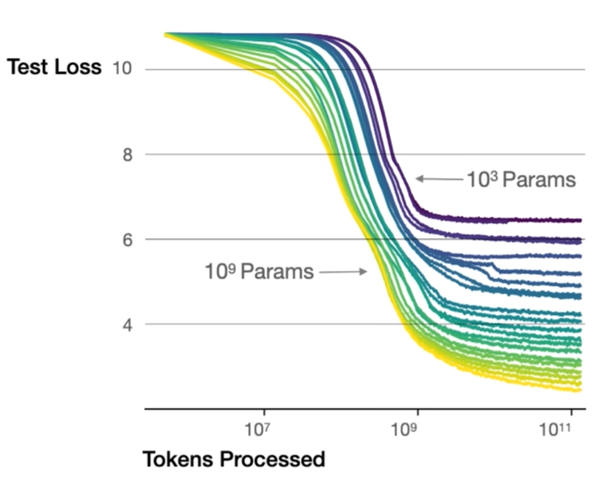
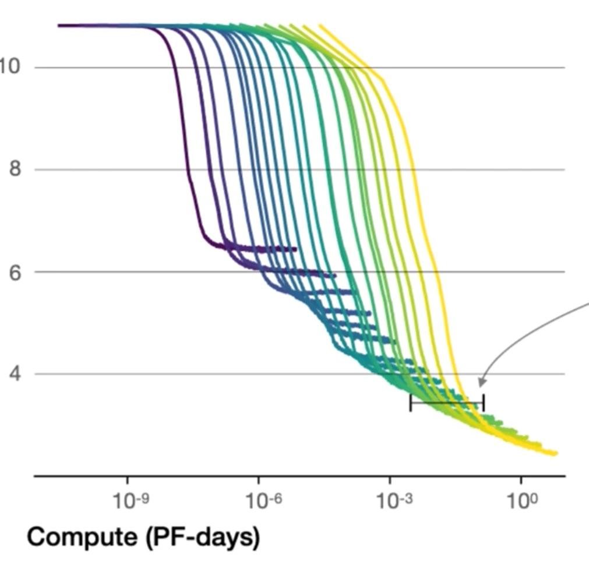

## 一、Scaling Law 的前世：大模型的第一性原理
2020 年，OpenAI 在《Scaling Laws for Neural Language Models》中提出了一条被业界奉为圭臬的经验法则。他们发现，**模型性能( $Loss$ ) 与 参数量 $N$、训练数据量 $D$、计算量 $C$ 分别呈严格的幂律关系**。

- 在对数坐标系下，这是一条完美的直线。它向全行业传递了一个极具诱惑力的信号：**AI 的智能没有天花板，只要继续砸钱堆算力，AI 就能线性平滑可预测地变聪明**。

由于算力 $C \approx 6ND$（单位：FLOPs），Kaplan 等人据此推导出了第一代“算力最优分配公式”：
$$N_{opt} \propto C^{0.73},\quad D_{opt} \propto C^{0.27}$$

**通俗翻译：** 当算力增加 10 倍时，应该把大部分资源用来扩充模型体积（参数扩大 5.5 倍），而数据量只需少量增加（扩大 1.8 倍）。这直接催生了 GPT-3 等“巨型模型”的诞生。

> P.S. 为什么是 **C = 6ND**？
> 以典型的 Decoder-only Transformer 为例，每处理 1 个 token，每个参数参与的计算量可以拆解为两部分：
> 1. **前向传播 (Forward Pass)：约 2N FLOPs**
>    每个参数在矩阵乘法中，参与一次“乘”和一次“加”，共 2 次浮点运算。模型中大量的线性层（Q/K/V/O 投影、MLP 层）和注意力计算都近似遵循这个规律，故整体近似 $2N \text{ FLOPs/token}$ 。
> 2. **反向传播 (Backward Pass)：约 4N FLOPs**
>    反向传播需要计算两类梯度，每类各占约 $2N$ FLOPs：
>    - 对激活值的梯度（传递到前一层）
>    - 对权重的梯度（用于更新参数）

---

## 二、前置知识
### 1. Tokens数据量与模型大小的关系

- 不同大小的模型都有一个最优token，超过这个数的token数量对训练效果提升不明显。
- 模型越大，对应的最优token越大。
- 用相同数量的训练token，去训练大模型的效果会更好。
### 2. 算力与模型大小的关系

- 在相同算力下：模型过小，容易浪费算力；模型过大，训练不充分。
- 相同算子下，要寻找最优尺寸的模型，才能充分利用算力。
### 3. 最优参数量 $N_{opt}$
基于对数线性拟合，最优参数量 $N_{opt}$ 与算力 $C$ 的关系可以表示为：
$$
\log N_{opt} = a \log C + constant \implies N_{opt} \propto C^a
$$
同理可得 $\log D_{opt} = b \log C + constant \implies D_{opt} \propto C^b，\text{其中 } a + b = 1$

---

## 三、Scaling Law 的修正
### 0. 2020 年的 Scaling Law
2020年，OpenAI 的 Kaplan 等人推导出的第一代“算力最优分配公式”：
$$N_{opt} \propto C^{0.73},\quad D_{opt} \propto C^{0.27}$$

### 1. 数据$D$ 与 参数$N$ 需“等价齐观”
2022 年，DeepMind 发布 Chinchilla 模型，指出 OpenAI 的结论严重低估了数据的重要性，“重参数、轻数据”并不科学。他们发现 70B 参数搭配 1.4T token 训练的 Chinchilla，性能几乎全面碾压了 280B 的 Gopher

- DeepMind 提出了一个后来被广泛引用的**损失函数分解公式**：
$$
L(N, D) = E + \frac{A}{N^\alpha} + \frac{B}{D^\beta}
$$

这个公式极其优雅地把大模型的 Loss 拆成了三块：
1. **$E$（不可约损失）**：语言本身的噪声和固有熵（如数据源中的噪音）。这是绝对下限，模型无法通过规模化消除的底噪。
2. **$\frac{A}{N^\alpha}$**：随着**参数量 $N$** 增加而缩小的损失。
3. **$\frac{B}{D^\beta}$**：随着**数据量 $D$** 增加而缩小的损失。

只要把公式里的 $\alpha$ 和 $\beta$ 拟合出来，配合 $C=6ND$ 的条件，就能知道算力该往哪边倾斜。DeepMind 实验得出，参数和数据对降低 Loss 的贡献几乎是平起平坐的。

Chinchilla 通过实验拟合，给出的修正分配方案：
$$
N_{opt} \propto C^{0.5},\quad D_{opt} \propto C^{0.5}
$$
每参数数据量比值 $ r = \frac{D}{N} \propto \text{常数} $，即：**算力增加时，参数和数据应该“等比缩放”**。

---

## 四、为什么以前的实验会“骗人”？回看之前的实验设计
为什么初代 Scaling Law 会得出区别如此大的结论？下面是一些浅显的原因（但这不全是研究人员的“考虑不周”，而是实际情况下要考虑成本因素，实验没法控制好每个变量每个都做一遍去得出全面的结论）
1. **训练 Token 强行截断**：当时所有规模的模型都被限制在 130B token 内训练。小模型吃饱了，但大模型严重营养不良，人为压低了数据扩容的收益曲线。
2. **学习率衰减陷阱**：由于 lr (learning rate) 余弦退火，训练末期学习率趋近于 0 时，损失曲线自然变平，不能下定论是“性能饱和”。
3. **英语语料的“低效偏差”**：研究发现，由于语言特性，模型学习**法语**语法达到同等能力的效率比英语高 50-100 倍。
