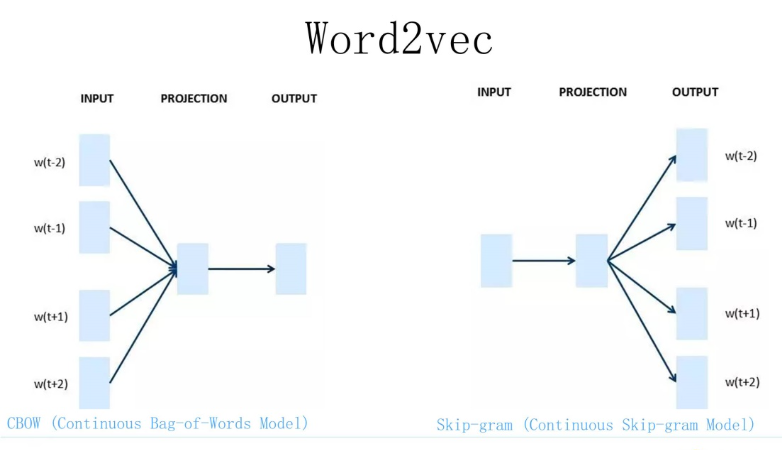
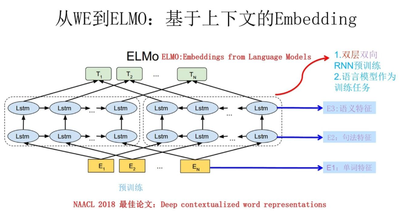
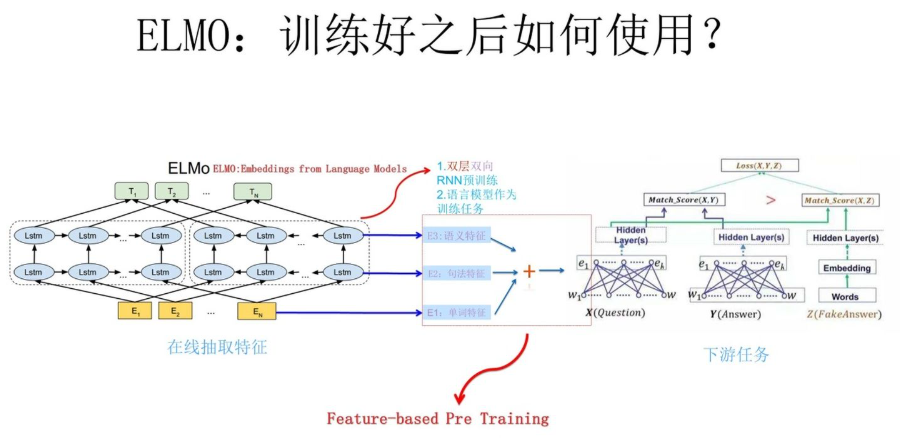
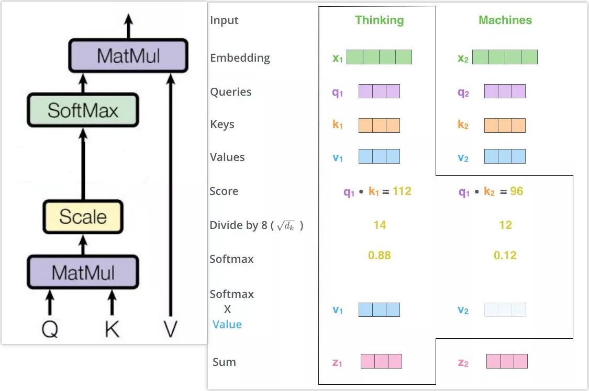
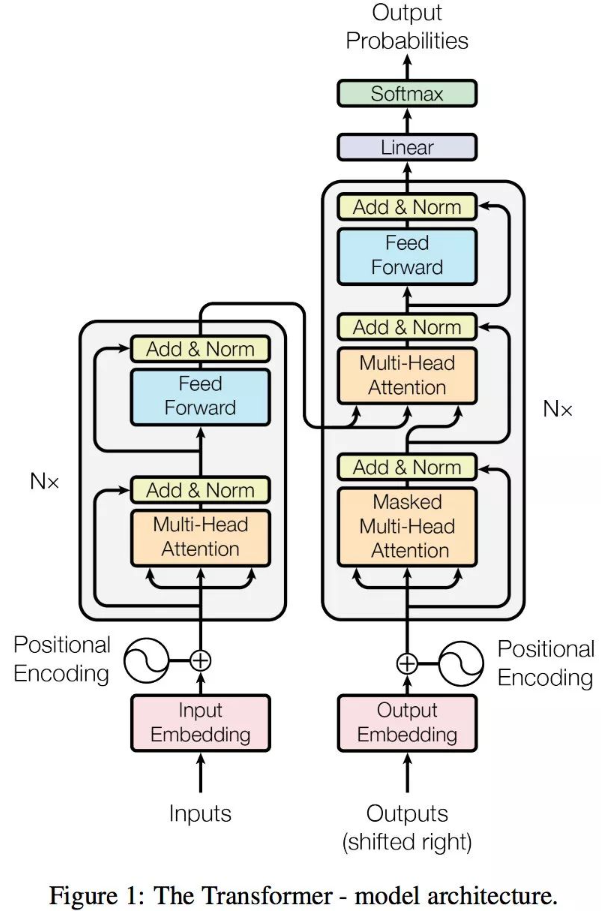
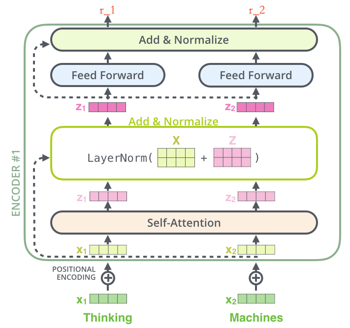

## 预训练语言模型的前世今生：从“静态字典”到“通用智能”
## 0. 溯源：什么是“`语言模型`”？
在谈论BERT之前，我们必须先回到原点：**到底什么是语言模型(LM, Language Model)？**
**技术定义：**
语言模型在数学上本质上是一个**概率密度估计（Probability Density Estimation）**。它的任务是计算一个句子出现的概率 $P(S)$，或者根据上文预测下一个Token的条件概率 $P(w_t | w_1, ..., w_{t-1})$。
- `概率链式法则`
$$
\begin{aligned}
P\left(w_{1}, w_{2},\cdots, w_{n}\right) &=P\left(w_{1}\right) P\left(w_{2} \mid w_{1}\right) P\left(w_{3} \mid w_{1}, w_{2}\right) \cdots P\left(w_{n} \mid w_{1}, w_{2}, \cdots, w_{n-1}\right) \\
&=\prod_{i=1}^{n} P\left(w_{i} \mid w_{1}, w_{2}, \cdots, w_{i-1}\right)
\end{aligned}
$$
>**通俗理解**: 它是一个判断“这句话像不像人话”或者“文字接龙”的机器。
> - **输入**：“今天天气真...”
> - **模型预测**：$P(\text{好} | \text{context}) = 0.8$，$P(\text{人} | \text{context}) = 0.001$。

为了实现这个目标，历史上演化出了两种的流派：**统计语言模型**与**神经网络语言模型**。
### (1) `统计语言模型` (SLM): N-Gram 时代
**核心思想：** 依靠**计数(Counting)**。
为了简化计算，N-Gram引入了**马尔可夫假设(Markov Assumption)**：假设当前词出现的概率只与前 $N-1$ 个词有关。
如果是 Bi-Gram(2-gram)，公式就简化为：
$$
P(w_i | w_{1}, ..., w_{i-1}) \approx P(w_i | w_{i-1}) = \frac{\operatorname{count}(w_{i-1}, w_i)}{\operatorname{count}(w_{i-1})}
$$
**补丁：平滑技术(Smoothing)**
统计方法面临一个致命问题：**零概率问题(Zero Probability)**。如果训练语料里从来没出现过“今天天气真诡异”，那么概率就是0，导致整个句子的概率直接归零。
为了解决这个问题，引入了拉普拉斯平滑（**加一平滑**）：
$$
P_{\text{Laplace}}\left(w_{i} \mid w_{i-1}\right) = \frac{\operatorname{count}\left(w_{i-1}, w_{i}\right) + 1}{\operatorname{count}\left(w_{i-1}\right) + |V|}
$$
*注：$|V|$ 为词表大小，确保分母不为0且概率和为1。*
**SLM 的局限（为什么被淘汰）：**
1.  **维度灾难 (Curse of Dimensionality)：** 随着 N 增大（想看更长的上下文），参数空间呈指数级爆炸，内存根本存不下。
2.  **离散性与语义鸿沟：** 这是一个硬伤。在 SLM 眼中，“猫”和“狗”是两个完全独立的 ID，模型无法理解它们都是“宠物”。

### (2) 神经网络语言模型 (NNLM): 预测下一个词，副产物为词向量 
**核心思想：** 依靠**计算(Computing)**与**分布式表示(Distributed Representation)**。
2003年，Bengio 提出了经典的 NNLM。不同于 N-Gram 的查表数数，NNLM 将每个词映射为一个**连续的稠密向量(Vector)**。
$$
f(w_t, w_{t-1}, ..., w_{t-n+1}) = \text{Softmax}(h(\text{Word Vectors}))
$$
**NNLM 的历史性突破：**
1.  **相似性泛化：** 因为“猫”和“狗”在向量空间中距离很近，模型学到了“猫喜欢吃鱼”后，会自动推断出“狗”也可能喜欢吃某种食物。这是统计模型做不到的。
2.  **平滑的概率函数：** 神经网络输出的是连续的概率分布，天然避免了零概率问题，不再需要复杂的平滑算法。
> P.S. 向量化其实是副产物：后人发现随机化矩阵Q训练好后，(one-hot) `wQ` 在一定程度上（目前的Q效果仍不行）可以通过**余弦相似度**描述词的**相似性**

**历史地位：**
最早的N-Gram是基于统计的（Counting），后来进化为神经网络语言模型（NNLM）。所有的预训练皇冠上的明珠（BERT/GPT/LLaMA），无论参数量千亿还是万亿，归根结底都是在做一个**最简单的“自监督”任务**：预测下一个词（`Next Token Prediction`）或还原被遮盖的词（`Masked Language Modeling`）。
**大道至简**。正是这个简单的目标函数，配合神经网络强大的**拟合能力**和**泛化能力**，让机器最终学会了人类的通识知识与逻辑推理。

---

## P.S. 为什么我们需要“`预训练`”？
**历史的窘境与数据的救赎**
在深度学习早期，NLP任务通常是`Train from Scratch`（从零训练）。这种方式面临两个巨大的历史障碍，而“预训练（`Pre-training`）”正是为了解决这些痛点应运而生：
### (1) 数据标注的瓶颈 (Label Scarcity)
这是最现实的原因。
- **高昂成本：** 只有Google、百度等巨头才有财力构建百万级的“情感分类”或“机器翻译”标注数据集。
- **长尾困境：** 对于医疗、法律、金融等垂直领域，专家标注的数据极其稀缺。在小样本上从头训练深层网络，极易导致**过拟合（Overfitting）**，模型只能记住训练集，无法泛化。
### (2) 范式的觉醒：自监督学习 (Self-Supervised Learning)
在计算机视觉（`CV`）领域， **ImageNet** 预训练早已证明了`迁移学习`(Transfer Learning)的威力：“先让模型看懂边缘和纹理，再微调去识别猫狗。”
**NLP领域的觉醒：**
我们意识到，互联网上有着无穷无尽的**无标注文本**（维基百科、CommonCrawl）。
- **预训练的核心逻辑：** 我们不需要人工标注“这是褒义词”，我们只需要把海量的书扔给模型，让它自己去“完形填空”。
- **本质：** 预训练是通过**自监督学习**，利用无限的无标签数据，学习通用的**语言表示（Representation）**，将知识存储在模型参数中，再迁移到有限的有标签下游任务中。

---

## 第一阶段：静态词向量 (Static Word Embeddings)
**代表技术：** Word2Vec (2013), GloVe
**核心理念：** `Feature Learning`（特征学习），将离散符号映射为连续向量。
### 1. `Word2Vec`的历史地位：打破维度的诅咒，分布式假设的胜利
在Word2Vec之前，我们使用`One-Hot`（独热编码）表示单词。如果词表有10万个词，每个词就是一个长达10万维的稀疏向量（维度灾难），且任意两个词向量正交，无法衡量相似度。

Word2Vec基于语言学著名的**分布式假设(Distributional Hypothesis)**——“词的含义由它周围的词决定”，其主要目的是为了训练**得到`Q`矩阵**。
- **技术突破 1：模型架构 (CBOW / Skip-gram)**
  通过神经网络将单词压缩到一个低维（如300维）的**稠密空间(Dense Vector Space)**中。
  - **`CBOW` (Continuous Bag of Words):**
    - **逻辑：** 用上下文推中心词。
    - **训练视角：** 本质是为了得到Q矩阵。所以从**误差反向传播**的角度来看，其实是“一个老师训练多个学生”。
    - **特点：** 训练速度快（上下文向量取平均只进行一次计算），但对生僻词效果较差（细节被平均平滑掉了）。适合速度优先生僻词少的任务。
  - **`Skip-gram`:**
    - **逻辑：** 用中心词推上下文。
    - **训练视角：** 从**监督信号来源**的角度，是“多个老师训练一个学生”。
    - **特点：** 训练速度慢（每个词作为中心词单独训练过），但对生僻词较好。适合精度优先、生僻词多的任务。
- **技术突破 2：训练优化 负采样 (`Negative Sampling`)**
  在标准的神经网络输出层，我们需要使用 **Softmax** 来计算概率。
  $$ P(w_O|w_I) = \frac{\exp(v'_{w_O}{}^T v_{w_I})}{\sum_{w=1}^{|V|} \exp(v'_w{}^T v_{w_I})} $$
  - **计算瓶颈：** 分母需要遍历整个词表。这意味着每训练一个样本，都要把整个词表算一遍，**计算量大到不可接受**。
  - **负采样**将原本复杂的“多分类问题”（从整个词表里挑1个正确的）转化为了简单的**二分类问题**（判断这个词是否正确）。
    - **正样本 (Positive)：** 真实的中心词-上下文词对。标签设为 **1**。
    - **负样本 (Negative)：** 随机从词表中抽取 $k$ 个（通常5-20个）原本不存在于上下文的“噪声词”。标签设为 **0**。
    - **核心思想：** 我们不再试图让模型在所有词中找到概率最大的那一个，而是让模型**拉近与正样本的距离，推开与这 k 个负样本的距离**。
  - **效果：** 每次更新只需要计算 $1+k$ 个词的梯度，而不是整个词表V。计算复杂度从 $O(|V|)$ 骤降为 $O(k)$，使得在大规模语料上训练成为可能。
- **里程碑：** 它首次让计算机理解了单词间的**线性语义关系**。
  $$ \text{Vec(King)} - \text{Vec(Man)} + \text{Vec(Woman)} \approx \text{Vec(Queen)} $$
  这不仅仅是数学巧合，更是计算机对语义空间结构的初次构建。

### 2. 演进逻辑：为什么它被淘汰了？
**核心缺陷：静态表征的局限 (The Static Representation Limit)**
Word2Vec生成的词向量是**上下文无关(Context-Independent)**的。一旦训练完成，一个词的向量就**固定**了(因为`Q`矩阵固定了)。
> **多义词灾难：**
> - 句子 A: "I ate an **Apple**." (水果)
> - 句子 B: "I bought an **Apple**." (科技公司)
> Word2Vec给 "Apple" 分配了一个**固定**的静态向量。无论上下文如何变化，这个向量一动不动。这种**静态映射**不仅无法解决多义词(Polysemy)问题，也无法捕捉复杂的句法结构。

---

## 第二阶段：动态上下文感知 (Contextualized Word Embeddings)
**代表技术：** ELMo (2018)
**核心理念：** `Context-Dependent`（语境依赖），词义由上下文动态生成。
### 1. `ELMo`的历史地位：语境的觉醒,从“查字典”到“读句子”
- ELMo (`Embeddings from Language Models`) 是一次观念上的飞跃。它提出：**词向量不应该是查表得到的，而应该是算出来的。**
- Word2Vec 预训练好的`Q`矩阵仍是很好的词向量生成矩阵。ELMo 在此基础上不仅仅训练`Q`矩阵，还把**上下文信息**融入`Q`矩阵。
它使用 **双头LSTM** (`Bi-LSTM`)作为**编码器**。
- **动态生成：** 当输入 "Apple" 时，ELMo会结合该词的左文(Left Context)和右文(Right Context)，动态生成一个向量。
- **突破点：** 在ELMo眼中，"Apple"(水果) 和 "Apple"(公司) 通过上下文信息可以拥有完全不同的向量表示。这是NLP从“词级别”迈向“句级别”的关键一步。

预训练：左边的LSTM获取了E2的上文信息，右边的LSTM获取了E2的下文信息。

`预训练语言模型的下游任务改造`：
### 2. 演进逻辑：为什么LSTM架构走到了尽头？
虽然ELMo效果很好，开启了动态向量时代，但它依然基于LSTM（RNN的一种）。**这个底层架构注定了它的上限：**
1.  **串行计算的瓶颈(The Sequential Bottleneck)：**
    LSTM必须按照时间步 $t$ 依次计算：读完第1个词，才能读第2个词。这导致它无法利用GPU强大的并行计算能力。在数据量爆炸的“大数据时代”，**训练效率低下**是不可接受的。
2.  **长距离依赖的缺失(Long-term Dependency Issue)：**
    尽管LSTM引入了门控机制，但在处理长文本时，开头的信息传到结尾依然会衰减(Vanishing Gradient)。
3.  **伪双向(Pseudo-Bidirectional)：**
    ELMo的双向LSTM本质上是“一个从左到右的模型”和“一个从右到左的模型”的简单拼接。它无法像人类一样，**同时**看到整个句子并理解词与词之间复杂的相互作用(Self-Attention)。
**历史在呼唤一种既能并行计算，又能捕捉深层语义的全新架构。**

---

## 第2.5阶段：引入 `Attention` 注意力机制
### 1. `Attention` 是一种 `QKV` `思想`
在RNN时代，模型必须按顺序读完整个句子，还得把所有信息压缩到一个固定长度的向量里（容易忘事）。而**Attention**的出现，让模型拥有了“上帝视角”和“划重点”的能力。即 通过计算 Q 和 K 每个信息的相关性权重 “通过 Query 这个信息权重从 Values 中筛选出重要信息”。
这可以更加好的解决序列长距离依赖问题，并且具有并行计算能力。

- **Attention通用`思想`的内涵**：Q可以是任何东西(如Q文生V图)，V也可以是任何东西，K往往跟V的类似/同源的（数学上: KV矩阵大小一致）。
计算QK相似度并SoftMax()归一化得到注意力权重 -> 注意力权重和V向量加权聚合得到最终的**上下文向量**
1. 计算比较 Q 和 K 的相似度，一般以下有四种计算方法：
   - 点乘（Transformer）： $f(Q,K_{i})=Q^{T}K_{i}$
   - 通用权重： $f(Q,K_{i})=Q^{T}WK_{i}$
   - 拼接权重： $f(Q,K_{i})=W[Q^{T};K_{i}]$
   - 感知器：   $f(Q,K_{i})=V^{T}\tanh(WQ+UK_{i})$
2. 将相似度 softmax 归一化（得到注意力权重）
   - $\alpha_{i}=\text{softmax}(\frac{f(Q,K_{i})}{\sqrt{d_{k}}})$
   - **Scaled Dot-Product Attention**: 防止在键向量的维度 $d_{k}$较高时，相似度分数的方差过大，导致 Softmax 将几乎全部的概率分给最大值，进而导致Softmax函数的**梯度消失**问题，使其无法有效学习，所以要把方差标准化为1，让梯度保持在敏感区间。
3. 加权求和（生成注意力向量）
   - $Attention=\sum_{i=1}^{m}\alpha_{i}V_{i}$
   - 这个 新的向量 Z 其实就是 V 的注意力版本，K 和 V 往往是同源的
### 2. Self-Attention 自注意力机制
- **核心思想**：QKV同源于同一个X，计算方法跟Attention类似，通过自注意力机制可以包含上下文信息（如得出她/他/它在上下文中可能对应哪个名词）

当然，实际情况是自注意矩阵，得到的Z是X加上上下文词元信息的新向量
### Cross-Attention 交叉注意力机制
- **核心思想**：KV同源(来自编码器 Encoder)，QV不同源(来自解码器 Decoder)
- 这是机器翻译或文生图任务中，源数据与目标数据交互的桥梁，从而来处理多模态任务。
### 3. `Mask Self-Attention` 掩码自注意力机制
- **核心思想**：防止“偷看答案”(Preventing Information Leakage)。通过(上三角-inf)掩码矩阵 M 未来预测的位置为-inf ($e^{-\infty} \approx 0$)
  - 填平训练阶段跟预测阶段的`gap`: 训练时不应该像预测时那样一个词一个词串行地“蹦”，而应该通过Mask使得训练可以并行执行。
- 如 GPT 等自回归(Auto-Regressive)模型：
### 4. `Multi-Head Self-Attention` 多头自注意力机制
- **核心思想**：将输入**投影到不同的`子空间`**，实现多维度的特征提取。
- 分、算、合: 用8组不同的权重矩阵(8头)将输入X投影到不同的低维子空间，并行计算输出向量Z(代表对句子的某种独特理解)，$Z_i$头尾相接恢复为512维，经过最终一个线性层$W^O$全连接计算，得到输出Z，增强了模型的特征表达能力。
- **理论计算开销对比**：
  - QKV 权重矩阵需要训练的参数量、计算量一致：($512 \times 512$)
  - 相似度/注意力权重分数计算量一致：($512 \times L^2$)
  - 输出融合计算量一致：($512 \times 512$)
- 真正有影响的性能问题：
  - **显存开销**：8个注意力矩阵($L \times L$)，反向传播时要全部缓存进显存，即QKV空间复杂度高一个常数h头数。
### 5. 为什么Attention可以做并行计算
- 矩阵并行，无前置依赖，GPU最喜欢的一集！（特指训练阶段）
### 6. `Positional Encoding` 位置编码
- 为什么 Self-Attention 需要位置编码？
  - **核心痛点：** Self-Attention 机制是并行计算、乱序的。在模型眼里输入是一个集合Set而不是序列Sequence，"I love you"和"You love I"是完全一样的，因为自注意力纯粹只是看词与词之间的语义相似度。所以我们必须把位置信息添加进向量X中。
- 通过线性变换表达相对位置，而非硬编码的绝对位置。
对第pos个位置的词元，其词向量的奇偶维度上的位置编码为：
$PE_{(pos, 2i)} = \sin\left(pos / 10000^{2i/d_{\text{model}}}\right)$
$PE_{(pos, 2i+1)} = \cos\left(pos / 10000^{2i/d_{\text{model}}}\right)$
$X_{final}=X_{embedding}+PE$ P.S. 在高维空间(如512维)中，词嵌入分布非常稀疏，加上 PE 不怎么会混淆语义，保留了原本的维度
- 当i很小 (低维索引)时： 分母较小，波长短频率高，稍微换一下pos，数值就变了。此时PE负责区分精细的**相邻**位置。
- 当i很大 (高维索引)时： 分母极大，波长长频率低。此时PE负责区分**长距离**的宏观位置（如开头结尾）。
- 由三角函数的和差化积有：
$
\left\{\begin{array}{l}
PE(pos+k,2i)=PE(pos,2i)\times PE(k,2i+1)+PE(pos,2i+1)\times PE(k,2i)\\
PE(pos+k,2i+1)=PE(pos,2i+1)\times PE(k,2i+1)-PE(pos,2i)\times PE(k,2i)
\end{array}\right.
$
**这意味着：**
$$ {PE}_{pos+k} = \text{Linear}({PE}_{pos}) $$
- 不管是哪一个 $pos$，只要两个词距离是 $k$，它们之间的联系(公式)就是固定的，是一个线性组合(变换)。${PE}_{pos+k}$ 都可以通过 ${PE}_{pos}$ 乘以一个固定的**线性旋转矩阵**得到，从而实现了不需要死记硬背每个绝对位置，只需要学习这个线性变换，就能理解单词之间的“相对距离”，即 **平移不变性**(`Translation Invariance`)。
- Q: 为什么不用 Learnable Embeddings（可学习的位置编码）
  - A: BERT 和 GPT 其实使用了可学习的位置编码（即把位置也当成参数训练出来，暴力训练出来的参数可能比人工设计的函数更能适配特定的任务）
  - 但在原版 Transformer 论文中选择正弦函数主要考虑了其**外推性**(`Extrapolation`)。哪怕训练时句子最长只有 100，模型通过学习这种“相对距离的旋转关系”，在预测时可能也能处理更长的序列，因为它学会的是“相对位置的变化规律”，而不是死记硬背每个绝对坐标。

---

## P.S. 机器学习的本质
- $y=\sigma(wx+b)$: 通过多层非线性的变换(如深度学习)，学习到一个复杂的非线性映射，将原始数据点，“扭曲”映射到一个新的高维特征空间，在新的空间实现简单的区分。
- **`非线性变换`的本质**: “空间坐标”的再定位

---

## 第三阶段：Transformer架构与预训练范式的确立
**代表技术：** Transformer, GPT, BERT
**核心范式：** `Self-Attention` (自注意力机制) + `Pre-training & Fine-tuning` (预训练-微调范式)
- NLP预训练的目的就是为了生成词向量
### 1. Transformer的革命：从时序依赖到全局并行
2017年， `《Attention Is All You Need》` 的发表为 NLP 奠定了架构基础，而随后2018年的 `BERT` 则开启了 NLP 的‘ImageNet时刻’。Transformer架构通过摒弃传统的循环神经网络（RNN/LSTM）和卷积神经网络（CNN）中的**归纳偏置(Inductive Bias)**，完全基于 **Attention** 机制构建深度网络。
*   **计算并行化 (Parallelization)：**
    RNN类模型存在本质的**时序依赖(Sequential Dependency)**，即 $t$ 时刻的状态计算必须等待 $t-1$ 时刻完成，这限制了GPU并行计算能力的发挥。Transformer 将输入序列视为整体矩阵，通过**位置编码(Positional Encoding)**注入序列信息，实现了训练过程的**完全并行化**，使得在亿级规模数据上进行训练成为可能。
*   **全局依赖建模 (Global Dependency Modeling)：**
    在LSTM中，长距离的语义传递面临梯度消失风险。而Transformer利用Self-Attention机制，使得序列中任意两个Token之间的交互路径长度仅为 **$O(1)$**。这意味着模型具有了**全局感受视野**，能够瞬间捕捉长距离的句法和语义关联。

### Transformer Architecture
Transformer 整体架构由 **Encoder（编码器）** 和 **Decoder（解码器）** 组成。
#### (1) **`Encoder` 编码器**
编码器：把输入变为一个词向量。其里面又有N个结构相同的编码器层（默认N=6,吃显存），每一个 Encoder Layer 内部包含：多头自注意力、前馈FFN、每次都做Add&Norm。
#### a. `Residual` Connection 残差连接
**公式：** $Output = \text{Layer}(x) + x$
**核心痛点：梯度消失 (Gradient Vanishing)**
随着网络层数加深（比如堆到12层），在反向传播时，梯度需要连乘。如果每层导数都小于1，乘到最后梯度就趋近于0，导致底层参数不再更新，网络退化。所以引入残差链接在反向传播求导时，$\frac{\partial(x+f(x))}{\partial x} = 1 + f'(x)$。
#### b. `LayerNorm` 层归一化
**公式：** $LN(x) = \frac{x - \mu}{\sigma} \cdot \gamma + \beta$
**核心痛点：梯度爆炸与协变量偏移 (Internal Covariate Shift)**
在深度网络中，每一层的输入分布都在剧烈变化，导致后一层需要不断适应前一层，训练极不稳定，且容易出现梯度爆炸。所以强制把每一层的输出拉回到**均值为0、方差为1**的标准正态分布，并且让数值保持在激活函数的敏感区间（这也是为什么说好的$\sigma()$的敏感区间一般都在N(0,1)）。
- Q: **为什么用 LayerNorm 而不用 BatchNorm？**
  - **BN** 是在这个 Batch 内所有样本的同一个特征维度上做归一化。这依赖于Batch_Size，且对于**变长序列**（NLP句子长度不一）非常不友好，适合CV固定图片大小的大Batch_Size。
  - **LN** 是在**同一个样本**的所有特征维度上做归一化。不管句子长短，也不管Batch大小，我自己归一化我自己。这天然适合 NLP 任务。
#### c. Position-wise Feed-Forward Network (`FFN`) 前馈网络
**公式：** $FFN(x) = \text{ReLU}(xW_1 + b_1)W_2 + b_2$ “窄-宽-窄”的非线性全连接
**作用：** 非线性变换与特征整合。
*   Attention 只是在做线性变换的“加权求和”，如果没有 FFN 中的激活函数(ReLU/GELU)，整个神经网络堆多少层都等价于一层线性变换，无法拟合复杂的非线性函数。
*   **Position-wise** 的意思是：虽然全连接层的参数 $W_1, W_2$ 对所有词共享，但这个运算是对序列中的每一个词单独、并行进行的，词与词之间在这一步没有任何交互。

### (2) **`Decoder` 解码器**
解码器：根据Encoder提供的KV向量和已经生成的输出，继续生成输出。
- `Q`来自Decoder的上一层输出，`KV`来自Encoder最后一层输出(源语句的语义信息)，即**KV注意力确定源语句哪些词对接下来的输出更重要**： 
  - 使用Masked Self-Attention防止“偷看答案”，Cross-Attention“多模态”分析，Position-wise FFN“窄-宽-窄”的非线性全连接
  - Linear Layer(线性投影) + Softmax： 输出
  - 自回归生成(Autoregressive Generation)循环往复，直到输出“终止符”

### TODO BERT and GPT

### 2. BERT与GPT：自监督学习的两条路径
随着Transformer提供了强大的特征提取能力(Backbone)，NLP从“从头训练(Train from Scratch)”转向了**预训练+微调**的工业化范式。即利用海量无标注文本进行**自监督学习(Self-Supervised Learning)**以获取通用的语言表征，随后在`下游任务`(**Downstream Tasks**)中进行参数微调/改造。

基于对**语言概率分布建模**方式的不同，发展出了两条截然不同的技术路线：
*   **GPT (`Generative Pre-Training`) —— 自回归语言模型 (`Auto-Regressive`, AR)**
    *   **架构：** 基于 Transformer **Decoder** 的单向结构。
    *   **预训练目标：** 标准的语言模型目标(Likelihood)，即最大化条件概率 $P(w_t | w_{<t})$。
    *   **技术特性：** 具有严格的因果掩码(Causal Masking)，只能利用上文信息预测下一个Token。
    *   **适用场景：** **自然语言生成 (NLG)**。它模拟了人类产生语言的过程，擅长文本续写、代码生成。
    *   **演进逻辑：** 早期GPT在理解任务上弱于BERT，但OpenAI坚持这一路线，通过**Scaling Laws(扩展定律)**验证了随着参数量和数据量的指数级增加，模型能涌现出强大的少样本学习(Few-Shot)乃至零样本推理能力。
*   **BERT (`Bidirectional Encoder Representations`) —— 自编码语言模型 (`Auto-Encoding`, AE)**
    *   **架构：** 基于 Transformer **Encoder** 的双向结构。
    *   **预训练目标：** **掩码语言模型 (Masked Language Modeling, MLM)**。即随机Mask掉输入中的部分Token，利用上下文信息重建被Mask的词。
    *   **技术特性：** 引入了**深层双向注意力 (Deep Bidirectional Attention)**，能同时融合左右两侧的上下文信息，生成上下文相关的深层语义表征。
    *   **适用场景：** **自然语言理解 (NLU)**。在文本分类、命名实体识别（NER）、阅读理解等判别式任务上表现卓越。
    *   **历史地位：** BERT的提出建立了NLP领域的**通用特征提取标准**。它证明了在大规模语料上预训练的深层模型，可以轻松迁移到各种下游任务，大幅降低了特定任务的模型设计门槛。
**总结：**
BERT选择了“看懂全文”，在理解任务上做到了极致；GPT选择了“预测未来”，最终通往了通用人工智能。两者本质上都是对海量数据中蕴含的语言规律进行**高维压缩与表征**。

---

## TODO NLG(文本生成), Question Answering(问答系统), RLHF(人类反馈强化学习), Prompt Engineering, In-context Learning, 思维链(Chain-of-Thought, CoT).

---

## 总结：为什么是这样的发展历程？
回顾从Word2Vec到BERT/GPT的十年，这一历程并非偶然，而是由**三个底层要素**共同推动的：
1.  **算力的解放 (Hardware Lottery)：** `GPU/TPU` 的并行算力 + Transformer这种为并行计算而生庞大的架构，允许我们堆叠出千亿参数的“怪物”。
2.  **数据的觉醒 (Data)：** 从昂贵且稀缺的人工标注数据（Supervised Learning），到`预训练-微调范式`开启的**自监督学习(Self-Supervised Learning)**，让互联网上无穷无尽的“废话”变成了最有价值的**基础**训练数据。
3.  **认知的跃迁 (`Cognition Evolution`)：**
    *   **Word2Vec时代：** 认为语言是**符号的静态映射**。
    *   **ELMo时代：** 认为语言是**流动的上下文**。
    *   **BERT/GPT时代：** 认为语言是一种**对世界逻辑的压缩**。
这一发展历程告诉我们：NLP的进步，不仅仅是算法的胜利，更是**工程能力/算力与数据规模**量变引起质变的结果。

## 参考文献：
- https://www.cnblogs.com/nickchen121/p/16470569.html
