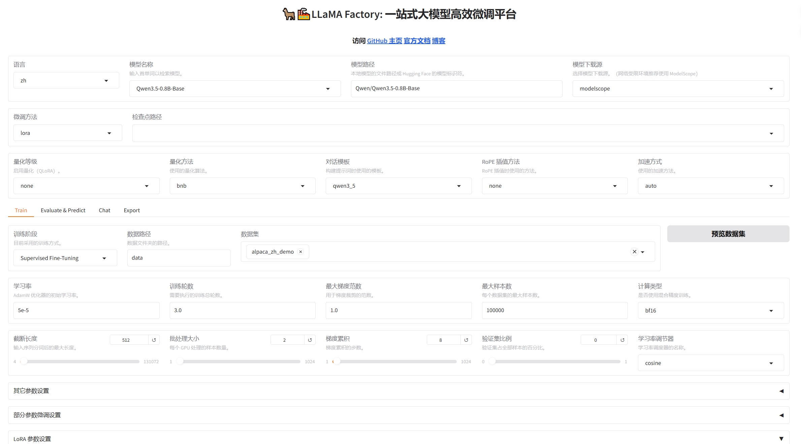
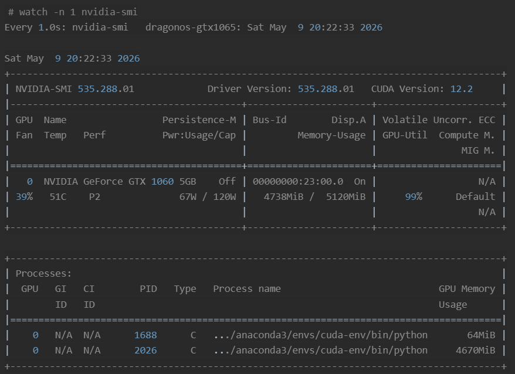
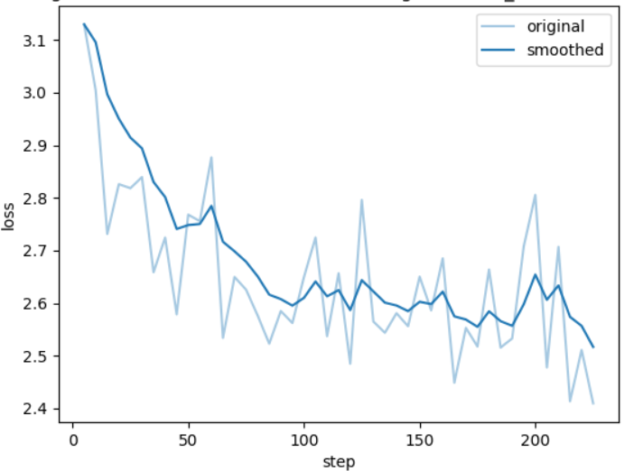

# SFT（Supervised Fine-Tuning）监督微调
## 1. LoRA (Low-Rank Adaptation) 低秩适配
**核心思想**: 内在低秩性 (`Intrinsic Low-Rank`): 
传统微调需要更新模型全部参数，而 LoRA 认为 **`过度参数化`的模型，其权重更新实际上位于一个`极低维度的内在子空间`(Intrinsic Subspace)中**（在数学上表示为 奇异值分解SVD得到的 $U \Sigma V^T$ 的 $\Sigma$ 只有前几个数值大，后面的数值趋近于 0）。

而模型权重的更新量（$\Delta W$）可以分解为两个极小的低秩矩阵 $B$(升维矩阵) 和 $A$(降维矩阵) 的乘积。
*   **权重矩阵**: $W_{new} = W_0 + \Delta W = W_0 + B \times A$
    *   $W_0$ 是被“冻结”的基础模型权重(只需FP16存储，不更新)
    *   **低秩分解**: $\Delta W = B \times A$，其中 $B$的维度为(输出维度 × r)，$A$的维度为(r × 输入维度)。$r$ 是一个远小于输入输出维度的超参数(如 r=8)。
        *   *A高斯分布随机初始化，B初始化为零矩阵，确保$\Delta W = 0$不会在初始阶段引入随机噪声导致模型崩溃*

*   **LoRA的计算流**: 在模型前向传播时，输入 $x$ 会同时经过原路径和旁路路径：
    $$Y = W_0 x + \frac{\alpha}{r}(BA)x$$
    *   其中，LoRA缩放因子 $\alpha$ 是一个常数，引入 $\frac{\alpha}{r}$ 的目的是：在改变秩 $r$ 时，不需要大幅度调整学习率，它可以保持输出数值维度的稳定性。

*   **LoRA的优势**: 
    1.  **极低的显存消耗**：
        $W_0$ 被冻结，只需以低精度(FP16/BF16)存储。而 LoRA 仅需为极小的 $A$ 和 $B$ 矩阵分配梯度空间和 AdamW 状态（参数量通常小于全模型的 1%）。
    2.  **零推理延迟 (Zero Inference Latency)**：
        在部署时，我们可以直接将 $BA$ 与 $W_0$ 合并：$W_{final} = W_0 + \frac{\alpha}{r}BA$。推理时直接调用 $W_{final}$，没有额外的计算路径，速度与原模型完全一致。
    3.  **极高的模块化与可交换性**：
        由于 LoRA 权重极小（通常仅几十 MB），你可以为同一个基础模型训练多个适配器（如：翻译 Adapter、写作 Adapter、代码 Adapter）。在生产环境中，基础模型只需加载一次，根据请求动态切换微调层即可。
    4.  **训练的高效性**：
        由于更新参数量极少，训练速度比全量微调快得多，且不容易发生灾难性遗忘。

*   **LoRA的变体**
    1.  **QLoRA**: 结合 4-bit 量化技术，将 $W_0$ 量化为 NF4 格式，进一步压低显存，是目前的主流方案之一。
    2.  **AdaLoRA**: 动态分配秩 $r$。给重要的权重矩阵分配更高的 $r$，其他的分配更低的 $r$。
    3.  **DoRA (Weight-Decomposition Low-Rank Adaptation)**: 将权重分解为幅值(Magnitude)和方向(Direction)，只用 LoRA 更新方向，效果更接近全量微调，且性能通常优于LoRA。

---

# 🚀 Qwen3.5-0.8B LoRA训练时 显存分析
本文将以 `Qwen3.5-0.8B` 本地微调为例，教你如何精确计算微调时的显存占用。

[魔塔社区 Qwen3.5-0.8B-Base](https://www.modelscope.cn/models/Qwen/Qwen3.5-0.8B-Base)

## 0. Qwen3.5-0.8B 核心配置参数 (Setup)
*   **模型参数量 ($M$)**: 0.8B
*   **网络层数 ($L$)**: 24 层
*   **隐藏层维度 ($h$)**: 1024
*   **训练精度**: FP16 (2 字节/参数)
*   **训练配置**: 
    *   Batch Size ($b$): 2
    *   Sequence Length ($s$): 1024
    *   LoRA Rank ($r$): 8
    *   优化器: AdamW (12 字节/参数，FP32 状态)


> 对于 `Qwen3.5-0.8B`:
> *   **混合注意力架构 (Hybrid Attention)**：结合了“Gated DeltaNet (一种线性注意力)”和传统的“标准注意力”。
> *   **分组查询注意力 (Grouped-Query Attention, `GQA`)**：将标准注意力KV头从Qwen3-0.6B的8个显著**压缩至2个**，成倍减少了推理时的 **KV Cache** 占用。
> *   **门控Delta网络 (Gated Delta Networks, `GDN`)**：作为一种高效的线性注意力变体，GDN是Qwen 3.5系列实现长上下文高效推理的关键技术。
> *   **多令牌预测 (Multi-Token Prediction, `MTP`)**：这能一次性预测接下来多个token，是一种为了加速推理而设计的训练策略。
> *   **原生多模态**：与其他“拼接式”的多模态模型不同，Qwen3.5-0.8B在预训练阶段就让文本和视觉数据在同一个底层空间里融合（Early Fusion），使得模型能更好地进行跨模态理解和推理。它能直接处理图像和视频，无需额外的视觉组件。

---

## 1. 模型权重显存 (Static Memory)
这是加载 `Qwen3.5-0.8B` 基础模型所需的固定显存。
*   **公式**: $V_{base} = M \times \text{Precision}$ (精度假设: FP16)
*   **计算**: $0.8 \times 10^9 \times 2B \approx \mathbf{1.60 \, GB}$ *(注：0.8B = 0.8 × 10^9 在转换为 GB 为单位应除以 1024^3，但实际上 0.8B 具体参数量为 873.44M，此处忽略该误差)*

---

## 2. LoRA适配器 参数与优化器显存 (Trainable Memory)
LoRA 只训练 **B矩阵(输出维度 × r)** 和 **A矩阵(r × 输入维度)** 两个低秩矩阵。假设我们针对 7 个线性层(q_proj, k_proj, v_proj, o_proj, gate_proj, up_proj, down_proj)添加 LoRA适配器。
*   **LoRA 可训练参数量 ($P_{lora}$)**:
    *   每层参数: $7 \times (h \times r + r \times h) = 7 \times (1024 \times 8 + 8 \times 1024) = 114,688 参数$
    *   L=24层网络全模型: $L \times 114,688 \approx 2.75M 参数$
1. **LoRA 权重显存 ($V_{lora}$)**: $2.75M \times 2B \approx \mathbf{5.5 \, MB}$
2. **LoRA 权重梯度显存 ($V_{grad}$)**:
    *   **计算**: $2.75M \times 2B \approx \mathbf{5.5 \, MB}$
3. **AdamW 优化器状态显存 ($V_{opt}$)**:
    *   **公式**: $P_{lora} \times 12B$ (AdamW 包含 FP32 副本w、动量m、方差v)
    *   **计算**: $2.75M \times 12B \approx \mathbf{33.0 \, MB}$
*   **合计**: $5.5 + 5.5 + 33.0 = \mathbf{44.0 \, MB}$

---

## 3. 前向激活值显存 (Activation Memory) —— 真正的显存吞噬者
激活值是为了反向传播求导而缓存的中间状态，随 batch_size 和 序列长度 增加而**飙升**。

> 💡 **Qwen3.5-0.8B 的架构特殊性：**
> 它采用了 **混合注意力架构 (Hybrid Attention)**：24层网络是由 **18层 Gated DeltaNet (线性注意力)** 和 **6层 传统标准注意力** 以 3:1 的比例交替组成的。线性注意力极大地降低了长上下文时的显存占用。

计算前向激活值显存：
### 先计算核心组件计算公式（单层）
1.  **线性层投影估算 (QKV-O)**：$4 \times (b \times s \times h \times 2B) = 4 \times 4MB = 16MB$
    - 实际上 Qwen3.5-0.8B 的 `8Q:2KV GQA` 精确公式为：$4 \times (b \times s \times \text{num\_heads} \times \text{head\_dim}  \times 2B)$
      - Q/O: $b \times s \times 8 \times 256 \times 2B = 8MB$
      - K/V: $b \times s \times 2 \times 256 \times 2B = 2MB$
      - 合计: $8MB + 2MB + 2MB + 8MB = \mathbf{20 \, MB}$
    - Qwen3.5-0.8B 的 DeltaNet 层 16QKV 的线性注意力:
      - Q/K/V/O: $b \times s \times 16 \times 128 \times 2B = 8MB$
      - 合计: $8MB + 8MB + 8MB + 8MB = \mathbf{32 \, MB}$
2.  **标准注意力分数 ($S^2$)**：仅在标准 Attention 层产生：
    *   $b \times \text{heads} \times s \times s \times 2B = 2 \times 8 \times 1024 \times 1024 \times 2B \approx \mathbf{32 \, MB}$
3.  **FFN中间层 (SwiGLU)**：由于 SwiGLU 包含 Gate、Up 和 Down 三个投影及激活态，需乘以 3 倍：
    *   $3 \times (b \times s \times \text{inter\_dim} \times 2B) = 3 \times 2 \times 1024 \times 3584 \times 2B \approx \mathbf{42 \, MB}$
4.  **归一化与残差 (Norm/Misc)**：包含 RMSNorm 输入与 Element-wise 加法：约 $\mathbf{10 \, MB}$

### 混合架构层级累加
Qwen3.5-0.8B 由 24 层组成，采用 **6 层标准层 + 18 层 DeltaNet 层** 的设计：
*   **门控 Delta 层 (DeltaNet Layer, 18层)**：
    *   *注：线性注意力不产生 $S^2$ 的注意力分数矩阵，显存占用低。*
    *   单层激活值 = 线性层(32) + FFN(42) + Misc(10) $\approx \mathbf{84 \, MB}$
    *   18层合计：$18 \times 84 \approx \mathbf{1512 \, MB}$
*   **标准注意力层 (Standard Layer, 6层)**：
    *   单层激活值 = 线性层(20) + 注意力分数(32) + FFN(42) + Misc(10) $\approx \mathbf{104 \, MB}$
    *   6层合计：$6 \times 104 \approx \mathbf{624 \, MB}$

### 全模型总计
*   **无优化时的总激活值 ($V_{act}$)**: $1512MB + 624MB \approx \mathbf{2.09 \, GB}$

*   *(注：若不使用梯度检查点，该数值会很高；若开启，可降低约 70%)*

---

## 5. 总结看板 (Total VRAM Calculation)
为了直观对比，这里展示 **不开启** 与 **开启 Gradient Checkpointing (梯度检查点，简称 GC)** 的真实显存差异。*(注：GC 是用计算时间换取显存空间的经典技术，能消除大部分激活值显存)*。

| 组成部分 | 计算逻辑/项 | 无优化显存 (Baseline) | 开启 GC 后显存 |
| :--- | :--- | :--- | :--- |
| **基础权重** | $0.8B参数 \times 2B$ (FP16) | 1600.0 MB | 1600.0 MB |
| **LoRA权重+梯度+优化器状态** | $2.75M参数 \times (2+2+12)B$ | 44.0 MB | 44.0 MB |
| **前向激活值** | 24层混合架构累加 | **2136 MB** | **~ 750.0 MB** *(大幅下降)* |
| **CUDA/框架开销** | PyTorch 上下文 | ~ 600.0 MB | ~ 600.0 MB |
| **总计 (Total VRAM)** | 理论估算值 | **约 4.28 GB** | **约 2.92 GB** |

# Qwen3.5-0.8B-Base + LLaMA-Factory 实战
## 环境配置
```sh
# 配置 LLaMA-Factory
git clone https://github.com/hiyouga/LLaMA-Factory.git --depth 1 && cd LLaMA-Factory
pip install -e .[metrics,bitsandbytes,rouge_chinese,qwen]
# 下载 Qwen3.5-0.8B-Base 基模模型权重
pip install modelscope
modelscope download --model Qwen/Qwen3.5-0.8B-Base # 基模权重 
# https://www.modelscope.cn/models/Qwen/Qwen3.5-0.8B-Base
# modelscope download --model Qwen/Qwen3.5-0.8B # 微调模型权重 
# ls -lh ~/.cache/modelscope/hub/models/Qwen/Qwen3.5-0.8B-Base/ # total 1.7G

# 设置环境变量，允许 Gradio 共享链接并监听所有接口
export GRADIO_SHARE=1 && export GRADIO_SERVER_NAME=0.0.0.0
# 启动 LLaMA-Factory WebUI
export RECORD_VRAM=1 # 记录显存占用日志
llamafactory-cli webui # 默认监听 7860 端口
```


## 自定义数据集下载与处理
```python
# 数据预处理脚本：用 modelscope 自动下载 Moemuu/Muice-Dataset 并转换为 ShareGPT 格式
# https://www.modelscope.cn/datasets/Moemuu/Muice-Dataset
from modelscope.msdatasets import MsDataset
import json
import os
# 自动下载(如果没有)并加载数据集
ds = MsDataset.load('Moemuu/Muice-Dataset', subset_name='default', split='train')

# 转换为 ShareGPT 格式
output = []
for ex in ds:
    conversations = []
    if ex['system']:
        conversations.append({'from': 'system', 'value': ex['system']})
    for turn in ex['conversation']:
        conversations.append({'from': 'human', 'value': turn['human']})
        conversations.append({'from': 'gpt', 'value': turn['assistant']})
    output.append({'conversations': conversations})

# 保存到 data 目录
os.makedirs('data', exist_ok=True)
with open('data/muice_dataset.json', 'w', encoding='utf-8') as f:
    json.dump(output, f, ensure_ascii=False, indent=2)
print(f"Saved {len(output)} examples to data/muice_dataset.json")
```
```sh
# Moemuu/Muice-Dataset training_log.txt 中的日志输出
Loading dataset muice_dataset.json...
***** Running training *****
Num examples = 3,637
Num Epochs = 1
Num update steps per epoch = 228 (3637 / batch_size 16)
Instantaneous batch size per device = 2
Total train batch size (w. parallel, distributed & accumulation) = 16
Gradient Accumulation steps = 8
Total optimization steps = 228
```

## 查看 nvidia-smi 显存占用


- 前面的只是理论最小显存估算，下面是实际训练过程中显存占用的日志输出：
```sh
# training_log.txt 中的日志输出
Fine-tuning method: LoRA
# 不止 7个线性层，实际是 12 个线性层
Found linear modules: down_proj,in_proj_z,gate_proj,v_proj,o_proj,k_proj,in_proj_b,up_proj,q_proj,out_proj,in_proj_a,in_proj_qkv
# 视觉编码器只是不可训练，但不会被跳过加载
Set vision model not trainable: ['visual.pos_embed', 'visual.patch_embed', 'visual.blocks'].
Set multi model projector not trainable: ['model.visual.merger'].
trainable params: 5,411,328 || all params: 858,397,248 || trainable%: 0.6304

## 其他不可见因素
PyTorch CUDA Allocator 缓存池 和 内存碎片问题
enable_thinking=true 时序列长度增加
DataLoader / CUDA Context / cuDDN
```

