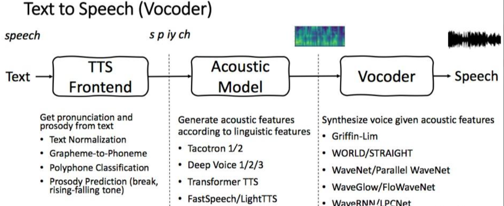
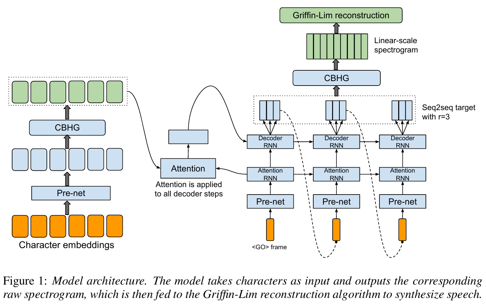
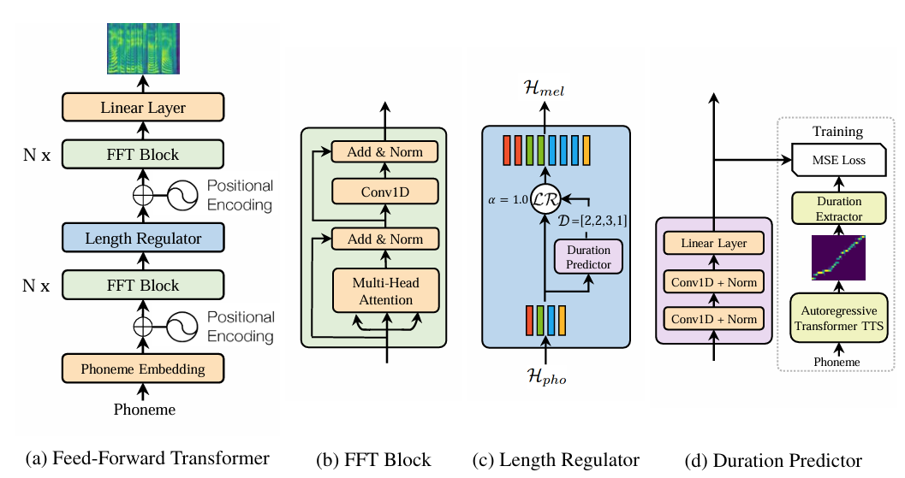
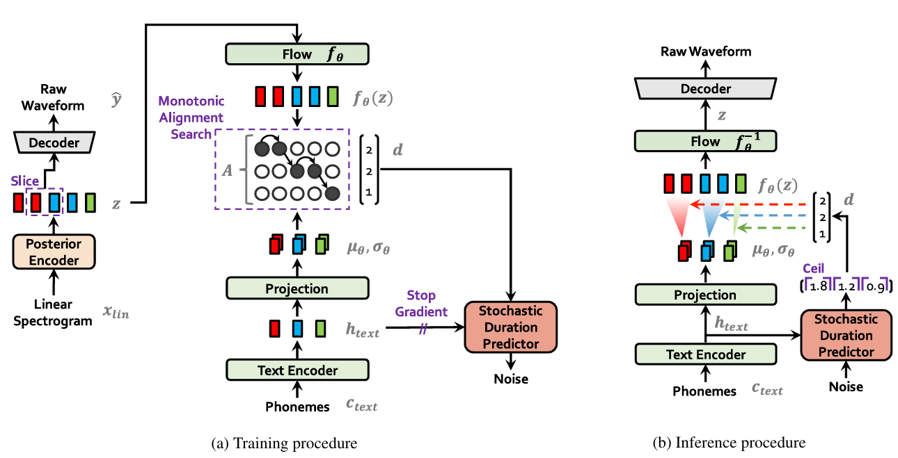

## 语音合成的前世今生：从「机器念稿」到「千人千声」
## 0. 溯源：什么是 `TTS`？
**技术定义**：
TTS 的任务是建立一个从**文本符号序列** $\mathbf{x}=(x_1,\dots,x_N)$ 到**语音波形** $\mathbf{y}=(y_1,\dots,y_T)$ 的映射。它的本质是建模条件概率 $P(\mathbf{y}\mid\mathbf{x})$——给定一句话，生成像人话一样念出来的声音。

>**通俗理解**: 它是一个把字念成声的机器。
> - **输入**："今天天气真好"
> - **模型输出**：一段听感自然、带语调、像真人在念的音频。

这看似简单的目标，背后却缠绕着**两组永恒矛盾**，整个 TTS 发展史就是在这两组矛盾里来回腾挪：

| 矛盾 | 一端 | 另一端 |
|:---|:---|:---|
| **自然度 ↔ 速度** | 听感逼真（高音质、有韵律） | 实时合成（不能逐样本慢慢磨） |
| **定制 ↔ 零样本** | 高质量（但要专门录几个小时训练） | 给一段参考音频就能克隆任意音色 |

> NLP 的演化是被**维度灾难 / 语义鸿沟 / 长距离依赖**三类痛点推着走的（详见 CS224N）。
> TTS 的演化逻辑完全不同——它被**实时性 / 端到端 / 零样本**三条主线推着走。
> 记住这三条线，后文每一代模型的为什么出现、又为什么被取代都会自然落位。

---

## P.S. **为什么 TTS 总是「三段式」流水线？**
几乎所有 TTS 系统都能拆成三段（即便后来 VITS 把它们焊成了一体，**数据流仍是这三段**）：
- **前端(`Front-end`)**：文本正规化（"100"→"一百"）、分词、字素→**`音素`转换**(Grapheme-to-Phoneme, `G2P`)。这是语言学的活，和深度学习关系不大。
- **声学模型(`Acoustic Model`)**：把音素序列映射成**声学特征**。所谓声学特征，绝大多数情况指 **`mel`频谱 (mel-spectrogram, 梅尔频谱)**。
- **声码器(`Vocoder`)**：把声学特征还原成可听的**`波形`(waveform)**。



- **为什么要把 mel 当中间产物？** 人耳对频率是**对数感知**的。把线性频率轴按 mel 尺度（人耳的等距感知刻度）压缩、再做取对数，就得到 mel 频谱。它的好处是**：维度远低于原始波形**（一帧 ~80 维 vs 波形一秒 16000 个采样点），却保留了人耳最敏感的信息。所以「`文本 → mel → 波形`」这条路，本质是**把一个高难度的长序列生成问题，拆成两个低难度的短序列生成问题**。

> NLP 里我们用词向量把离散符号压到稠密空间；TTS 里我们用 mel 把波形压到紧凑频谱。思路同源。
> 与 VAE 中 Encoder 将 $X$ 压缩到隐变量 $Z$ 的思路也完全同源

---

## 第一阶段：拼接式与参数式（前神经网络时代）
**代表技术**：拼接合成(Concatenative Synthesis, 1990s)、HMM 参数合成(Parametric/Statistical TTS, 2000s)
### 1. 拼接式的历史地位：用录音剪贴做出第一代机器语音
- **核心思想**：**查表拼接**。预先录一个**海量语音库**（每个音素在各种上下文下录多遍），合成时按文本去库里挑最合适的录音片段，用信号处理手段无缝拼起来。
- **痛点**：
  1. **数据库代价极高**：换一种语言、换一个人，就要重新录、重新标注、重新切割。
  2. **拼接痕迹 / 韵律生硬**：库里没有的搭配只能退而求其次，会在拼接处出现不自然的停顿。
  3. **不可控**：想调语速、情感，几乎无从下手——录音是死的。
### 2. HMM 参数式：用统计模型生成而非剪贴
- **核心思想**：**参数化建模**。不再拼接录音，转为用一个统计模型（**隐马尔可夫模型 HMM + 决策树**）预测每一帧的声学参数（基频 F0、频谱、时长），再用一个传统声码器（如 STRAIGHT）把参数还原成波形。
- **突破**：解决了拼接式的**灵活性**痛点——参数是算出来的，可以平滑地调语速、调音高、做情感转换。模型小、部署轻。
- **演进逻辑：为什么它被淘汰了？**
  - **致命缺陷：听感沉闷 / 机器味重 (Muffled / Robotic)**。HMM 用高斯混合拟合每一帧的分布，对语音这种高度非线性的信号建模能力太弱，生成的频谱过于平滑，听起来糊。

> **历史在呼唤一种能直接拟合、非线性地建模波形分布的方法。** 深度学习的爆发，把 TTS 推进了神经网络时代。

---

## 第二阶段：WaveNet —— 逐样本自回归生成原始波形
**代表技术**：WaveNet (2016, DeepMind)

> 论文：**WaveNet: A Generative Model for Raw Audio** · van den Oord et al. · arXiv：[1609.03499](https://arxiv.org/abs/1609.03499)

### 1. `WaveNet` 的历史地位：神经网络第一次直接生成波形
- **核心思想**：「**逐样本自回归**」。直接对原始波形建模，把波形生成当成一个极端的语言模型——像 GPT 预测下一个 token 那样，一个采样点一个采样点地自回归预测下一个采样点：
$$
P(\mathbf{y}) = \prod_{t=1}^{T} P(y_t \mid y_1,\dots,y_{t-1},\mathbf{c})
$$
其中 $\mathbf{c}$ 是条件（如文本的声学特征）。这和语言模型链式法则完全同构——只是把「词」换成了「采样点」，把「上文词」换成了「历史波形」。
- **技术突破 1：扩张因果卷积 (Dilated Causal Convolution)**。16kHz的波形一秒就是 16000 个采样点，要预测某个点需要看到几千点之前的历史。普通卷积感受野太小、堆太深又算不动。WaveNet 用**指数级增长的膨胀率**（1,2,4,8,…）的因果卷积：层数翻倍、感受野指数增长，既保证因果性（只看过去），又用极少参数覆盖超长上下文。
- **技术突破 2：μ-law 量化**。16-bit 音频有 65536 个取值，直接回归极难。WaveNet 用 μ-law 把波形压成 **256 个离散量化级**，于是逐样本生成退化为一个 **256 类分类问题**（softmax）。

> **通俗理解**: WaveNet 把念一段话当成了在波形这个超长句子上做文字接龙——每个采样点都是一个 token，模型一个点一个点地"接龙"出整段声音。

### 2. 演进逻辑：为什么TTS逐样本自回归走进了死胡同？
- **致命痛点**：**时序依赖 (Sequential Dependency)** 生成 1 秒 16kHz 音频要自回归 16000 次，在 GPU 上跑几分钟才出 1 秒声音，完全无法实时。
- 由此诞生了两条突围路线：
  - **路线 A（声码器路线，死磕波形）**：优化声码器，负责将声学特征还原为高质量波形。自回归蒸馏 Parallel WaveNet、ClariNet → 归一化流 WaveGlow → 最终演化出对抗生成网络 MelGAN 、Parallel WaveGAN、**HiFi-GAN**。
  - **路线 B（声学路线，换个建模目标）**：放弃生成庞大波形，自回归或并行地生成**低维紧凑的 Mel 频谱**去降维，再用快速声码器还原 → **自回归+注意力软对齐 Tacotron** → **非自回归并行架构 FastSpeech / Glow-TTS**。

---

## 第三阶段：Tacotron —— 端到端 seq2seq 生成频谱
**代表技术**：Tacotron (2017), Tacotron 2 (2018, Google)

> 论文：**Tacotron: Towards End-to-End Speech Synthesis** · Yuxuan Wang et al. · arXiv：[1703.10135](https://arxiv.org/abs/1703.10135)
> 论文：**Natural TTS Synthesis by Conditioning WaveNet on Mel Spectrogram Predictions** · Jonathan Shen et al. · arXiv：[1712.05884](https://arxiv.org/abs/1712.05884)



### 1. `Tacotron` 的历史地位：第一次把 TTS 焊成一个神经网络
- **核心思想**：「**端到端 seq2seq**」。把 **Encoder-Decoder + Attention** 架构原样搬到 TTS：一个 **Encoder** 把音素序列编码成一串向量，一个 **Decoder** 用 **Cross-Attention** 把这串向量“**对齐**”成 mel 频谱帧，最后接一个 WaveNet（或后来的 HiFi-GAN）做 Vocoder 声码器。
- 所谓 CBHG 就是作者使用的一种用来从序列中提取高层次特征的模块。
```text
音素──> [Encoder(Transformer/Conv+LSTM)] ──> 隐状态
──  Cross-Attention(K,V来自Encoder，Q来自Decoder)
──> [Decoder RNN (自回归)] ──> 一帧帧往外吐 mel 频谱帧
──> [Vocoder (WaveNet/HiFi-GAN)] ──> 波形
```
- **技术突破 1：注意力做软对齐**。传统流水线需要手工标注第几个音素对应第几帧音频（强制对齐，forced alignment）。Tacotron 让模型**自学对齐**——注意力权重矩阵就是文本与音频的软对齐图。
- **技术突破 2：端到端训练**。从音素直接到 mel，一个 loss 反传到底，省掉了 HMM 时代繁琐的流水线分段调参。

### 2. Reference Encoder / GST 旁支：音色控制的萌芽
差不多同期，Google 提出 **参考编码器(Reference Encoder)** 和 **全局风格标记(Global Style Tokens, GST)**：

> 论文：Towards End-to-End Prosody Transfer with Tacotron · arXiv：[1803.09047](https://arxiv.org/abs/1803.09047) ｜ Style Tokens · arXiv：[1803.09017](https://arxiv.org/abs/1803.09017)

- **核心思想**：把一段**参考音频**的 mel 经 CNN+RNN 编成一个**全局嵌入(global embedding)**，注入合成器，从而**控制语气、韵律、甚至音色**。GST 进一步把这个嵌入拆成一组可组合的风格 token软组合。
- **历史意义**：这是「**用参考音频控制输出音色**」思想的鼻祖——后文 VITS 的 ge、GPT-SoVITS 的多参考融合，根都在这里。

> 把参考音频编码成一个“全局嵌入”来控制输出，本质上是 AE 编码到隐空间，后续 VITS 会把这一步升级为真正的 **变分编码 VAE** 去获得连续、可插值的隐空间。

### 3. 演进逻辑：为什么 Tacotron 走到了瓶颈？
- **痛点 1：注意力不稳定 → 漏字 / 跳字 / 重复**。软对齐没有强约束，长句中注意力经常跳飞。
- **痛点 2：仍是自回归 → 慢**。Decoder 一帧帧串行吐 mel，虽比 WaveNet 快了两个数量级，仍不够实时。
- **痛点 3：时长不可控**。朗读快慢藏在注意力里，无法直接干预。

> **历史在呼唤：既能强制对齐不出错、又能并行生成的方案。**

---

## 第四阶段：并行化革命 —— FastSpeech / Glow-TTS / HiFi-GAN
**代表技术**：FastSpeech (2019), Glow-TTS (2020), HiFi-GAN (2020)

为了根治 Tacotron 的**对齐不稳**和**自回归慢**两个痛点，社区从两个角度发力，并配以一个决定性的并行声码器。

### 1. `FastSpeech`：用 时长预测器 换取并行与稳定
> 论文：**FastSpeech: Fast, Robust and Controllable TTS** · arXiv：[1905.09263](https://arxiv.org/abs/1905.09263)



- **核心思想**：「**非自回归(Non-Autoregressive, NAR) + 时长预测器(`Duration Predictor`)**」。彻底抛弃 Decoder 的自回归，改为：一个 Transformer Encoder 把音素编成隐状态，再由一个**时长预测器** 预测每个音素应该撑几帧，然后把每个音素的隐状态**按预测时长复制（上采样）**铺开成 mel 帧，最后一个 Transformer 映射成 mel。
- **突破**：
  1. **完全并行**：mel 帧一次出齐，速度暴涨，实时合成成为现实。
  2. **稳定对齐**：时长是显式预测出来的，不再靠飘忽的注意力，漏字跳字根治。
  3. **时长可控**：直接调时长预测值就能改语速——朗读快慢第一次变成可调旋钮。
- **代价（新痛点）**：时长预测器需要**强制对齐工具**（如 MFA）做训练标签，流水线又回到了需要外部工具的状态。

### 2. Glow-TTS：用 归一化流 + 单调对齐搜索 免去强制对齐
> 论文：**Glow-TTS: A Generative Flow for TTS via Monotonic Alignment Search** · Kim, Kim, Kong, Yoon · arXiv：[2005.11129](https://arxiv.org/abs/2005.11129)

- **核心思想**：「**归一化流(`Normalizing Flow`) + 单调对齐搜索(`MAS`)**」。引入生成流把文本隐空间映射到 mel 潜空间，关键贡献是 **MAS**——一个**解析式的最优单调对齐算法**，训练时**不需要任何外部强制对齐工具**，靠文本与 mel 在流空间里的最大似然直接搜出对齐：
$$
A^* = \arg\max_{A\in\mathcal{M}} \log p(x_A \mid \theta)
$$
其中 $\mathcal{M}$ 是所有单调对齐的集合。MAS 用动态规划 $O(T^2)$ 解出。
- **突破**：把 FastSpeech 并行的优点和无需外部对齐工具结合起来，是 VITS 文本侧的直接前身。
- **关键概念：归一化流 (Normalizing Flow)**。流(Flow)是一串经过特殊设计的**离散可逆网络层**，能把简单分布（如文本的高斯潜变量）层层扭曲成复杂分布（如 mel 频谱），且正向生成和逆向还原的概率都解析可算（绝对可逆的变换，且雅可比行列式容易计算）。

> **💡 历史关联**：这种“用可逆映射来弥合简单先验与复杂后验”的底层思想，不仅直接塑造了后来的 TTS 里程碑 **VITS**，更在其演化为“时间连续形态（Continuous Normalizing Flow）”后，成为了今天大火的 **Flow Matching (流匹配)** 生成架构的最核心理论基石。Glow-TTS 可以说是这一思想在语音领域的先驱探索。

### 3. HiFi-GAN：把声码器也变成 并行+高质量
> 论文：**HiFi-GAN: Generative Adversarial Networks for Efficient and High Fidelity Speech Synthesis** · Kong, Kim, Bae · arXiv：[2010.05646](https://arxiv.org/abs/2010.05646)

- **核心思想**：「**纯卷积生成器 + 多判别器对抗**」。用一个全卷积生成器（一堆转置卷积上采样）直接把 mel 一次性并行映射成波形，再配两个判别器做对抗训练：
  - **`MPD`(Multi-Period Discriminator, 多周期判别器)**：把波形按不同周期 reshape 成 2D，捕捉**周期性结构**（语音的准周期波）。
  - **`MSD`(Multi-Scale Discriminator, 多尺度判别器)**：在不同时间分辨率上判别，捕捉**长程结构**。
- **突破**：同时拿到了高质量、速度快、易训练——彻底取代了 WaveNet 的位置，成为事实上的**通用声码器**，几乎所有现代 TTS(VITS / VALL-E / GPT-SoVITS v1/v2/v4)都用它。

> **通俗理解**: HiFi-GAN 让mel → 波形这一步从逐样本接龙变成了一次性泼墨——又快又好，从此声码器不再是 TTS 的瓶颈。

---

## 第五阶段：VITS —— 把一切焊进 端到端 的 条件VAE
**代表技术**：VITS (2021), VITS2 (2023)

> 论文：**Conditional Variational Autoencoder with Adversarial Learning for End-to-End Text-to-Speech** · Kim, Kong, Son · arXiv：[2106.06103](https://arxiv.org/abs/2106.06103)



### 1. `VITS` 的历史地位：前人智慧大融合，真正意义上的**端到端**
在 VITS 之前，TTS 系统（如 Tacotron2 + WaveGlow, FastSpeech2 + HiFi-GAN）始终受制于**级联架构(Cascaded Architecture)**：声学模型先生成梅尔频谱，声码器再将频谱转为波形。这两个模型分开训练，不仅容易产生误差积累(Exposure Bias)，且梅尔频谱作为中间表示，往往会丢失相位等高频细节。

- **核心思想**：（前人智慧大融合）VITS 本质上是一个**带条件的变分自编码器(Conditional VAE)**。它将**声学模型(Acoustic Model)和声码器(Vocoder)**“焊死”在了一个网络里，通过**条件VAE潜空间 + 归一化流(Flow) + HiFi-GAN** 三件套，实现了从纯文本到音频波形的联合**端到端**训练。
  - **后验编码器 `enc_q` (音频侧)**：在训练时，它扮演 VAE 的 Encoder，从**真实的线性频谱图**中提取高分辨率的隐变量 $z$。这是目标分布，即`变分后验` $q_\phi(z \mid x)$。
  - **先验编码器 `enc_p` (文本侧)**：提取输入文本（音素）的特征，预测一个正态分布的均值和方差，作为先验分布 $p_\theta(z \mid c)$。
  - **归一化流 Flow $f_\theta$ (桥梁)**：由于文本预测的正态分布太简单，而真实音频提取的分布极其复杂，Flow 的作用是将简单的先验分布映射成复杂的分布，使其能与音频分布“对齐”。
  - **解码器 Decoder (声码器)**：直接内嵌了 **HiFi-GAN** 的生成器，它吃进隐变量 $z$，直接吐出原始波形(Raw Waveform)。
```text
训练时：
真实 mel ──[enc_q]──> 潜变量 z ──┬──[flow]──> 与 先验 enc_p 对齐 (KL散度项逼近)
                                └──[HiFi-GAN Generator]──> 波形 ──> 判别器 (GAN项损失)
推理时：
音素 ──[enc_p]──> 隐状态 ──[flow 反向]──> z ──[HiFi-GAN]──> 波形  (没有 enc_q！)
```

> 注意推理时**没有 `enc_q`**——因为推理时没有真实 mel，模型完全依赖 enc_p 和 flow 预测出符合真实规律的隐变量 $z$。这是 VAE “训练用后验、推理用先验”的经典套路。

- **技术突破**：一个 loss 联合优化一切。VITS 的损失是 Mel频谱重构 + 特征匹配 + GAN损失 + KL散度逼近 + 时长预测 的和：

$$
\mathcal{L}_{\text{VITS}} = \underbrace{\mathcal{L}_{\text{recon}}}_{\text{Mel频谱重构}} + \underbrace{\mathcal{L}_{\text{kl}}}_{\text{先验后验拉拢(KL散度)}} + \underbrace{\mathcal{L}_{\text{dur}}}_{\text{时长预测}} + \underbrace{\mathcal{L}_{\text{adv}}(G)}_{\text{GAN对抗}} + \underbrace{\mathcal{L}_{\text{fm}}(G)}_{\text{中间层特征匹配}}
$$
$$
\mathcal{L}_{\text{kl}} = \underbrace{\mathbb{E}_{q_\phi(z \mid x)}}_{\text{从真实音频提潜变量 } z} \left[\, \underbrace{\log q_\phi(z \mid x)}_{\text{音频后验(简单高斯)}} - \underbrace{\log \mathcal{N}\big(f_\theta(z) \mid \mu_\theta(c), \sigma_\theta(c)\big)}_{\text{文本先验 (将 } z \text{ 经过 Flow 逆向变换)}} - \underbrace{\log \left| \det \frac{\partial f_\theta(z)}{\partial z} \right|}_{\text{Flow 带来的体积雅可比惩罚}} \,\right]
$$

> **通俗理解**: $D_{\text{KL}}$ (KL散度) 这一项极其关键，它的作用是“**拉拢**”。它强迫「从真实音频提取的潜变量（后验）」和「从纯文字预测的潜变量（先验）」尽量保持一致。只有在训练时把两者拉得足够近，推理时纯靠文本“盲猜”的特征，才能顺利通过解码器生成清晰的声音。

### 2. 多说话人 VITS：用 speaker embedding 注入音色
VITS 架构非常容易扩展为多说话人(`Multi-Speaker`)模型。具体做法是引入一个**全局说话人嵌入向量 $g$ (`Speaker Embedding`)**。

将代表特定音色的向量 $g$ （通常通过残差连接或仿射变换）直接注入到 `enc_q`(后验)、`enc_p`(先验/时长) 以及解码器(HiFi-GAN) 中，作为生成声音的“条件”。

> 这个用于注入固定音色 $g$ 的“接口”，也正是后文将要介绍的**零样本克隆霸主 GPT-SoVITS 插手的绝佳位置**！
> GPT-SoVITS 的思路是：既然 VITS 留了音色接口，那我用一个强大的模型（如 HuBERT + GPT），从**任意给定的3秒参考音频中动态提取音色特征**塞进这个接口，从而实现惊艳的 Zero-Shot 声音克隆。

### 3. 演进逻辑：VITS 之后还剩什么没解决？
VITS 几乎是传统神经TTS的完美形态，但它解决不了 TTS 的第二大矛盾：**零样本音色克隆**。VITS 要换音色，仍需**为该说话人重新收集数据、微调**。

要实现给一段 3 秒参考音频就能克隆任意人的声音，还需要一次范式跃迁——把语音**离散化成token**，然后用**语言模型**去生成它。

---

## P.S. 把语音离散化：`EnCodec` 与「`音频即语言`」
这是连接 传统TTS 与 LLM时代TTS 的关键桥梁。

> 论文：**EnCodec: High Fidelity Neural Audio Compression** · Défossez et al. (Meta) · arXiv：[2210.13438](https://arxiv.org/abs/2210.13438)
> 论文：**AudioLM: A Language Modeling Approach to Audio Generation** · Borsos et al. (Google) · arXiv：[2209.03143](https://arxiv.org/abs/2209.03143)

- **核心思想**：「**`残差向量量化` (RVQ, Residual Vector Quantization)**」。
  Transformer 最擅长处理的是离散的、有限的词表，而真实的波形音频是连续且具有无穷无尽实数值的。
  1. EnCodec 先用一个**卷积编码器**将复杂的音频压缩成一个低频的连续一维隐变量 $z$。
  2. 引入 **VQ-VAE (向量量化变分自编码器)** 的思想，让这个连续的隐变量 $z$ 去强制匹配**离散码本(Codebook)** 中的向量。
  3. 但单靠一个码本无法在有限容量下保证高保真音质。于是 EnCodec 利用了 **RVQ(残差串联)**：用多层小码本串联，每一层都在量化上一层拟合后留下的**残差(Residual)**，最终将一段音频极其高效地压缩成了一个多层级的**离散 token 矩阵**：

$$
\text{音频} \;\xrightarrow{\text{CNN 编码器}}\; \text{连续特征 } z \;\xrightarrow{\text{RVQ 逐层量化残差}}\; \text{离散矩阵 } (q_1,q_2,\dots,q_K)
$$

> **通俗理解**：“先粗雕再精修”。第 1 层 $q_1$ 的 token 抓取了音频中最核心的骨架（如他在说什么字、大致的语调）；第 2 层 $q_2$ 补充了更细腻的韵律和情感；越往后的层，则像剥洋葱一样，一点点把独特的音色质感、呼吸气声甚至是背景底噪给完美补齐。

- **历史意义的突破 (AudioLM)**：
  既然音频被成功降维并离散成了 token，那么「**音频生成 = 在音频 token 上做语言建模**」的等式就完美成立了！
  - 这一步，直接把音频生成从复杂的“连续信号回归问题”变成了纯粹的“**Next-Token Prediction（预测下一个词）分类问题**”。
  - 它彻底打开了**用 LLM 的全部武器库做语音**的大门。从此，NLP 领域验证过的 Scaling Law、In-Context Learning、Zero-Shot 泛化能力，全都可以无缝平移到语音领域。微软的 VALL-E 正是这一思想的直接产物。

> **💡 历史的重演：万物归于 Token**
> NLP 领域经历过「Word2Vec (静态词向量) → ELMo (动态上下文) → BERT/GPT (通用大语言模型)」的跃迁。
> 语音领域几乎完美重演了这一幕：「连续 Mel 频谱 (声学表征) → HuBERT / w2v-BERT (连续的语义表征) → EnCodec / SoundStream (离散的声学 Token) → AudioLM / VALL-E / GPT-SoVITS (音频大语言模型)」。**至此，音频终成语言。**

---

## 第六阶段：VALL-E —— 神经编解码语言模型 与 零样本克隆
**代表技术**：VALL-E (2023, Microsoft)

> 论文：**Neural Codec Language Models are Zero-Shot TTS Synthesizers** · Wang, Chen, Wu et al. · arXiv：[2301.02111](https://arxiv.org/abs/2301.02111)

### 1. VALL-E 的历史地位：第一次实现真正的零样本音色克隆
- **核心思想**：「**把 TTS 当语言模型来做**」。输入是音素 + 一段 3 秒参考音频的 codec token，输出是目标内容的 codec token，再用 EnCodec 解码器还原成波形。
  - **核心洞察**：只要模型足够大、训练数据（声音素材）足够多，它就能像 GPT 一样，**通过 in-context learning 从参考音频“学到”这个人的音色**，无需任何微调。
- **技术突破：两阶段解码 (AR + NAR)**。EnCodec 的 RVQ 有 $K$ 层（通常 8 层），逐层自回归太慢。VALL-E 把生成拆成：
  - **AR 阶段（自回归）**：逐 token 生成**第 1 层** codec token（语义骨架）。
  - **NAR 阶段（非自回归）**：并行预测剩余 $K-1$ 层（补声学细节）。

> **GPT (AR) 与 BERT (AE) 两条路线**在语音上的合流：AR 生成骨架，NAR 并行填充细节。

- **突破**：第一次证明了「**神经编解码语言模型 = 零样本 TTS 合成器**」。给一段任意陌生人的 3 秒录音，无需训练即可克隆其音色念任意文本——TTS 第二大矛盾（定制 ↔ 零样本）被打开了一个口子。

### 2. 演进逻辑：VALL-E 留下的新痛点
- **痛点 1：AR 阶段仍是瓶颈**。逐 token 自回归，长文本慢。
- **痛点 2：音色相似度 / 韵律自然度仍有差距**。in-context learning 学到的音色不够稳，复杂句韵律偏生硬。
- 对此社区给出两类应对：
  - 用**并行解码**替代 AR（SoundStorm 等，双向注意力 + 置信度并行解码，比 AR 快约 100 倍）；
  - 用**扩散模型/流匹配** 重做声学模型，提升音质与韵律——这正是下一阶段。

> **GPT-SoVITS 的 `s1/GPT` 模块就是 VALL-E 谱系的工程化**：它以音素 + Chinese-RoBERTa BERT 特征为条件，自回归解码出离散 **HuBERT-VQ 语义 token**（注意：不是 EnCodec token，而是 HuBERT 量化的语义 token——信息更聚焦语义、与声学细节解耦）。

---

## 第七阶段：Diffusion 与 Flow Matching —— 把声学模型做成`生成模型`
**代表技术**：F5-TTS (2024)

VITS 用 VAE，VALL-E 用 AR 语言模型。其实还有第三条路：用**扩散模型/流匹配**直接把声学特征生成出来。这是 GPT-SoVITS v3/v4 解码器所走的路线。

> 论文：**Flow Matching for Generative Modeling** · Lipman et al. · arXiv：[2210.02747](https://arxiv.org/abs/2210.02747) · **F5-TTS** · arXiv：[2410.06885](https://arxiv.org/abs/2410.06885)

### 1. 从 DDPM 到 Flow Matching：换个数学语言做生成
- 通过流(Flow)的思想，把已知分布一步步流动转换为真实的目标分布。
  - 从本质上通过随机微分方程 (SDE) 逐步加噪的 DDPM，到纯粹的解概率流常微分方程 (PF-ODE) 的 EDM，再到直接“走直线”解ODE的流匹配 Flow Matching。

### 2. DiT 主干 + F5-TTS：完全非自回归的 flow-matching TTS
- **DiT (`Diffusion Transformer`)** 把扩散模型里的 U-Net 换成纯 Transformer：**patchify + adaLN-Zero 条件注入**。adaLN-Zero 用一个可学习的零初始化缩放，让深层 Transformer 训练稳定，对 scaling 有利。
- **F5-TTS**(2024) 把 DiT 主干 + Continuous Flow Matching (CFG) + classifier-free guidance (CFG) + Sway Sampling 拼成一个**完全非自回归**的 TTS：直接从噪声 mel 出发，一步积分出整段 mel。**GPT-SoVITS v3/v4 的 `s2` 解码器就是 F5-TTS 的直接复用**，再接独立声码器（v3 = BigVGAN 24kHz，v4 = HiFi-GAN 风格 Generator 48kHz）还原波形。

```text
GPT-SoVITS 的版本分叉（理解整条演进的关键）：
  v1/v2     : VITS 路径   → 语义 → enc_p → flow → HiFi-GAN Generator（一体化）
  v2ProPlus : v2 的 VITS 配方 + ERes2Net 多参考音色融合（声码器容量更大）
  v3/v4     : CFM 路径    → 语义 → enc_p → CFM(DiT) → mel → BigVGAN/Generator（解耦）
```

### 3. BigVGAN：声码器的下一代
BigVGAN 在 HiFi-GAN 基础上加 **snake 激活**（一种对**周期性信号**更友好的激活函数）解决高频毛刺，配合大规模训练，成为泛化极强的通用声码器。

> 到这一步，TTS 的「自然度 ↔ 速度」矛盾基本被化解：flow matching 在 mel 空间灵活建模、声码器解耦可单独升级。剩下的硬骨头，是**零样本音色克隆的相似度**。

---

## 第八阶段：说话人验证 SV —— 零样本音色克隆(Zero-Shot Voice Cloning)
**代表技术**：i-vector → x-vector/TDNN → ECAPA-TDNN → ERes2Net/ERes2NetV2

零样本克隆的核心，是从**参考音频**里准确提取一个**只表征"这是谁的声音"、滤掉"说了什么内容"**的**向量**——这其实就是**说话人验证 (Speaker Verification, SV)** 要做的事。SV 的演化其实是一根独立的主线，最终汇入 TTS。

> 论文：ECAPA-TDNN · arXiv：[2005.07460](https://arxiv.org/abs/2005.07460) ｜ ERes2Net · arXiv：[2305.12838](https://arxiv.org/abs/2305.12838) ｜ ERes2NetV2 · arXiv：[2406.02167](https://arxiv.org/abs/2406.02167)

### 1. SV 的统一范式：帧级编码 → 池化 → 段级嵌入
几乎所有神经 SV 都遵循同一个三段式：
$$
\text{音频} \xrightarrow{\text{帧级编码器}} \text{帧特征序列} \xrightarrow{\text{统计池化}} \text{定长向量} \xrightarrow{\text{段级 FC}} \text{说话人嵌入 (spk embedding)}
$$

> 说话人嵌入就是一个只编码身份信息、滤掉内容信息的**结构化隐变量**——与 VAE 编码到隐空间的思想同源。其区别在于训练目标：VAE 用变分推断（KL散度正则化隐空间），SV 用对比学习（GE2E损失拉近同说话人、推远不同说话人）。

- **i-vector (2010)**：深度学习前的主流，用因子分析把高斯超向量分解为低维向量。
- **x-vector / TDNN (2018)**：奠定神经范式——**TDNN（时延神经网络）做帧级编码 + 统计池化（均值/方差）+ 段级全连接**，得到固定维度（通常 192 维）的 x-vector。
- **ECAPA-TDNN (2020)**：工业界标准强基线。在 TDNN 上加 **SE 通道注意力 + 多层特征聚合（RES2Net 式多尺度）+ 加权统计池化**，大幅提升鲁棒性。
- **Res2Net → ERes2Net → ERes2NetV2**：不断强化多尺度感受野。ERes2Net 加局部/全局特征融合（LFF/GFF/AFF）；ERes2NetV2 剪枝冗余 + 扩展通道，专攻**短音频 (<5s)** 的 SV——这正是零样本克隆的现实场景（参考音频往往很短）。

### 2. 训练目标：GE2E —— 拉近同说话人、推远不同说话人
SV 嵌入用 **GE2E (Generalized End-to-End) 损失**训练：让同一说话人的嵌入互相靠近、不同说话人互相推远。这是**对比学习 (Contrastive Learning)** 在语音上的标准目标。

### 3. SV 如何接入 TTS：多参考音色融合（GPT-SoVITS v2ProPlus）

#### 特征提取层：从判别指纹到生成先验
- **超高维原始嵌入 (`sv_emb`)**：通过调用 `ERes2NetV2.forward3` 接口，绕过最后的池化带来的信息压缩，提取出一个高达 **20480 维** 的展平特征向量，最大限度保留参考音频中微小的音色质感与纹理细节。
- **线性语义对齐**：通过一个 `Linear(20480 → 1024)` 的线性投影层，将判别空间的超高维特征映射到生成空间的 1024 维**隐空间**，使其具备与后续合成模块进行张量运算的能力。

#### 算子融合层：身份与风格的双流汇聚
模型引入了**双流融合机制**来构建最终的**全局条件向量(Global Embedding, `ge`)**：
- **双流输入**：
  - 一是来自 `MelStyleEncoder` 提取的**基础风格向量**（捕获语调波动、环境底噪等动态特征）
  - 二是上述经过降维的 **SV 身份嵌入**（锁定本质音色）。
- **残差融合算子**：采用 `ge += sv_emb` 的加法残差逻辑。在数学上赋予了模型一种“偏置校正”能力——在 Mel 编码器提取的宏观风格基础上，由 SV 嵌入强制注入精准的说话人指纹。
- **多参考 consensus（共识）机制**：当提供多段参考音频时，模型会对每段音频生成的融合向量进行**算术平均**。这一步在工程上极具价值，它能通过均值计算有效地抵消单段参考音频中特有的内容偏置或突发噪声，从而提取出该说话人最稳定的“平均音色主轴”。

#### 任务注入层：全局条件的深度渗透
融合后的最终 `ge` 向量被作为核心先验，注入到 VITS 架构的每一个关键环节：
- **前端注入(MRTE 模块)**：在内容编码阶段，通过多参考音色提取器（MRTE），将 `ge` 作为条件与 SSL 内容特征、文本音素特征进行 **Cross-Attention（交叉注意力）** 计算。这确保了文本在被编码成隐状态时，就已经带上了特定说话人的韵律偏好。
- **后端注入(VAE/Flow/Dec)**：
  - **后验编码器 (`enc_q`)**：指导如何从真实频谱中提取潜变量。
  - **归一化流 (`flow`)**：在分布扭曲过程中提供身份约束。
  - **解码器 (`dec/HiFi-GAN`)**：作为全局偏置（Global Condition），决定最终波形合成的音色质感。

> 这条链生动诠释了 TTS 两大主线的合流**：VITS（声学模型/声码器主线）+ SV（音色表征主线）= 零样本多参考克隆**。

---

## TODO 多语种 TTS、情感可控合成、流式低延迟 TTS、零样本韵律迁移、 singing voice synthesis（歌声合成）。

---

## 总结：为什么是这样的发展历程？
回顾TTS一路发展到 GPT-SoVITS 的三十年，会发现 TTS 是由**三条主线**交织推进的：
1. **「自然度 ↔ 速度」的拉锯 (Real-time Factor)**
   - WaveNet（逐样本自回归，但慢到离谱）→ Tacotron（自回归频谱）→ FastSpeech / Glow-TTS（并行频谱）→ HiFi-GAN（并行声码器）→ flow matching（少步积分）。
   - 这条线最终解耦为**声学模型**与**声码器**两段，各自迭代到接近实时。
2. **「分段流水线 ↔ 端到端」的统一 (End-to-End)**
   - HMM 三段式 → Tacotron 声学模型端到端 → VITS 全程端到端（VAE + flow + GAN 一体）。
   - 端到端不是终点——VITS 之后又**主动解耦**（flow matching + 独立声码器），因为解耦后可单独升级比一体化更加工程友好。这也有合久必分的智慧。
3. **「定制 ↔ 零样本」的范式跃迁 (Zero-Shot)**
   - Reference Encoder/GST（音色控制萌芽）→ 多说话人 VITS（固定音色集）→ VALL-E（编解码语言模型 + in-context learning）→ SV 嵌入融合（ERes2Net → 精准音色表征）。
   - 这条线的本质是**：把 NLP 的 LLM 范式（离散化 + 预训练 + in-context）整体平移到语音**。

**现代 TTS 的最终形态，是这三条线的合流**：
- 语义预测层：一个LLM谱系的自回归语义解码器 (VALL-E / GPT-SoVITS s1 GPT)
- 声学解码层：配一个 Diffusion 或 Flow Matching 谱系的声学解码器 (F5-TTS / GPT-SoVITS v3/v4 s2)
- 音色约束层：再用 SV 模型从参考音频提取音色来全局身份嵌入 (ERes2NetV2)

文本 $\xrightarrow{LLM (AR)}$ 语义 Token $\xrightarrow{CFM (NAR)}$ 梅尔频谱 $\xrightarrow{HiFi-GAN/BigVGAN}$ 波形；

参考音频 $\xrightarrow{SV}$ 全局音色嵌入 $\xrightarrow{\text{注入}}$ CFM / LLM

## 参考文献：
- GPT-SoVITS (2024)：https://github.com/RVC-Boss/GPT-SoVITS
- Genie-TTS (2025)：https://github.com/High-Logic/Genie-TTS
1. WaveNet (2016)：https://arxiv.org/abs/1609.03499
2. Tacotron (2017)：https://arxiv.org/abs/1703.10135 | Tacotron 2 (2017)：https://arxiv.org/abs/1712.05884
3. FastSpeech (2019)：https://arxiv.org/abs/1905.09263
4. Glow-TTS (2020)：https://arxiv.org/abs/2005.11129
5. HiFi-GAN (2020)：https://arxiv.org/abs/2010.05646
6. VITS (2021)：https://arxiv.org/abs/2106.06103
7. EnCodec (2022)：https://arxiv.org/abs/2210.13438 ｜ AudioLM (2022)：https://arxiv.org/abs/2209.03143
8. VALL-E (2023)：https://arxiv.org/abs/2301.02111
9. Flow Matching (2022)：https://arxiv.org/abs/2210.02747
10. F5-TTS (2024)：https://arxiv.org/abs/2410.06885
11. ECAPA-TDNN (2020)：https://arxiv.org/abs/2005.07460 ｜ ERes2NetV2 (2024)：https://arxiv.org/abs/2406.02167