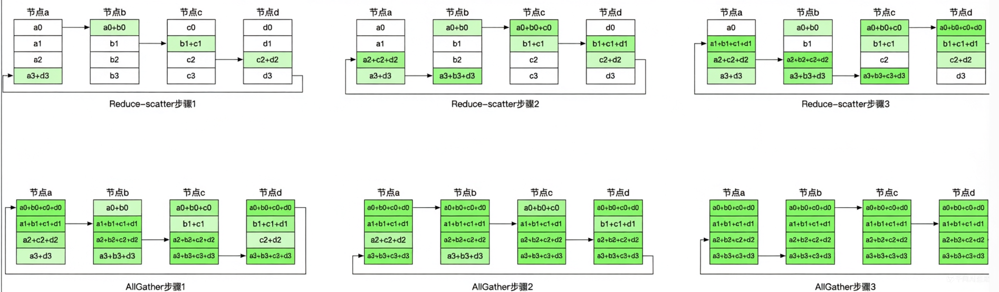

训练一个百亿参数的模型，单卡显存放不下，单机算力不够快。分布式训练要解决的核心问题只有两个：**怎么把模型/数据拆开分给多张卡，以及拆完之后怎么同步**。

这篇文章从底层原语讲到上层并行策略，把分布式训练的知识体系串起来。

---

## 1. 训练一个大模型需要多少显存？
在讨论“怎么拆分模型”之前，我们先来算一笔账：先搞清楚显存都花在哪里。以一个参数量为 $\Phi$ 的模型为例，为了平衡计算速度和数值稳定性，大模型通常采用**混合精度训练**（`Mixed Precision Training`）。以最常见的 FP16 前向计算 + FP32 优化器状态更新为例：

| 组成部分 | 精度 | 每参数字节数 |
|:---|:---|:---|
| 模型参数（前向副本） | FP16 | 2 |
| 梯度 | FP16 | 2 |
| 主权重（Master weights） | FP32 | 4 |
| Adam 一阶矩（m） | FP32 | 4 |
| Adam 二阶矩（v） | FP32 | 4 |
| **合计** | | **16 字节/参数** |

这是 Megatron-LM 的默认配置：**梯度以 FP16 传递，只在优化器内部转为 FP32 做参数更新**。（部分框架(如原生PyTorch DDP)可能会以 FP32 格式保留梯，则梯度项变为 4 字节）

- 模型状态显存：一个 70B 参数的模型，按 16 字节算需要约 **1120 GB** 显存，还没算前向激活值。一块 A100（80GB）完全放不下，必须拆开。
- 动态显存开销：这还没算上**前向传播产生的激活值**(Activations)。激活值的大小随 Batch Size 和序列长度线性增长，在长文本训练中往往又是数百 GB 的开销。

因此，我们必须横跨多个维度对模型进行拆解，这便引出了分布式训练的三大支柱：`数据并行`(DP)、`张量并行`(TP) 和 `流水线并行`(PP)。

---

## 2. 集合通信原语 (Collective Communication Primitives)
并行训练的本质是多个进程共同完成一个计算任务，执行过程中需要交换数据。所有的通信操作都建立在几个基本原语上，理解它们是理解并行策略的前提。
分布式训练的本质是多个计算设备（**Rank**）协作完成同一任务。
- 为了保证参数更新的一致性，设备间需要频繁交换数据。这些复杂的交换逻辑都被抽象成了几类标准的**集合通信原语**。
- 在 NVIDIA 显卡上，这些操作通常由 **NCCL (NVIDIA Collective Communications Library)** 高效实现。
### AllReduce
将所有进程的数据按指定运算（通常是求和Sum）聚合，结果广播回所有进程。
```text
Rank 0: [1, 2]                 Rank 0: [6, 8]
Rank 1: [2, 3]  ──AllReduce──> Rank 1: [6, 8]
Rank 2: [3, 3]                 Rank 2: [6, 8]
```
*   **典型用途**：数据并行(DP)中的梯度同步。每个进程(一般认为遵循1Process绑定1GPU)算出自己batch的局部梯度后，通过 AllReduce 确保所有进程拿到的都是全局平均梯度。
*   **核心实现**：**`Ring AllReduce`**
    在单机多卡或万兆网环境下，最常用的实现是 **Ring环形算法**。它将数据切成 $N$ 份，通过 $N-1$ 次 **Reduce-Scatter** 和 $N-1$ 次 **AllGather** 两个阶段完成。
    1. **`Reduce-Scatter`**：在每一轮中，Rank $i$ 将持有的一个分块(第一次是第i分块)传给右邻居 Rank $i+1$，邻居收到后将其与本地对应位置的分块**相加**。实现沿环传播并累加，最终经过 $N-1$ 轮每个进程都会持有全局和的一个分块。
    2. **`AllGather`**：将各进程持有的那个全局和分块沿环广播，最终所有进程拿到完整的全局和
    *   **通信量分析**：总通信量为 $2 \cdot (N-1) \cdot \frac{DataSize}{N}$。（如果是中心化方案O(2N)，全连接方案O(2(N−1))，卡越多，通信越慢）
    *   **核心优势**：通信带宽不随卡数 $N$ 的增加而增加，能完美压榨 NVLink 或 InfiniBand 的带宽。


> 虽然 Ring AllReduce 在数学上非常完美，但在真实的工程环境下，它面临严峻的**木桶效应(Straggler Problem)**：
>   1.  **坍缩风险**：Ring算法是强同步的。如果环中有一张显卡因为散热不佳导致降频或者某条网线质量抖动，整条环的同步速度都会瞬间坍缩到那个最慢节点的水平。
>   2.  **异构困境**：在混合部署了不同代际 GPU 的集群中，标准 Ring 算法无法发挥快卡的优势，算力会被白白浪费在等待慢节点上。
>   3.  **工业界对策**：
>     *   **分层通信(Hierarchical)**：先机内（NVLink）同步，再机间（IB）同步，缩小慢节点的影响范围。
>     *   **算法切换**：在节点能力不均或规模极大时，NCCL 会自动从 Ring 切换到 **Tree AllReduce**（树状算法），利用 $\log N$ 的延迟结构来缓解单点阻塞带来的连锁反应。
>     *   **手动配平**：如 `nanotron` 等框架允许在流水线并行中，根据各节点的能力手动调整计算负载（给慢卡少分几层层，给快卡多分几层）。

### Broadcast / Point-to-Point
- Broadcast 是 1 对 N 的通信，常用于初始化同步（如把 Rank 0 的模型参数广播给其他 Rank）。
- P2P(Send/Recv)是进程间直接传递数据，流水线并行中相邻阶段传递激活值就用 P2P。

---

## 3. 数据并行 (Data Parallelism)
数据并行(DP)的核心逻辑是：**模型不动，数据拆分**。
### 3.1 核心原理：算力的横向扩展
在数据并行中，**每张显卡(Rank)都维护一份完整的模型参数**。训练时，全局的 Batch Data 被均匀切分并分发到各个 Rank 上。
*   **前向传播**：各显卡独立计算自己那份数据的 Loss。
*   **反向传播**：各显卡独立计算出局部梯度Local Gradients。
*   **同步更新**：通过我们前面提到的 **AllReduce** 原语，所有 Rank 交换并聚合梯度，算出全局平均梯度，最后各自更新本地模型。

### 3.2 PyTorch DDP 的工程艺术：Bucket 与 Overlap
单纯的“计算完成后再同步”会导致 GPU 在通信期间处于闲置状态。PyTorch 的 **`DDP`(DistributedDataParallel)** 引入了两项关键优化，极大提升了吞吐量：
1.  **梯度通信与计算重叠 (`Overlap`)**：
    DDP 不会等整个反向传播结束才开始通信。相反，它利用了反向传播“自底向上”的特性——当模型最后一层的梯度计算完成时，这一层的 AllReduce 就可以**立刻发起**。此时，前面的层仍在进行梯度计算。这种方式将庞大的通信延迟隐匿在了计算时间里。
2.  **分桶机制 (`Bucketing`)**：
    由于大模型拥有成千上万个细碎的参数矩阵，如果每个参数都发起一次 AllReduce，网络握手的开销（Latency）将直接拖垮系统。DDP 将多个参数的梯度打包进一个**桶(Bucket)**中，当一个桶填满后，触发一次聚合通信。这显著减少了网络往返次数，提升了带宽利用率。

### 3.3 数据并行的局限：显存墙
尽管数据并行在算力扩展上表现优异，但它有一个致命的弱点：**显存冗余**。
*   **每张卡都要存一份完整的模型状态**。
*   正如我们在第一章算的账：一个 70B 模型仅参数和优化器状态就需要 ~1120 GB 显存。如果单卡只有 80GB，你无论堆多少张卡做 DP，模型都依然塞不进显卡。
*   这就是所谓的**显存墙**：数据并行可以让你算得更快，但它无法让你放得下更大的模型。要突破这道墙，我们需要更细粒度的拆分策略——**张量并行(TP)** 和 **流水线并行(PP)**。

---

## 4. 张量并行（Tensor Parallelism）
张量并行(TP)（也叫层内模型并行）的核心思路是：将模型每一层的权重矩阵 $W$ 直接切开，分给多张卡并行计算，最后再把结果拼回来。
- 这是解决单卡“显存墙”最直接的手段，其理论基础是**矩阵乘法的可结合性**。
### 4.1 $f$ 与 $g$ 算子：前向与反向的对偶
Megatron-LM 论文巧妙地定义了两个算子来自动化处理 TP 中的数据流。理解它们，就理解了 TP 的底层通信逻辑：
*   **$f$ 算子**：
    *   **前向**：直接透传。每张卡拿到相同的完整输入 $X$。
    *   **反向**：对梯度做 **AllReduce**，将各卡对相同输入的梯度累加。
*   **$g$ 算子**：
    *   **前向**：对输出做 **AllReduce**。将各卡算出的局部结果聚合，得到完整的输出。
    *   **反向**：直接透传。将梯度分发(Identity)给各卡。

$f$ 和 $g$ 是一对**对偶算子**：把 $f$ 放在列并行 GEMM 的入口，$g$ 放在行并行 GEMM 的出口，就构成了一次完整的张量并行计算——前向只有 $g$ 通信（1 次 AllReduce），反向只有 $f$ 通信（1 次 AllReduce）。

### 4.2 列并行与行并行
对于一个矩阵乘法 $Y = X \cdot W$，有两种切法：
1. **列切分**(Column Parallel)：将 $W$ 按列切成 $[W_1, W_2]$，每张卡算出 $Y$ 的一列：
$$[Y_1, Y_2] = [X \cdot W_1,\ X \cdot W_2]$$
入口套 $f$，前向时输入 $X$ 直接广播给各卡（不通信），反向时梯度 AllReduce。
2. **行切分**(Row Parallel)：将 $W$ 按行切成 $\begin{bmatrix}W_1 \\ W_2\end{bmatrix}$，同时将输入 $X$ 按列切成 $[X_1, X_2]$：
$$Y = X_1 \cdot W_1 + X_2 \cdot W_2$$
出口套 $g$，前向时局部结果 AllReduce 聚合，反向时梯度直接分发给各卡。

### 4.3 MLP 层的切分
标准 MLP：$Z = \text{Dropout}(\text{GeLU}(X \cdot W1) \cdot W2)$
```text
输入 X ── f (Copy) ──> 每卡拿到完整 X (无通信)
    ↓ 
列并行: GEMM 1 ──> 与 W1 的列切分 [W1₁, W1₂] 相乘 → 局部输出 [Y₁, Y₂]
    ↓
GeLU (非线性激活) ──> 独立计算 GeLU(Y₁), GeLU(Y₂) (无通信)
    ↓
行并行: GEMM 2 ──> 与 W2 的行切分 [W2₁; W2₂] 相乘 → 局部输出 Z₁, Z₂
    ↓
Z₁ + Z₂ ── g (AllReduce) ──> 得到完整输出 Z
```
**为什么要“先列后行”？**
关键在于中间的 **GeLU 非线性函数**。由于 $\text{GeLU}(A+B) \neq \text{GeLU}(A) + \text{GeLU}(B)$，如果我们先做行切分，就必须在进入 GeLU 之前做一次 AllReduce。而采用“列切分接行切分”，**整个 MLP 层在前向和反向都各自只需要 1 次 AllReduce**，将通信开销降到了最低。

### 4.4 Self-Attention 层的切分
Attention 层的切分更加天然：**按多头(Multi-Head)切分**。
*   **Q, K, V 投影**：采用**列切分**。每张卡负责若干个完整的 Head。
*   **计算**：各卡独立计算各自 Head 的 Attention，无需跨卡交换数据。
*   **输出投影(Dense)**：采用**行切分**。最后通过一次 **$g$ 算子 (AllReduce)** 将所有 Head 的结果聚合。
结果：整个 Attention 块同样只需 **前向 1 次、反向 1 次 AllReduce**。
两个块加起来，一个完整 Transformer 层：**前向 2 次 AllReduce，反向 2 次 AllReduce，共 4 次**。

### 4.5 TP 的代价：
虽然 TP 极大缓解了单卡显存压力，但它是有代价的：
1.  **通信量与激活值成正比**：每次通信量为 $2 \cdot \frac{t-1}{t} \cdot (b \cdot s \cdot h)$。这意味着 Batch Size 或 序列长度s 越大，通信开销越重。
2.  **强同步瓶颈**：由于 TP 是在“层内”切分，每一层计算都必须等待 AllReduce 完成才能进入下一层。
3.  **硬件要求苛刻**：TP 的通信频率极高，要求卡间通信带宽极高，一旦走机间的低速网络（如千兆网），训练速度会断崖式下跌。
    *   **工程准则**：**TP 通常只在机内执行**（如NVLink/NVSwitch），利用 **NVLink**（数百GB/s）实现高速同步。跨机则交给通信频率较低的 PP（流水线并行）或 DP（数据并行）。

### 4.6 显存收益：不仅是参数
TP 对显存的节省是全方位的：
*   **权重参数**：分摊到了 $t$ 张卡上，每张卡只占 $1/t$
*   **优化器状态**：同样随权重分摊，每张卡只占 $1/t$
*   **激活值**：在非并行区域（如 $f$ 算子后）激活值是全量的，但在并行计算区域，中间结果也被切分成了 $1/t$

---

## 5. 序列并行 (Sequence Parallelism)
- 张量并行(TP)解决了权重矩阵(GEMM)的切分，但在显存管理上有一些算子被它遗漏了：**LayerNorm 和 Dropout**。

在标准 TP 架构中，为了保证**残差连接(Residual Connection)**时的一致性，行并行之后的 `AllReduce` 会让所有显卡都有一份完全相同的 $(b, s, h)$ 全量激活值。这意味着随后的 LayerNorm 和 Dropout 会在每张卡上进行完全重复的计算。

### 5.1 核心思路：按需交换的内存管理艺术
序列并行（Sequence Parallelism，Megatron-LM v3 提出）的本质是一种**按需交换的内存管理艺术**，其做法是：在 GEMM（矩阵乘法）区域选择切开隐藏层维度(Hidden Size)，在非 GEMM 区域（LayerNorm、Dropout、残差连接），改切 **序列维度(Sequence Length)**。
*   **TP 的局限**：在进入 LayerNorm 之前，数据处于“完整序列”状态。
*   **SP 的解法**：在非并行区域（LayerNorm、Dropout、Residual Connection），将序列 $s$ 均分为 $t$ 份。每张卡只负责计算其中一段 $s/t$ 的序列。
    *   P.S. SP 切分的区域有一个共同特点：它们是**逐元素(Element-wise)**或在序列维度上独立的。这些算子在计算 Token A 时不需要 Token B 的信息，完全不会影响 LLM 的理解能力和输出结果。

### 5.2 通信变化：AllReduce → Reduce-Scatter + AllGather
序列并行**`并没有引入额外的通信开销，只是重新排列了通信的顺序`**。

我们在第二章讲过，一个完整的 **AllReduce** 在底层是由 **Reduce-Scatter** 和 **AllGather** 两个阶段组成的。SP 只是将这两个阶段“拆散”并“嵌入”到了计算流中：
| 位置 | 原 TP | SP+TP |
|:---|:---|:---|
| 列并行 GEMM 前 | $f$（无通信） | **AllGather**（拼回完整序列） |
| 行并行 GEMM 后 | $g$（AllReduce） | **Reduce-Scatter**（切分序列并累加） |
AllReduce 本来就等于 Reduce-Scatter + AllGather，**通信总量不变**，但把数据在"序列分片状态"和"完整状态"之间来回转换，让 LayerNorm/Dropout 只在序列分片上运行，从而节省了这部分的激活值显存。

### 5.3 显存收益
1. 单层Transformer激活值的构成（**约34bsh**）：
   - **多头注意力模块**（约12bsh）
     - QKV矩阵各1bsh共3bsh; 注意力输出中间结果1bsh; 多头注意力最终输出Dense层1bsh; LayerNorm中间变量均值和方差2bsh; 其他残差连接/点乘操作约5bsh; 
   - **MLP模块**（约22bsh）
     - 第一个线性变换维度扩增4h输出4bsh; 激活函数输出4bsh; 第二个线性变换维度回归1h输出1bsh; LayerNorm中间变量2bsh; 其他辅助计算（dropout等）约11bsh
2. 以一个典型配置（$b=4, s=4096, h=8192, t=8$）为例：
- 单个 Transformer 层的激活值（不含参数）≈ $2bsh$ 字节（FP16/BF16）
  - TP 下 LayerNorm/Dropout 激活：每卡 $2 \times 4 \times 4096 \times 8192 = 268 \text{MB}$（全量），8卡集群共浪费了约 1.9GB 的重复空间。
  - SP 下：每卡只有 $s/t = 512$，降为 **33.5 MB**，并消灭了冗余的显存占用。

### 5.4 黄金前提：`FlashAttention` 的 IO 感知变革
在讨论序列并行SP的收益前，必须先搬掉显存占用中最大的一座山：**注意力矩阵的 $O(s^2)$ 爆炸。**
#### 1. 痛点：被读写速度拖累的 GPU
研究发现，标准 Attention 的瓶颈不在于“算力”（浮点运算），而在于**显存带宽**。
*   **HBM**：显存容量大但读写慢。
*   **SRAM**：片上缓存速度极快但容量极小（仅几百KB）。

**标准 Attention 的“搬运灾难”**：
它频繁地在 HBM 和 SRAM 之间搬运那个巨大的 $s \times s$ 注意力得分矩阵。当序列长度 $s=128K$ 时，这个矩阵会吞掉数百 GB 显存。由于读写速度远慢于计算速度，GPU 大部分时间都在“赶路”（搬运数据），而不是“干活”（计算）。

#### 2. FlashAttention 的解法：IO 感知 (IO-Aware)
FlashAttention 不改变数学公式，它只改变**计算过程**。通过两大核心技术，它将显存占用从 **$O(s^2)$ 降为线性 $O(s)$**：
*   **分块计算(`Tiling`)**：
    它将 $Q, K, V$ 矩阵切成能塞进 SRAM 的小块，在缓存里直接完成注意力分数的迭代计算。这意味着**那个巨大的 $s \times s$ 矩阵根本不会被写回显存HBM**，它只存在于极速的片上缓存中，随用随弃。
*   **重计算(`Recomputation`)**：
    在反向传播时，FlashAttention 不去显存里读取前向传播时存下的结果，而是利用前向存下的少量统计量，**当场重新算一遍**。
    *   **直觉违背但工程正确**：在现代 GPU 上，重算一遍矩阵乘法的时间，远比从慢速显存里读取一个巨型矩阵的时间要短。**`以计算换IO`**是它的核心精髓。

#### 3. 强强联手：FlashAttention 与 SP 的分工
*   **FlashAttention 负责解决“算得动”的问题**：
    它消灭了 $O(s^2)$ 的激活值显存占用瓶颈。如果没有它，注意力矩阵会直接导致硬件层面的 OOM（显存溢出）。
*   **序列并行 (SP) 负责解决“存得下”的问题**：
    在 FlashAttention 搬走 $s^2$ 这座大山后，LayerNorm 和 Dropout 产生的 $O(bsh)$ 冗余便成了新的瓶颈。SP 通过切分序列维度，消灭了这部分“人手一份”的浪费。

**结论**：在长上下文场景（$s \geq 32K$）中，**FlashAttention 保证了单层计算的物理可行性，而序列并行（SP）则通过消除架构冗余，让整体训练吞吐量实现了质的飞跃。** 它们共同构成了现代大模型支持超长文本训练的底层基石。

---

## 6. 流水线并行 (Pipeline Parallelism)
如果说张量并行(TP)是在“横向”切分每一层的宽度，那么流水线并行(PP)就是在“纵向”切分模型的深度。其核心思路是：**将模型的 $L$ 层划分为多个阶段Stages，分发到不同的设备上，数据像流水线作业一样在设备间传递。**

最朴素的做法（GPipe）：把 batch 分成若干 micro-batch，依次流过流水线。

### 6.1 流水线气泡(Pipeline Bubble)
*   **痛点**：由于层与层之间存在前向依赖（必须拿到上一层的输出）和反向依赖（必须拿到下一层的梯度），设备在等待数据时会产生空闲时间，这被称为**流水线气泡(bubble)**: 在填充（warm-up）和排空（drain）阶段，大量设备是空闲的。
*   **量化分析**：
    假设流水线有 $p$ 个阶段，每个前向步耗时 $t_f$，反向步耗时 $t_b$。
    *   **气泡总时长**：$t_\text{bubble} = (p-1)(t_f + t_b)$。这是流水线从“开始填充”到“最终排空”所浪费的总时间。
    *   **气泡占比**：
        $$\text{Bubble Ratio} = \frac{p-1}{m}$$
        *(注：当 $m \gg p$ 时，气泡占比被稀释。**工程约束**：虽然增大 $m$（微批次数量）可以降低 bubble 比例，但这也意味着需要在显存中同时缓存更多 Micro-batch 的激活值，易触发 OOM)*

### 6.2 `1F1B` 调度 (One-Forward-One-Backward)
为了打破“增加 $m$ 必然导致显存爆炸”的僵局，Megatron-LM v2 引入了 **1F1B** 调度策略。

核心思想：不再等所有 Micro-batch 跑完前向才开始反向。一旦流水线填充完成，每个设备就进入“**一个前向接一个反向**”的稳定循环。
```
时间 →
Rank 0: [1F][2F][3F] | [4F][1B] [5F][2B] [6F][3B] | [4B][5B][6B]
Rank 1:     [1F][2F] | [3F][1B] [4F][2B] [5F][3B] [6F][4B] | [5B][6B]
Rank 2:         [1F] | [2F][1B] [3F][2B] [4F][3B] [5F][4B] [6F][5B] | [6B]
Rank 3:              | [1F][1B] [2F][2B] [3F][3B] [4F][4B] [5F][5B]   [6F][6B]
                     ↑ 稳定态(1F1B 循环)相比 GPipe，气泡显著减少
```
1F1B 的关键改进不只是气泡——更重要的是**显存占用变成了常数**：
- 流水线深度为 $p$ 的 GPipe 在 warm-up 阶段所有设备一起堆积前向激活，同时在内存中驻留的 micro-batch 数量可达 $p \cdot m$
- 1F1B 稳定态下，每个设备同时持有的 micro-batch 激活数量固定为 **$p$ 个**（不随 $m$ 增大），这是 1F1B 最核心的工程价值。

> 通信算子: P2P 设备通常使用 `torch.distributed.batch_isend_irecv`

### 6.3 交错式流水线 (Interleaved Pipeline)
为了进一步榨干硬件性能，Megatron-LM 提出了**虚拟流水线(Virtual Pipeline)**概念，即交错式调度。（本质是**用通信频繁度换计算连续性**）
*   **做法**：每个设备不再负责连续的一大块层，而是负责多个**不连续的层块(Layer Chunks)**。
    *   *例：设备 0 负责第 1-2 层和第 9-10 层；设备 1 负责第 3-4 层和第 11-12 层。*
*   **优势**：通过缩短每个阶段的计算跨度，气泡占比进一步降低为：
    $$\text{Bubble Ratio} \approx \frac{p-1}{v \cdot m}$$
    *(其中 $v$ 为每个Rank的分块数。)*
*   **代价**：每个 Rank 每次 micro-batch 的通信次数由 2 次变为 $2v$ 次，通信量增加，这带来了更频繁的 **P2P 通信**。如果设备间带宽不足，这种优化可能会因小失大。

---

## 7. ZeRO：数据并行(DP)的显存优化
`ZeRO` (Zero Redundancy Optimizer，DeepSpeed 提出)的核心洞察：传统数据并行(DP)中，每张卡都存了**完全相同**的模型状态（参数、梯度、优化器状态），这是冗余的，只应该在需要计算的时候通过通信临时“借”过来用一下，用完立刻释放。

ZeRO 分三个阶段逐步消除这些冗余：
### ZeRO-1：切分优化器状态 (Optimizer State Sharding)
这是性价比最高的一步。回忆第一章的账本，Adam 优化器状态（$m$ 和 $v$）占据了显存的“大头”（约 12 字节/参数）。
*   **做法**：模型参数和梯度依然每卡一份，但优化器状态按 $N$ 张卡均匀切分。每张卡只负责更新自己那 $1/N$ 的参数。
*   **收益**：优化器显存占用从 $12\Phi$ 降至 $12\Phi/N$。
*   **通信**：几乎没有额外通信。

### ZeRO-2：切分梯度 (Gradient Sharding)
在 ZeRO-1 的基础上，进一步切分梯度。
*   **做法**：反向传播计算出的梯度不再进行 `AllReduce`（所有人拿全量），而是进行 `Reduce-Scatter`。每张卡只保留属于自己负责更新的那 $1/N$ 块梯度。
*   **收益**：梯度显存占用从 $2\Phi$ 降至 $2\Phi/N$。
*   **通信**：依然是 $2\times$ 数据量（与 DDP 持平），效率极高。

### ZeRO-3：切分参数 (Parameter Sharding)
这是最彻底的“无冗余”方案，也是 **`FSDP`(Fully Sharded Data Parallel)** 的理论原型。
*   **做法**：连模型参数 $\Phi$ 也切开，每张卡只存 $1/N$。
*   **计算流**：
    *   **前向**：计算某一层时，通过 `AllGather` 从邻居那里把参数临时抓过来，算完立刻丢弃。
    *   **反向**：同理，算梯度前抓参数，算完丢弃。
*   **收益**：模型参数显存占用从 $2\Phi$ 降至 $2\Phi/N$。**理论上，只要卡够多，你可以训练无限大的模型。**
*   **代价**：通信量增加了约 50%（前向多了一次参数收集）。

| 阶段 | 显存单卡占用 (FP16) | 额外通信量 | 适用场景 |
| :--- | :--- | :--- | :--- |
| **原生 DP** | $16\Phi$ | 0 | 小模型 |
| **ZeRO-1** | $4\Phi + 12\Phi/N$ | 0 | 显存略微吃紧 |
| **ZeRO-2** | $2\Phi + 14\Phi/N$ | 0 | 主流大模型训练标配 |
| **ZeRO-3** | $16\Phi/N$ | 1.5倍总通信量 | 单卡放不下参数的极巨型模型 |

### 7.4 Distributed Optimizer：Megatron-LM的极致实现
在 Megatron-LM（v3 之后）的语境中，ZeRO-1/2 的功能被整合重构为一个叫做 **Distributed Optimizer** 的模块。它与 DeepSpeed 的 ZeRO 虽然目标一致，但在 3D并行(DP, TP, PP)架构下的执行逻辑有显著区别：
*   **DeepSpeed ZeRO**：将模型看作一个平坦的参数列表，在 DP Group 内做梯度和优化器状态的分片，与 TP 独立
*   **Megatron Distributed Optimizer**：耦合3D并行,在 TP Group 内在反向传播就做优化器状态的分片，TP 负责切分权重和激活，DP 负责切分梯度和优化器状态。

---

## 8. 显存优化技术
除了三维并行策略，工程上还需要几项关键技术来进一步压榨硬件性能。

### 8.1 激活重计算 (Activation Checkpointing)
前向传播产生的激活值（约 $34bsh$）是训练时的显存大户。
*   **策略**：前向传播时只保存部分“检查点(checkpoint)”（如 Transformer 层的输入），反向传播时若需要中间激活值，则从最近的检查点重新计算。
*   **权衡**：**以时间换空间**。通常增加约 33% 的计算量，但能将激活值显存从 $O(L)$ 降至 $O(\sqrt{L})$。
*   **与 FlashAttention 的关系**：FlashAttention 本质上是**算子级的、更高效的“重计算”**（针对 $s^2$ 项）。用了 FlashAttention 后，全局重计算的需求会显著降低。

实践中通常以 Transformer 层为粒度打 checkpoint，在显存和计算量之间取得较好的平衡。
### 8.2 混合精度训练 (Mixed Precision)
FP32 精度虽好但太占显存且计算慢；FP16 显存减半但易溢出。混合精度实现了两者的平衡：
*   **FP16/BF16**：用于前向和反向计算，加速 GEMM 算子。
*   **FP32 (Master Weights)**：用于优化器更新参数，确保模型收敛。
*   **BF16 的优势**：其指数位宽与 FP32 一致(8 bit)，天然解决了 FP16 容易数值下溢(Underflow)的问题，目前已成为 A100 以上 GPU 训练的主流选择。
### 8.3 梯度裁剪的分布式同步 (Global Norm Clipping)
梯度裁剪是防止 Loss 爆炸的关键。但在分布式环境下，这并不是一个本地操作：
*   **隐形通信点**：必须计算 **Global Norm** $\sqrt{\sum \|g_i\|^2}$。由于梯度分片存在于 TP 和 DP 组中，必须先做一次 **AllReduce** 汇总各卡的梯度平方和，再进行裁剪。
*   **避坑指南**：这个同步点发生在反向传播结束、优化器更新之前。如果通信频率过高（微调场景），这个隐形的 AllReduce 也可能会成为瓶颈。
### 8.4 梯度累积 (Gradient Accumulation)
想用大 Batch 但显存不够？梯度累积可以模拟“逻辑上的大 Batch”：
*   **原理**：在 $k$ 个步长内只做 `backward` 并累加梯度，不进行 `optimizer.step()`。
*   **优化**：在累积步期间，DDP 必须开启 `no_sync()` 模式，禁止昂贵的 `AllReduce` 梯度同步。只有在第 $k$ 步更新时才触发一次通信，从而将通信开销平摊到多个计算步中。

---

## 9. 小结
分布式训练的艺术，本质上是一场关于**带宽(Bandwidth)、显存(Memory)与算力(Compute)**的动态博弈。没有一种并行策略是万能的：
*   **数据并行 (DP/DDP)**：**模型不动，数据拆分**。每张显卡都维护一套完整的模型参数，仅在反向传播时同步梯度。它的优势是逻辑简单、通信重叠性好，但缺点是显存冗余极高（每张卡都要重复存储一样的参数）。
*   **ZeRO (及 FSDP)**：**数据并行的“极致优化版”**。它保留了 DP 的数据拆分逻辑，但**把模型状态（参数、梯度、优化器状态）也切开分给不同卡存储**。它通过在计算前临时收集参数、计算后立刻释放的方式，消除了 DP 中的显存冗余，是训练超大规模模型的基石。
*   **张量并行 (TP)**：**层内拆分**。将模型每一层的权重矩阵直接切开，解决了单卡放不下单个超大算子的问题。但它通信极其频繁，通常只建议在机内 **NVLink** 环境下使用。
*   **流水线并行 (PP)**：**纵向切分**。将模型按层分段给不同设备，支持模型跨机扩展。它虽然通信量小，但存在硬件空闲（流水线气泡）的问题，需要通过 **1F1B** 等调度算法优化。

**3D 并行的本质，是根据你的物理带宽（机内NVLink 或 机间万兆网）和模型规模，在上述维度中寻找让硬件利用率(TFLOPS)达到峰值的最优解。**

如果你不想看 DeepSpeed 里为了兼容性而堆砌的“冗余”代码，想看最纯粹的**干货**工程实现，Hugging Face 的 **[nanotron](https://github.com/huggingface/nanotron)** 是最好的教科书。它摒弃了过度的抽象，用最直观的代码展示了如何通过 `ParallelContext` 划分三维并行的通信组。理解了 `nanotron`，你就真正掌握了从论文公式到万卡调度的那一座桥梁。
