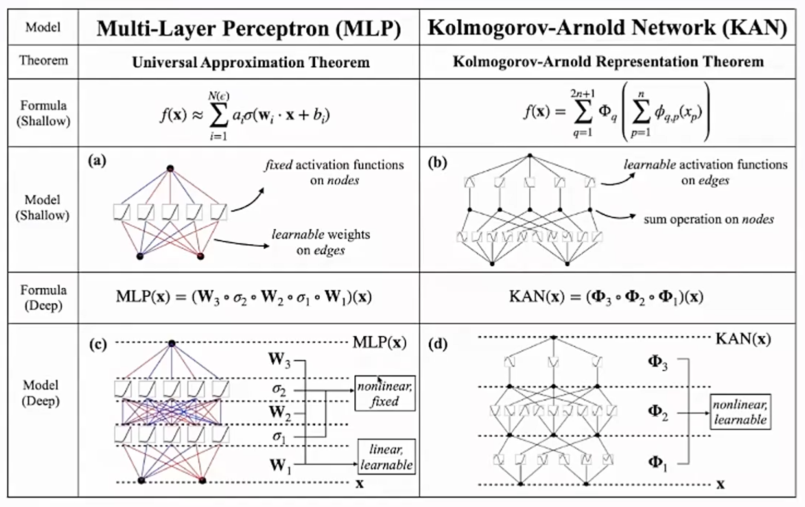

这是一篇我自己的论文的复盘博客。**MS-WavKAN**(Multi-Scale Wavelet-integrated Kolmogorov-Arnold Network)

https://journals.sagepub.com/doi/10.1177/09544062261477826

- 把 KAN 里的 B-spline 激活基函数换成**可学习的 Morlet 小波**，接在多尺度 1D-CNN 编码器后面，用 **71k 参数** 在强噪声(-6dB SNR)下做轴承故障的 10 分类，在跨负载跨转速的真实损伤数据集上打参数对齐的 MLP / LSTM / Transformer / B-spline KAN 基线。

---

# 1 研究背景：滚动轴承失效机理与故障诊断原理
## 1.1 滚动轴承结构组成
滚动轴承作为旋转机械的核心支承部件，承担转轴定位、降低摩擦损耗的功能。电机运转过程中，转轴依靠轴承实现稳定旋转，避免转轴与机架直接摩擦。轴承主要由四类构件组成：

| 零件 | 英文名称 | 功能描述 |
|---|---|---|
| 内圈 | inner race | 装配于转轴外侧，随轴同步旋转 |
| 外圈 | outer race | 固定于轴承座内，保持静止 |
| 滚动体 | rolling element(本数据集共9个钢珠) | 介于内外圈之间，将滑动摩擦转化为滚动摩擦 |
| 保持架 | cage | 均匀分隔滚动体，避免滚动体相互碰撞磨损 |

轴承运行过程：转轴带动内圈旋转，内圈推动滚动体实现自转与公转，保持架约束滚动体运动轨迹，外圈保持静止。

**故障产生机理**：长期交变接触应力会造成滚道、滚动体表面产生局部剥落、点蚀，形成缺陷区域。本文所用CWRU数据集采用电火花加工(EDM)人为预制缺陷，缺陷直径分为0.007 in、0.014 in、0.021 in(约0.18 mm、0.36 mm、0.53 mm)，最小缺陷尺寸仅略大于头发丝直径。

工程统计表明，约40%~50%的电机故障由轴承缺陷引发，因此轴承状态监测是机械设备预测性维护的核心研究对象。

## 1.2 故障信号特征：周期性冲击序列与阻尼振铃
当滚动体滚过表面缺陷时，会产生瞬时机械冲击。多个滚动体依次经过缺陷区域，形成**周期性冲击序列**，冲击间隔由轴承几何参数与转轴转速共同决定(推导详见2.3节)。

传感器采集到的信号并非理想脉冲序列，而是**阻尼振铃响应**。冲击可近似视作脉冲激励，宽带能量会激发轴承座、传感器装配体的结构共振。信号宏观表现为短时激励、指数衰减的正弦振荡：
$$
x(t) \approx A\, e^{-\zeta \omega_n t} \sin(\omega_d t)
$$

故障信号可概括为：按照轴承几何周期重复出现的阻尼振荡脉冲串。该信号形态(衰减包络叠加振荡载波)与Morlet小波形态高度吻合，这也是本文方法的核心物理依据，后续2.1、3节将再次展开论述。

## 1.3 信号采集方案与分类任务定义
故障诊断无需停机拆解设备：加速度传感器安装于轴承座外表面，采集振动加速度信号，获得一维时序数据。CWRU数据集驱动端采样频率设置为12 kHz；本文按照1024个采样点划分样本，对应时长约85 ms，采用z-score归一化，滑窗重叠率50%。

85 ms时间窗口具备明确物理意义：该窗口能够完整容纳约13.5个BPFI冲击周期、8.9个BPFO冲击周期、2.5个轴转周期(相关频率计算公式见2.3节)。窗口长度保障各类故障冲击序列在单样本内多次复现，便于模型完成跨周期特征提取。

本文构建**十分类任务**：类别包含正常状态，以及内圈故障、外圈故障、滚动体故障三类故障类型，每种故障对应3种不同损伤尺寸。

---

# 2. 三个 Primer：小波、KAN、轴承物理
## 2.1 小波是什么：从 FFT 的致命伤讲起
振动信号分析需要回答三个问题：**什么时间、什么频率、多大能量**。类比排查千万行服务日志：只统计出现过哪些故障类型(频率成分)远远不够，还必须定位故障爆发的时段与时长(时间信息)。

### **FFT**：快速傅里叶变换将信号映射至全局频谱，但全局积分的特性会彻底抹去时间维度信息。。

$$
X(f)=\int x(t)\,e^{-i2\pi ft}\,dt
$$

基函数 $e^{i2\pi ft}$ 时间域无限延展(从 $-\infty$ 到 $+\infty$)，所有局部瞬态冲击的能量都会被弥散至全频段。我们仅能获取信号整体的频率构成，这对故障诊断存在根本性短板：轴承局部冲击属于时域极窄、频域分布的宽带事件，恰好是时频不确定性原理的典型场景；环境背景噪声同样具备宽带特性。在全局频谱中，冲击特征与噪声难以区分。论文后文那张"-4dB 噪声下包络谱峰被淹没"的图(§2.3)，病灶就在于此。

### **STFT**：短时傅里叶变换 给 FFT 引入滑动窗口，但代价是锁死分辨率。
$$
X(\tau, f)=\int x(t)\,w(t-\tau)\,e^{-i2\pi ft}\,dt
$$

STFT 面临的核心矛盾：**固定的窗长无法适配全频段信号**。捕捉高频瞬态毛刺需要短窗保证时间定位精度；解析低频周期包络则需要长窗保障频率分辨能力。

- 而 **时频不确定性原理** $\Delta t \cdot \Delta f \ge \frac{1}{4\pi}$ 告诉我们：**时间定位与频率分辨率天然存在取舍 trade-off**。时间窗越窄频率分辨率越差，时间窗越宽时间定位越糊。STFT的处理是用固定窗口长度，并不好用。

### **小波 (Wavelet)**：窗长随频率自适应伸缩。
将STFT固定窗长×固定振荡的基函数，替换为尺度可连续伸缩的一族基函数。选定母小波 $\psi(t)$，依靠 尺度参数 $a$ 与 平移参数 $b$ 生成完整小波基函数族：

$$
\psi_{a,b}(t)=\frac{1}{\sqrt{a}}\,\psi\!\left(\frac{t-b}{a}\right)
$$

- **尺度 $a$ (scale)**：$a$ 增大，小波被拉伸，适配低频缓变信号(等效长窗，频率分辨率高)；$a$ 减小，小波被压缩，适配高频瞬态信号(等效短窗，时间定位精准)。
- **平移 $b$ (translation)**：控制小波沿时间轴滑动，完成时间维度定位。

### **Morlet小波** (本文选用的基函数)：
$$
\psi(t)=\underbrace{e^{-t^{2}/2}}_{\text{高斯包络}}\cdot\underbrace{\cos(5t)}_{\text{余弦载波}}
$$

两个因子各管一件事：
- $e^{-t^2/2}$：**高斯包络** 赋予 **时间局部性约束**。函数呈钟形快速衰减，$|t|>3$ 后幅值趋于零，基函数仅捕捉局部时段信号；相比矩形窗硬截断，有效抑制频谱泄漏。同时，高斯窗是时频不确定性极限下的最优窗函数，满足 $\Delta t \Delta f$ 理论下界。
- $\cos(5t)$：**余弦载波** 赋予 **频率选择特性**，能量集中于特定频带，实现频率筛选。

> Q: 为什么只取了实值部分？
> A: **复值形式与实值形式的选择**。标准 Morlet 小波为复值定义：$\psi_{\text{complex}}(t) = e^{-t^2/2} e^{i\omega_0 t} = e^{-t^2/2}[\cos(\omega_0 t) + i\sin(\omega_0 t)]$，虚部 $i\sin(\omega_0 t)$ 与实部构成希尔伯特变换对。
> 复值小波系数包含幅值与相位双重信息，可用于提取瞬时频率、分析相位耦合与调制特性、区分正负频率成分，以及实现信号精确重构(逆小波变换)。
> 本文采用其实值形式(仅取实部)，原因在于：本文任务为故障模式分类，KAN网络消费的是时频能量分布特征，实值小波的匹配滤波结果经平方后即可表征能量，相位信息对分类判别贡献有限；同时，将复值小波嵌入网络激活函数会引入复数域运算，导致梯度计算、参数更新复杂度显著上升，与本文轻量化设计目标相悖。对于实值振动信号，实值小波已完成带通滤波与模板匹配的职能，在诊断精度与计算开销之间取得合理平衡。

### **连续小波变换(CWT) 与 时频表(Scalogram)**
$$
W_x(a,b) = \int x(t) \cdot \psi_{a,b}(t) \,dt = \frac{1}{\sqrt{a}}\int x(t)\,\psi^{*}\!\left(\frac{t-b}{a}\right)\,dt
$$

小波系数表征：“信号 $x(t)$ 在时刻 $b$、尺度 $a$ ，信号与小波模板的相似程度，本质为匹配滤波运算”。遍历所有 $(a,b)$ 得到一张二维时频能量分布图：横轴时间b、纵轴尺度a( $f = f_c f_s / a$，其中 $f_c$ 为母小波中心频率，$f_s$ 为采样率)、像素强度代表信号能量——时频图(scalogram)。

可类比语音领域的log-mel频谱图：mel频谱依靠固定窗长FFT结合滤波器组生成；scalogram依托小波变换，窗长随频率自适应伸缩，具备恒Q特性。

> 现有方法大多将小波作为前端预处理模块：先完成时频变换，再送入网络学习特征，变换参数固定、不可训练。本文提出新思路：将小波嵌入网络激活函数，把尺度、平移参数设置为可学习变量。

### **与原版KAN的 B-spline 对照** 
原版的 KAN 采用 B样条(B-spline) 参数化 边函数：依靠分段多项式在节点处光滑拼接，通过控制点线性组合构造一维映射函数。B样条设计目标是通用函数逼近，天然追求曲线平滑、能够拟合任意形态，但缺乏信号结构先验。

本文总结其三大局限：函数平滑无振荡结构；基函数全局定义，不具备局部支撑特性；没有内嵌时频局部化语义，无法先验匹配冲击振铃形态。

同时原版KAN的参数量更大：每条边包含G=3区间、k=3阶共6个系数与SiLU残差权重，分类头参数量约13k；Morlet小波方案仅需2058个参数，参数量缩减约6倍。

## 2.2 KAN 是什么：把激活函数从节点搬到边上变成可学习的非线性变换函数
### 回顾 多层感知机 MLP 的基础结构：
$$
y = W_2\,\sigma(W_1 x)
$$

模型可学习参数只有边上的权重矩阵 $W_1, W_2$。非线性 $\sigma$(ReLU/GELU/SwiGLU)是**固定的、全网络共享的、装在节点上**的运算：激活函数的具体形式属于**超参数**，不参与梯度更新，且激活函数的选取对模型性能存在显著影响。

### **KAN**：
Kolmogorov-Arnold 网络(KAN，Liu et al. 2024)重构了网络拓扑：可学习的一维函数部署在边上，节点仅执行求和操作。
- KAN 的**优势**：**在特定场景下**(需要可解释性的科学建模；作为轻量级分类/回归头放在CNN/RNN等特征提取器后面；低维光滑函数逼近任务；**不适合**大规模CV/NLP/持续学习/高维数据等，并且其训练慢GPU不友好训练稳定性差)，参数效率高、可解释性强、平滑泛化好，在符号回归上占优。
    - 总体而言，KAN属于是**在特定场景下的补充，而非MLP的通用替代品**。

- **Kolmogorov-Arnold 叠加定理的直观理解与理论局限**：KAN 的命名源自1957年的Kolmogorov-Arnold叠加定理：$[0,1]^n$ 上任何多元连续函数都能写成：

$$
f(x_1,\dots,x_n)=\sum_{q=1}^{2n+1}\Phi_q\!\left(\sum_{p=1}^{n}\phi_{q,p}(x_p)\right)
$$

- 定理表明：多元函数拟合不一定依赖多元映射；数学上可证明，各输入变量先经过一维变换、线性叠加后再次经过一维变换，两层嵌套结构即可等价表征任意多元连续函数。

应用该定理构建KAN时，需要明确三条理论边界：
1. 定理仅为存在性证明，理论存在的一维映射可能形态病态；而实际KAN采用可学习光滑函数族，属于工程近似方案。
2. 现实中的深度KAN网络会堆叠多层、拓展宽度，早已超出定理原始的两层结构。
3. 定理**无法保证参数效率**；模型参数量、拟合能力**高度依赖基函数的选取**(e.g. 样条 vs 小波)。

本文用的前向公式：$y_i=\sum_{j=1}^{d_{\mathrm{in}}} w_{ij}\,\psi\bigl(a_j z_j + b_j\bigr)+c_i$

各符号含义：
- $z_j$：输入特征，本文为全局平均池化(GAP)后得到的48维特征向量分量；
- $a_j z_j+b_j$：对特征轴(输入变量)的仿射变换。注意 $a_j$ 作用于自变量实现横轴伸缩，区别于输出端的纵向缩放；
- $\psi(\cdot)$：**固定的** Morlet 母小波；
- $w_{ij}$：边权重，控制该支路的输出幅值，每条边独立；
- 求和到节点，加输出偏置 $c_i$。

模型可学习参数为 $w_{ij}, a_j, b_j, c_i$；母小波形状固定，优化目标为基函数的伸缩、平移与输出加权系数。

参数量核算**2,058参数**：两层 Wav-KAN (48→32→10)：
- 第 1 层：$w_{ij}$ 有 $32\times48=1536$ 个；$a_j$ 48 个、$b_j$ 48 个、$c_i$ 32 个 → 1,664；
- 第 2 层：$10\times32=320$ 个，$a_j$ 32 个、$b_j$ 32 个、$c_i$ 10 个 → 394。合计 **2,058**。

> 需要说明：相较于原始KAN，本文公式为轻量化参数压缩版本，属于工程层面的取舍。

## 2.3 轴承故障特征频率：几何决定的冲击节拍
滚动体依次碾过损伤区域，形成周期性冲击序列，冲击重复频率完全由轴承几何参数确定，常被称为轴承的“节拍器”。

定义两类核心**故障特征频率**(Fault Characteristic Frequency, **FCF**)：
$$
\mathrm{BPFO} = \frac{N}{2} f_r \left(1 - \frac{d}{D}\cos\beta\right), \qquad \mathrm{BPFI} = \frac{N}{2} f_r \left(1 + \frac{d}{D}\cos\beta\right)
$$

- **BPFO(Ball Pass Frequency, Outer race)**：外圈固定不动，单位时间内滚动体滚过外圈缺陷的次数；
- **BPFI(Ball Pass Frequency, Inner race)**：内圈随轴旋转，单位时间内滚动体滚过内圈缺陷的次数。

以CWRU数据集SKF 6205轴承、2 hp工况为例，代入参数计算：
| 符号 | 物理含义 | 数值 |
|---|---|---|
| $N$ | 滚动体数量 | 9 |
| $f_r$ | 转轴转频(轴转速≈1750 rpm) | ≈29.2 Hz |
| $d$ | 滚动体直径 | 7.94 mm |
| $D$ | 节径(滚动体中心圆直径) | 39.04 mm |
| $\beta$ | 接触角(纯径向载荷工况) | ≈0°，$\cos\beta\approx 1$ |

可得：$\mathrm{BPFO} \approx 104.6\ \text{Hz}$，$\mathrm{BPFI} \approx 157.9\ \text{Hz}$。对应周期(用于第4节感受野分析)：BPFI周期≈**6.3 ms**，BPFO周期≈**9.6 ms**，轴旋转周期≈34.2 ms(半转周期17.2 ms)。

### 内、外圈公式符号差异物理释义
将内外滚道类比两条传送带，滚动体夹在中间纯滚动。外圈静止、线速度为0；内圈随转轴运动。内圈与滚动体相对滑移速度更大，滚动体扫过内圈缺陷的频率更高，因此 $\mathrm{BPFI} > \mathrm{BPFO}$，公式中采用加号。

### 特征频率守恒关系
存在恒等关系：$\mathrm{BPFI} + \mathrm{BPFO} = N f_r$。代入数值验证：$157.9 + 104.6 = 262.5 \approx 262.8 = 9 \times 29.2$。滚动体与内外滚道总接触频次守恒，缺陷位于内圈或外圈仅改变冲击频次分配。

### 三类故障调制特性差异(直接影响分类难度)
不同位置故障不仅特征频率不同，信号幅值调制规律存在显著差异，该差异可解释模型混淆矩阵的分布规律：

| 故障位置 | 缺陷相对传感器运动状态 | 信号形态特征 | 可分性 |
|---|---|---|---|
| 外圈 | 保持静止 | 冲击幅值稳定，等间隔冲击序列 | 最高，冲击规律最强 |
| 内圈 | 随轴旋转，周期性进出承载区 | 冲击间隔保持BPFI，幅值受轴转频调制，形成呼吸包络(半转周期17.2 ms) | 中等，存在额外幅值调制 |
| 滚动体 | 同时自转与公转，交替撞击内外圈 | 受保持架频率调制，冲击周期性最弱 | 最低 |

### 低信噪比下传统方法失效分析
传统包络解调流程：人工选取共振频带→带通滤波→Hilbert变换提取包络→包络谱FFT，在BPFO/BPFI处识别谱峰。论文对比实验显示：高信噪比工况下，包络谱在≈157.9 Hz(BPFI)出现明显谱峰；注入-4 dB高斯白噪声后(噪声功率约为信号功率2.5倍)，BPFI谱峰被噪声淹没，基于峰值检测的诊断方法失效。

**性能差异内在原因**：传统方法完全依赖单一谱峰信噪比，特征谱峰被噪声覆盖则诊断失败；端到端深度学习模型融合多维度时序证据：85 ms窗口内十余个冲击周期的联合时序模式、多尺度感受野互补特征(4.2节)、批归一化抑制宽带噪声，同时利用全部类别先验信息。模型依靠整体特征分布完成判别，无需依赖单一显著谱峰。类比规则系统：单条规则失效即整体崩溃；学习型模型依靠特征组合实现鲁棒决策。

---

# 3. 核心思路：将小波嵌入激活函数
## 网络结构设计
原始KAN的边函数采用B样条参数化，本文将其替换为**固定形态的Morlet母小波叠加可学习仿射变换**，前向计算公式为：
$y_i=\sum_{j=1}^{d_{\mathrm{in}}} w_{ij}\,\psi\bigl(a_j z_j + b_j\bigr)+c_i$

模型可学习参数仅包含四类：$w_{ij}$(边权重，控制支路输出幅度)、$a_j$(尺度参数，控制横向伸缩)、$b_j$(平移参数，控制横向偏移)、$c_i$(节点偏置)。

## 结构先验与物理约束的边界
该设计引入的是**结构先验**，而非物理约束，二者存在本质区别。

- 本文利用Morlet小波的**形态特性**：高斯包络与余弦载波组合形成局部振荡结构，与轴承故障冲击振铃信号在形态上定性相似。
- 明确本文方法属于**小波结构化模型，而非物理信息神经网络(PINN)**。
    - 经典PINN将控制方程(偏微分方程)嵌入损失函数，作为软约束引导模型学习；本文损失函数不包含任何物理正则项，物理领域知识仅编码于模型假设空间的函数形态中。
- 该思路与卷积神经网络、旋转位置编码(RoPE)的设计哲学一致：通过架构本身偏置假设空间。优势在于不与损失函数产生冲突，无需引入额外权重超参数；局限性在于无法严格保证物理一致性。

## 尺度参数软截断策略
若允许 $a_j$ 无约束学习，训练过程易出现不稳定：当 $a_j$ 取值过小，激活函数近似退化为线性，模型拟合能力不足；当 $a_j$ 取值过大，激活函数高频振荡，容易引发逐样本过拟合，同时导数剧烈波动，造成梯度爆炸。

为此，本文采用sigmoid函数实现**软截断(soft-clamping)**：
$$a_j = 1.5\,\sigma\bigl(w_{a_j}\bigr) + 0.5 \;\in\; [0.5,\, 2.0]$$
无约束参数 $w_{a_j}\in\mathbb{R}$ 经sigmoid映射至 $[0,1]$，再线性缩放至 $[0.5,2.0]$ 区间。该方案全程可导，不存在硬裁剪带来的梯度死区。参数区间并非主观设定，消融实验(§7.1)对比多组候选范围，$[0.5,2.0]$ 在验证精度与训练稳定性之间取得最优平衡，位于Pareto前沿拐点。

对应反向传播梯度表达式(同步更新 $a_j$、$b_j$)如下：
$$\frac{\partial \mathcal{L}}{\partial a_{j}} = \sum_{i} \delta_{i} w_{ij}\,\psi'(\phi_{j})\, z_{j}, \qquad \frac{\partial \mathcal{L}}{\partial b_{j}} = \sum_{i} \delta_{i} w_{ij}\,\psi'(\phi_{j})$$
其中 $\phi_j = a_j z_j + b_j$，偏置参数 $b_j$ 初始化服从均匀分布 $\mathcal{U}(-1,1)$。

## 特征空间说明
需要特别说明：激活函数 $\psi(a_jz_j+b_j)$ 作用于全局平均池化后的48维特征向量，而非原始时域振动信号。因此，尺度参数 $a_j$ 调控激活函数在特征轴上的振荡速率，平移参数 $b_j$ 决定特征轴上的偏移位置，**二者均不直接对应物理时间或物理频率**。模型与物理信号的关联仅依托Morlet母小波的形态先验，尺度参数取值范围 $[0.5,2.0]$ 不具备物理频段含义。