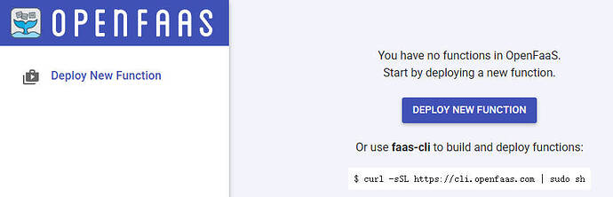
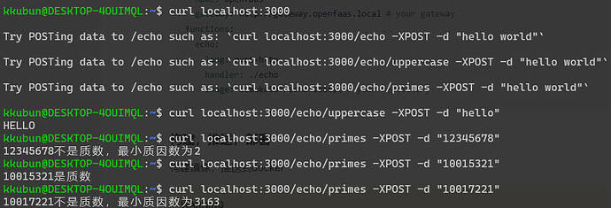
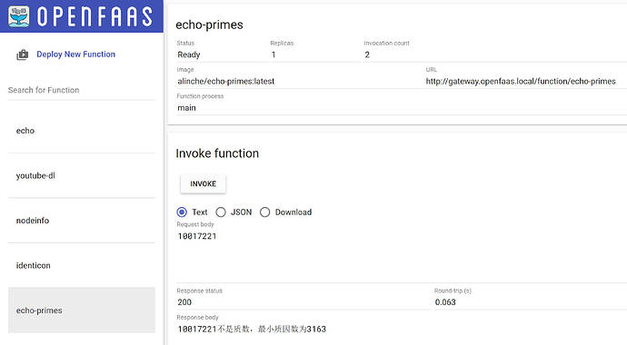

## Lab
### Step 1 本地部署一个 OpenFaaS

1. 选择在裸机环境下安装 `faasd` (我没有这么做)
2. `Kubernetes` ( `k8s` )
- 为什么要 `k8s` ：
   1. 服务发现和负载均衡
   2. 存储编排
   4. 自动部署和回滚
   5. 自动资源调度
   6. 自我修复容器（重启、替换、杀死容器）
   7. 密钥与配置管理

  附：[OpenFaaS CE 官方文档](https://docs.openfaas.com/deployment/kubernetes/)

3. OpenFaaS
```sh
# 查看IP
kubectl get nodes -o wide
kubectl get svc gateway -n openfaas

# 设置/更改密码
# 删除旧密码 kubectl -n openfaas delete secret basic-auth
kubectl -n openfaas create secret generic basic-auth \
    --from-literal=basic-auth-user=admin \
    --from-literal=basic-auth-password=newpassword

```
```sh
kubectl get pods -n openfaas
```
确保所有 `pods` 为 `STATUS: Running`，而不是 `CrashLoopBackOff` (搞这个莫名搞了我半天 `:(` 

4. 登进 `OpenFaaS` http://&lt;Node-IP&gt;:31112 (可选：修改 `hosts` 文件)


### Step 2 编写业务代码
> GET /：返回提示信息。

> POST /echo：返回请求体内容。

> POST /echo/uppercase：返回转为大写的请求体内容。

> POST /echo/primes：返回是否为质数。

main.rs:(我这里想实现一个2e7范围内判断质数的 `FaaS` ，需要手动配置 `Tokio` )
```rust
fn handler_service(req: Request<Body>) -> BoxFuture<'static, Result<Response<Body>, Infallible>> {
    Box::pin(async {
        match handler::echo(req).await {
            Ok(response) => Ok(response),
            Err(e) => {
                let error_response = Response::builder()
                    .status(500)
                    .body(Body::from(format!("Internal Server Error: {:?}", e)))
                    .unwrap();
                Ok(error_response)
            }
        }
    })
}

fn main() {
    // 配置 Tokio 运行时的栈空间大小
    let runtime = Builder::new_multi_thread()
        .thread_stack_size(160 * 1024 * 1024) // 设置每个线程的栈空间为 160MB
        .enable_all() // 启用所有功能（包括 I/O 和时间功能）
        .build()
        .unwrap();
    
    let addr = ([0, 0, 0, 0], 3000).into();
    // 创建服务
    let make_svc = make_service_fn(|_conn| async {
        Ok::<_, Infallible>(service_fn(handler_service))
    });
    // 启动服务器
    
    runtime.block_on(async {
        let server = Server::bind(&addr).serve(make_svc);
        println!("服务器已启动，监听地址: {}", addr);
        if let Err(e) = server.await {
            eprintln!("server error: {}", e);
        }
    });

    println!("服务器已退出");
}
```
当异步函数执行到一个await表达式时，状态机会保存当前状态，并将控制权返回给调用者。
`cargo run` 测试如下：


### Step 3 部署 `FaaS`

1. login 
```sh
# docker hub
docker login -u <yourname>

# OpenFaaS
cat ~/faas_pass.txt | faas-cli login -u admin --password-stdin --gateway http://172.30.225.124:31112
```
下面这样就是成功登录了，不要像我一样以为刚需https，捣鼓一晚上 `:(`
> Calling the OpenFaaS server to validate the credentials...
WARNING! You are not using an encrypted connection to the gateway, consider using HTTPS.
credentials saved for admin http://172.30.225.124:31112

2. 部署函数：
```sh
# 构建函数镜像 DOCKER_BUILDKIT=1 faas-cli build
faas-cli build -f <function-yaml-file>

# 推送函数镜像到仓库
faas-cli push -f <function-yaml-file>

# 部署函数到 OpenFaaS
faas-cli deploy -f <function-yaml-file>

# 三合一
faas-cli up -f <function-yaml-file>

# 查看函数列表
faas-cli list
```
3. 登上 `OpenFaaS UI` 或者用 `curl` 查看(在或者用 `faas-cli invoke my-func`)
```sh
# 查看密码
PASSWORD=$(kubectl -n openfaas get secret basic-auth -o jsonpath="{.data.basic-auth-password}" | base64 --decode)
echo "OpenFaaS admin password: $PASSWORD"
```
成果如下：


### 后记
多路由函数（比如/echo，/echo/others 等等），在 `OpenFaaS` 上要注意：
> (外部网关)http://172.30.225.124:31112/function/echo 的 `echo` 只是名字，其实是 `/` 根目录

### 后后记（基于sjgg的讲解继续学习）
在OpenFaaS中，`Hooks` 是通过 `Watchdog` 实现的，`Watchdog` 是OpenFaaS的关键组件，负责：
1. 启动和监控函数的运行
2. 进行函数的生命周期管理
3. 并发处理和超时管理
4. 健康检查

> COPY at My Blog [bbs 2024 Week3](https://bbs.dragonos.org.cn/t/topic/487)