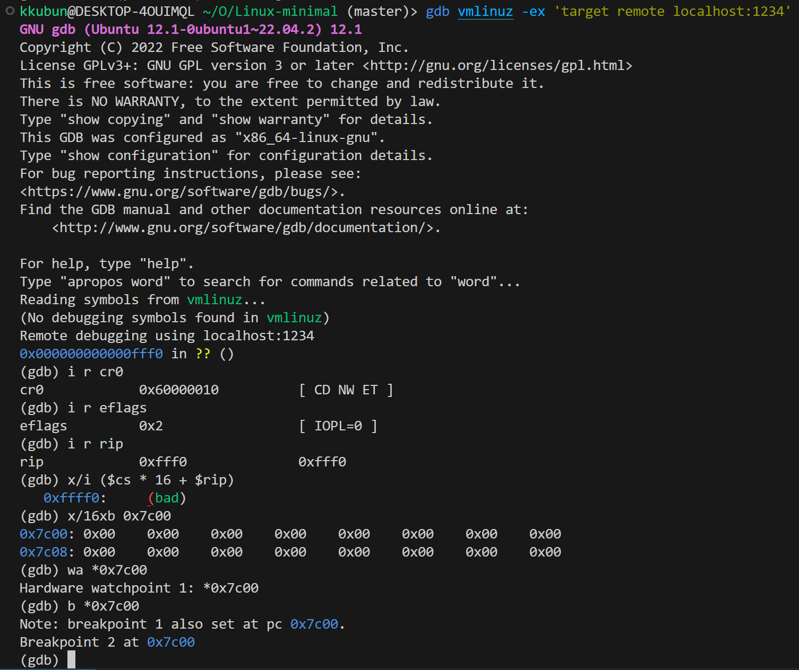
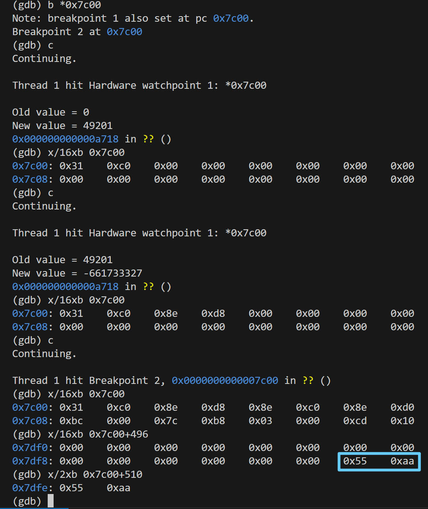

# CPU Reset → Firmware → Boot loader → start_kernel() →

## 1. CPU RESET
- 为了让计算机能运行我们的程序，一定会存在一些软件/硬件的约定，使CPU Reset 后，处理器处于某个确定的状态：
  - 当CPU接收到复位信号(如电源接通或硬件复位)时，它首先会进入`实模式`，PC 指针一般指向一段 memory-mapped ROM（对于x86 CPU，这个地址通常是 `0xFFFF0` (在 1MB 内存空间的​​最顶端，是一个 jmp 指令) (储存了厂商的firmware 即 BIOS/UEFI 的入口点)）
  - `实模式`(Real Mode)(16位模式)：其真实的物理地址(20位)=段寄存器*16+偏移地址，可通过 `(gdb)x/i ($cs * 16 + $rip)` 查看具体要执行的指令。
  - Q: "0xFFFF0里的数据是怎么来的？"
    - A: `内存映射`(Memory-Mapped I/O，MMIO) 加电初始化时，芯片组会将 BIOS ROM 硬件通过内存映射I/O映射到20位总线模式下的高端地址(0xFFFFF-0xF0000 共64KB大小)，CPU 读取这些地址时实际上是从 BIOS ROM 中读取的数据。
  - Q: "CPU物理地址空间大小是2^N根地址线​​ 字节，为什么此时看到的是只有20位的物理地址空间(1MB)" 
    - A: 这是由硬件设计的历史兼容性和启动流程决定的
      1. 首先你可以通过 `cat /proc/cpuinfo | grep address | head -1` 查看到你的CPU​​地址总线宽度，现代CPU通常大于20。但是​加电复位时CPU会强制进入8086兼容状态(如：实模式+地址回绕)，从而兼容BIOS的设计模式。
      2. 大部分地址(低端区域0x00000–0x9FFFF)被映射到DRAM（内存条）​​：这是物理地址空间的主体。操作系统和应用程序的数据都存放在这里。
      3. 一部分地址(高端区域0xA0000–0xFFFFF)被映射到硬件设备（MMIO）​​：如 0xA0000-0xBFFFF映射到显卡显存，0xF0000-0xFFFFF映射到BIOS ROM。​​CPU访问这些地址时，​​数据来自设备而非DRAM​​，由`芯片组直接路由`。
      ```sh
      > dmesg | grep e820
      [    0.000000] BIOS-provided physical RAM map:
      [    0.000000] [mem 0x0000000000000000-0x000000000009fbff] usable  # ​​常规低端640KB DRAM
      [    0.000000] BIOS-e820: [mem 0x000000000009fc00-0x000000000009ffff] reserved  # 扩展 BIOS 数据区(EBDA, Extended BIOS Data Area)
      [    0.000000] BIOS-e820: [mem 0x00000000000f0000-0x00000000000fffff] reserved  # BIOS ROM
      [    0.000000] BIOS-e820: [mem 0x0000000000100000-0x000000000ffdffff] usable  # 解压后的Linux 内核主体
      [    0.000000] BIOS-e820: [mem 0x000000000ffe0000-0x000000000fffffff] reserved  # 保留区域
      [    0.000000] BIOS-e820: [mem 0x00000000fffc0000-0x00000000ffffffff] reserved  # ​​PCI 设备映射
      [    0.006910] e820: update [mem 0x00000000-0x00000fff] usable ==> reserved  # 实模式数据IVT&BDA
      [    0.007095] e820: remove [mem 0x000a0000-0x000fffff] usable  # MMIO
      [    0.747347] e820: reserve RAM buffer [mem 0x0009fc00-0x0009ffff]  # 将 EBDA 区域标记为保留缓冲区
      [    0.747500] e820: reserve RAM buffer [mem 0x0ffe0000-0x0fffffff]  # 高端内存的一些缓冲区
      ```
- 此时，CPU的 `CR0` 寄存器处于实模式状态，大部分特性处于关闭状态（如：缓存、虚拟存储、内存保护、分页机制等），所有内存访问都是对物理地址的直接读写。软件拥有对整个 1MB 地址空间（0x00000 - 0xFFFFF）的完全控制权。


- `CR0` ​(Control Registers)控制寄存器：
  - ​​PE (Protection Enable, 位 0)  = 0​​：​​禁用保护模式​。（这是 CPU 处于实模式的根本原因）
  - ET (Extension Type​​，   位 4)  = 1；兼容浮点协处理器格式。（x86 CPU上通常被硬编码为 1）
  - NW (Not Write-through​​，位 29) = 1；禁用了“通写”缓存策略。
  - CD (CaChe Disable，    位 30) = 1；禁用 CPU 内部缓存​。
  - PG (Paging Enable,     位 31) = 0​​：​​禁用分页机制​​。所有地址都是物理地址。
- `EFLAGS` (Extended Flags Register)算术状态标志和控制标志
  - IOPL (I/O Privilege Level，位12和13) IOPL 的值是一个介于 0 到 3 之间的数字，代表​​环等级(Ring Level)。​​Ring 0​​: 最高特权级，也称为内核态或超级visor模式，可以执行任何指令，访问任何硬件资源；​​Ring 3：最低特权级​​，用户态
  - IOPL=0 的含义是：只有当前特权级(CPL, Current Privilege Level)为 0 的程序(即内核代码)才被允许执行与 I/O 相关的指令(IN,OUT,INS,OUTS,CLI,STI)，将操作硬件的权限完全保留给OS内核。如果 CPL > IOPL，那么任何尝试执行 I/O 指令的行为都会导致一个​​通用保护故障(#GP, General Protection Fault)，导致程序被操作系统终止
  - IF (Interrupt Enable Flag，位9) IF=0 中断关闭。（通过 CLI(Clear Interrupt) STI(Set Interrupt)指令调整）


## 2. Firmware （BIOS/UEFI） 将用户数据加载到内存
- BIOS (basic I/O system)(基本输入输出系统): 固件，负责硬件检测、硬件初始化、上电自检(POST, Power-On Self-Test)，然后寻找可启动设备（如硬盘、光盘、USB、网络等）（“可启动”的判断标准是：第一个扇区最后两个字节是否为魔数 0x55和 0xAA）
1. CPU从 0xFFFFFFF0(在实模式下表现为 0xFFF0) jmp到​​BIOS固件代码​​，BIOS代码执行到最后寻找到可启动设备，会将磁盘引导扇区读取并加载到内存中的特定地址 `0x7c00`。（这个过程是BIOS通过磁盘I/O中断(如 INT 0x13)调用自身的例程来完成的）
2. 此时，主引导扇区 `MBR` (Master Boot Record)（512Bytes）就载入了内存0x7c00（watchpoint 触发）, 将控制权交给 Bootloader


- Q: "为什么BIOS要把主引导扇区数据载入内存0x7c00，而不是选择像CPU Reset一样直接做内存映射I/O？" 
  - A: 磁盘存储的数据量很大（通常以扇区为单位），而且磁盘访问速度较慢，因此磁盘内容通常不直接映射到内存地址空间供CPU执行，而是加载到内存供CPU读取。

## 3. ​​Bootloader​​
- MBR是Bootloader的第一阶段。但由于MBR只有512字节，无法容纳复杂逻辑，所以它通常只负责分区扫描(64Bytes分区表)、磁盘读取(通过BIOS磁盘中断(INT 13h)，​加载并跳转Bootloader第二阶段，即磁盘的其他扇区)和错误处理。
  - Bootloader仍在实模式下运行，MBR后续扇区可能会完成一些基本设置（如文件系统解析​、多系统引导、硬件检测与初始化​​​等）。
- 最后加载内核到内存，传递好启动参数 [struct boot_params](https://code.dragonos.org.cn/xref/linux-6.6.21/arch/x86/include/uapi/asm/bootparam.h#185)，将CPU切换到保护模式(32位)或长模式(64位)(取决于内核)，跳转到内核入口点

> 今天的 boot loader 面临麻烦得多的硬件：
> - 指纹锁、不知名厂商网卡上的网络启动、USB上的蓝牙转接器连接的蓝牙键盘、…… 
> - Secure Boot 签名
```sh
实模式下CPU通过地址总线能访问的`物理地址空间`布局示例图（1MB，包括MMIO）
0xFFFFF +--------------------+
        | BIOS ROM (64KB)    |
0xF0000 +--------------------+
        | 各种MMIO (192KB)   |
0xC0000 +--------------------+
        | 显存 (128KB)       |
0xA0000 +--------------------+ ← MMIO 跟 DRAM 的分界
        | ​​自由内存​ (680.5KB)  |
0x7E00  +--------------------+
        | MBR代码 (512B)     |
0x7C00  +--------------------+  ← 引导扇区加载点
        | 自由区域 (29.75KB) |
0x0500 +--------------------+
        | BIOS数据区 (256B)  |
0x0400 +--------------------+
        | 中断向量表IVT (1KB) |
0x0000 +--------------------+
```
```sh
/ > dmesg | grep node
[    0.000000] Faking a node at [mem 0x0000000000000000-0x000000000ffdffff]
[    0.000000] Movable zone start for each node
[    0.000000] Early memory node ranges
[    0.000000]   node   0: [mem 0x0000000000001000-0x000000000009efff] # 实模式MMIO区域之前的DRAM空间
[    0.000000]   node   0: [mem 0x0000000000100000-0x000000000ffdffff] # 解压后的内核，避开1MB一下的MMIO
[    0.000000] Initmem setup node 0 [mem 0x0000000000001000-0x000000000ffdffff]
# 下面开始初始化节点node0的内存管理系统...
```

## start_kernel()​​
- [Linux start_kernel code](https://code.dragonos.org.cn/xref/linux-6.6.21/init/main.c#874)
- 这是Linux内核的入口函数，位于init/main.c。内核开始执行时，会进行一系列初始化操作（如设置内存管理、中断、时钟​、进程调度器​​、设备驱动等）。
- 内核最终会移交控制权，并启动用户空间的第一个进程，`init`程序。

## init
- 内核启动后，它会执行用户空间的init进程。这是第一个用户进程，进程ID为1。
- init进程负责进一步启动系统服务和管理运行级别。
[Linux 寻找默认init的逻辑](https://code.dragonos.org.cn/xref/linux-6.6.21/init/main.c#1497) 
```c
if (!try_to_run_init_process("/sbin/init") ||
    !try_to_run_init_process("/etc/init") ||
    !try_to_run_init_process("/bin/init") ||
    !try_to_run_init_process("/bin/sh"))
	return 0;
panic("No working init found.  Try passing init= option to kernel. "
      "See Linux Documentation/admin-guide/init.rst for guidance.");
```
- 从此以后，Linux Kernel 就进入后台，成为 `“中断/异常处理程序”`
```
init─┬─httpd
     ├─mysh─┬─pstree
     │      └─{mysh}
     └─nc
```