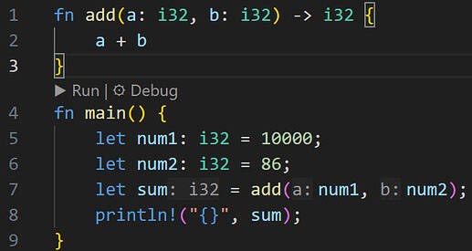
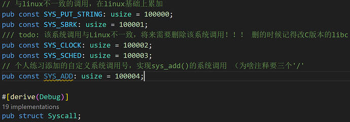
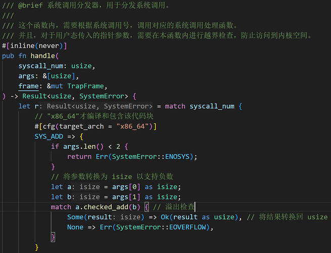

## Lab 1 ： 在DragonOS中实现一个系统调用

### Step 0 什么是系统调用？

系统调用（System Call）是用户程序和操作系统内核之间的接口，用户不能直接 `touch` 内核，用户程序（`e.g.` `main`函数）通过特定的**系统调用接口**发起请求，实现从用户态到内核态的调用。

在 `Linux` 系统上，`Rust` 标准库的 `println!()` 宏就可能是通过 **`glibc`** 来访问系统调用，如 `write` ，从而将字符串输出到标准输出。而下面的add()函数就只在用户态中用函数调用栈调用

那么，具体是怎么从用户态 **`trap`**（陷入）到内核态捏（

答：32位是int $0x80中断，64位是syscall汇编指令（先将系统调用号，参数等传入CPU寄存器）

### Step 1 实现一个简单的系统调用
如上述提到的 `fn add()` ，进入 `kernel/src/syscall/mod.rs` ，先创建 `const SYS_ADD` 自定义系统调用号(伪)

读源码查找到 `SystemError::EOVERFLOW` 表示数值溢出错误，`SystemError::ENOSYS` 表示系统调用不支持或不存在。
临时将参数转为`isize`，并使用 `checked_add()` 检查是否溢出，最后转回`usize`

### Step 2 编写用户态测试程序并进行测试
>**注：** 使用 `use libc::syscall` 需要在 `Cargo.toml` 中添加依赖 `libc = "0.2.153"` 

保存后 `make build` 编译 运行，结果如下：

## 小结一下
`OS` 还有很多知识不太了解，应补尽补，但也不能急于求成，要细嚼慢咽多往深处细学 `:))`

> COPY at My Blog [bbs 2024 Week2](https://bbs.dragonos.org.cn/t/topic/477)