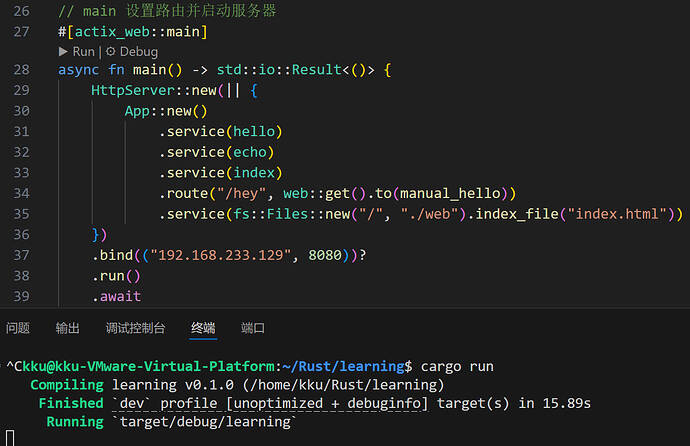
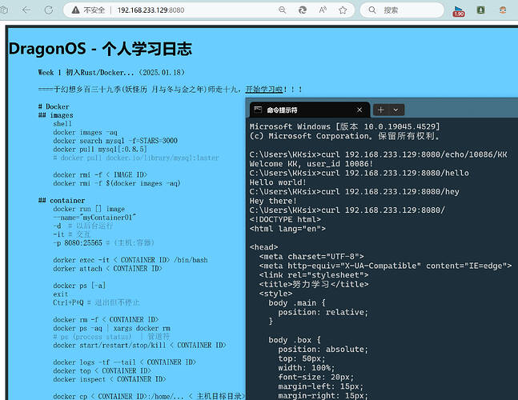
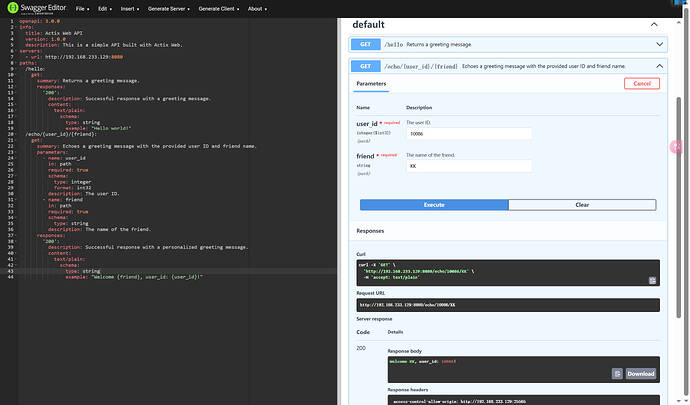
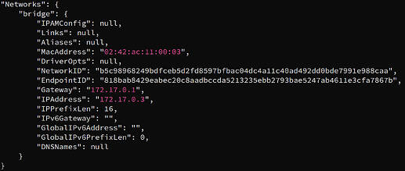
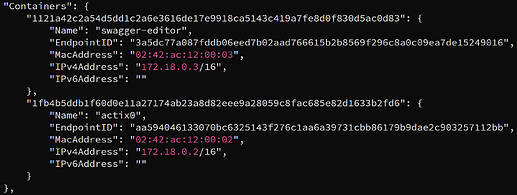

## Lab 1 : Practice web app with docker
### Step 1~3 初识`Actix-web`
使用`SSH` + `Termius`组合拳使我们可以安全地在本地计算机上执行命令和操作远程计算机。

初识`Actix-web` ，先直接把官网的小白代码copy下来，通过GPT辅助进行学术研究。
1. 加入你所需要的全部依赖项
```rust
   [dependencies]
   actix-rt = "2.10.0"
   actix-web = "4"
   actix-files = "0.6"
   actix-cors = "0.7.0"
```
2. 把`bind` 的地址改成虚拟机`ip` ，默认使用8080端口，在局域网下主机可以访问虚拟机。
3. 用宏定义一个 GET 路由/echo/{user_id}/{friend}
```rust
    #[get("/echo/{user_id}/{friend}")] // define path param
    async fn index(path: web::Path<(u32, String)>) -> Result<String> {
        let (user_id, friend) = path.into_inner();
        Ok(format!("Welcome {}, user_id: {}!", friend, user_id))
    }
```
4. 你可以创建一个名为`web` 的文件夹，并将你的静态文件放在其中。（顺便也可以用于记录你的 `Rust` / `Docker` 等的笔记doge）
```rust
    HttpServer::new(|| {
        App::new()
            .wrap(Cors::permissive())
            # 将./web 目录下的文件作为静态文件提供，并且当访问根路径/时，默认返回index.html文件。
            .service(fs::Files::new("/", "./web").index_file("index.html"))
    })
```

1. 编译运行，然后使用主机访问虚拟机（可以使用 `CMD` 或 `浏览器`，如下图所示）

### Step 4 Swagger 智能检查 API
部署`Swagger Editor`
```sh
# 拉取镜像
docker pull swaggerapi/swagger-editor
# -d 以后台方式运行  -p 25565:8080 # (主机端口25565:容器端口8080)
docker run -d -p 25565:8080 swaggerapi/swagger-editor
```
主机访问虚拟机ip:端口号，然后编写 `openAPI` 文档定义请求，效果如下：


## Lab 2 封装Rust应用到docker镜像
### Step 1~3
添加 `dorkerfile` 到项目根目录，然后打包成镜像。
>***注：要改为***  `.bind(("0.0.0.0", 8080))?`
> 使服务器可以接受来自本地机器以及任何远程机器的连接请求。



```sh
docker build -t actix-web:v0.1 .
```
```sh
docker run -d -p 25565:8080 actix-web:v0.1
```
（探究：`-d` 参数是转为后台运行，`-it`参数是进入交互( `exit` 退出并停止, `Ctrl+P+Q` 退出但不停止)
（探究：也可以创建一个自定义网络：
```sh
docker network create my-network
# 用 docker network inspect my-network 查看详情
docker run -d -p :25565:8080 --name actix0 --network my-network actix-web:v0.1
# 查看容器`IP`
docker inspect -f '{{range .NetworkSettings.Networks}}{{.IPAddress}}{{end}}'  {CONTAINER ID}
```

## 小结一下
首先感谢DLC学长的指导，这几天也努力学了一些`Rust`相关知识，对它的所有权系统、生命周期等等既感到好奇又有点困惑，继续努力吧`:)`

> COPY at My Blog [bbs 2024 Week1](https://bbs.dragonos.org.cn/t/topic/463)