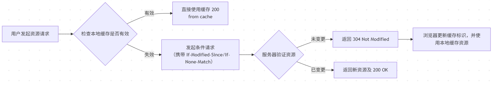

[参考文献-小林coding](https://xiaolincoding.com/network/2_http/http_interview.html)

# HTTP：从基础到进阶的深度解析与实践指南
## 一、HTTP核心概念再梳理

> **HTTP是基于TCP/IP的、无状态的、应用层的请求-响应协议，用于在客户端（浏览器/APP）与服务器之间传输超文本（HTML、图片、视频等）资源。**

### 关键特性
- **无状态(Statelessness)**：每次请求独立，服务器不保存会话状态。（系统权衡：无状态使得服务器无需维护庞大的会话上下文，极大地降低了内存消耗，天然支持水平扩展（负载均衡集群）。状态管理则通过 `Cookie/Session` 或 `Token` 交由应用层处理）
- **请求-响应模型**：文本协议，遵循经典的 C/S 交互哲学，`header + body`结构清晰、易于调试。
- **可扩展性(Extensibility)**：Header 机制允许协议在不破坏兼容性的前提下，通过新增字段实现 HTTPS 加密、Keep-Alive 持久连接、分块传输、缓存控制等进阶功能。

---

## 二、HTTP缓存技术：性能优化
- 缓存的核心目标只有一个：**减少不必要的网络往返(RTT)和带宽消耗**。HTTP缓存机制将这一目标拆解为“过期验证”与“内容校验”两个层次。
### 1. 缓存分类：强缓存 vs 协商缓存
| 类型       | 触发条件                     | 作用机制                          | 响应状态码 |
|------------|------------------------------|-----------------------------------|-----------|
| **强缓存** | 浏览器检查本地缓存是否过期   | 没过期就直接使用本地缓存，**不请求服务器** | 200 (from cache) |
| **协商缓存**| 强缓存过期后，与服务器验证   | 若服务器返回304，浏览器使用本地缓存   | 304 (Not Modified) |
#### 详细工作流程（以浏览器访问为例）

### 2. 核心 Header 参数理解
理解这些 Header 的优先级与“握手”机制，是工程落地的关键：
#### A. 强缓存控制：无需校验
*   **`Cache-Control` (首选)**：现代标准，控制权的核心。
    *   `max-age=N`：资源在 N 秒内被视为新鲜，无需校验。
    *   `no-cache`：不走强缓存，**必须进行协商缓存**（不要被名字误导）。
    *   `no-store`：彻底禁止缓存（用于敏感数据）。
    *   `immutable`：告诉浏览器资源永不改变，即使刷新也不必再次校验。
*   **`Expires` (遗留)**：HTTP/1.0 产物。它是**绝对时间**，强依赖服务器与客户端时钟同步。由于时钟漂移问题，**现代工程实践中应被 `Cache-Control` 完全取代**。

#### B. 协商缓存：精确校验的“握手”机制
协商缓存本质上是一场“对话”：服务器告诉浏览器资源的版本标记，浏览器下次请求时带上这些标记，询问服务器“我的版本还是最新的吗？”。

| 校验维度 | 请求头（浏览器发给服务器） | 响应头（服务器下发给浏览器） | 校验逻辑 |
| :--- | :--- | :--- | :--- |
| **内容摘要** | `If-None-Match` | `ETag` | 服务器对比 `If-None-Match` 值与当前资源 `ETag`。一致则 304。 |
| **最后修改时间** | `If-Modified-Since` | `Last-Modified` | 服务器对比时间戳。未超过则 304。 |

**Q: 为什么需要两套机制？**
*   **`If-None-Match` 与 `ETag` (推荐)**：这是**强校验**。`ETag` 是资源的唯一指纹（如内容的 Hash 值）。只要内容变了，Hash 必变。它解决了 `Last-Modified` 的精度问题（秒级）和“内容没变但时间戳变了”的缓存失效问题。
*   **`If-Modified-Since` 与 `Last-Modified` (兜底)**：这是**弱校验**。如果服务器不支持生成 `ETag`，或者为了节省生成 Hash 的 CPU 开销，会退化使用最后修改时间。
    *   *缺陷*：若文件在 1 秒内被多次修改，`Last-Modified` 无法感知。

### 3. 如何设计缓存策略
在构建生产级 Web 服务时，不能简单地“全缓存”或“不缓存”，应依据资源的**生命周期**分类处理：
1.  **对版本化静态资源（如 `main.v1.2.3.js`）**：
    *   **策略**：缓存永久有效。
    *   **配置**：`Cache-Control: max-age=31536000, immutable`。
    *   **原理**：因为文件名包含版本号（或 Hash 值），一旦内容更新，文件名即变，浏览器会视为一个全新的资源，完全不必担心缓存旧数据。
2.  **对入口文件（如 `index.html`）**：
    *   **策略**：禁止强缓存，强制协商缓存。
    *   **配置**：`Cache-Control: no-cache`。
    *   **原理**：`no-cache` 并不意味着不缓存，而是**禁止直接使用强缓存**。浏览器必须带上 `If-None-Match` 请求服务器验证。这样既确保了用户永远拿到最新页面，又能通过 304 节省传输开销，降低服务器负载。
3.  **对敏感或动态数据（如用户 API 响应）**：
    *   **策略**：完全不缓存。
    *   **配置**：`Cache-Control: no-store`。
    *   **原理**：禁止任何形式的本地或代理存储，确保数据的实时性与安全性。

---

## 三、 HTTP 核心特性深度解析：性能与架构的博弈
- `HTTP/1.1` 是现代 Web 的基石，其最突出的优点是「简单、灵活和易于扩展、应用广泛和跨平台」。其特性设计旨在解决网络传输中的**延迟(Latency)**、**连接开销(Overhead)**与**用户体验(Consistency)**三大痛点。
- HTTP 协议是基于 `TCP/IP` 的，并且使用了「`请求-响应`」的通信模式，所以其性能的关键就在这**两点**里。

### 1. 长连接(Keep-Alive)：重塑连接效率
在 HTTP/1.0 时代，每请求一次资源就要经历一次完整的TCP三次握手和慢启动(Slow Start)，属于串行请求，延迟极其严重。
*   **设计目标**：复用 TCP 连接，摊销握手成本，避开 TCP 慢启动机制带来的初始拥塞。
*   **进化机制**：
    *   **HTTP/1.0**：默认短连接，必须显式携带 `Connection: keep-alive`。
    *   **HTTP/1.1**：默认开启长连接，除非显式设置 `Connection: close`。
*   **性能提升逻辑**：TCP 连接一旦建立，后续的多个 HTTP 请求可以在同一个通道内串行发送。这极大地降低了每个请求的延迟，尤其是对于包含多个资源（如图片、CSS、JS）的页面加载来说。
*   **专家洞察**：长连接并非免费的午餐，它需要服务器维持连接状态。在高并发下，过多的空闲连接会占用服务器的文件描述符FD和内存资源，需配合`超时关闭机制`(Keep-Alive Timeout)来平衡性能与资源消耗。

### 2. 管道化(HTTP Pipelining)：失败的先行者
在 HTTP/1.1 中引入了管道化技术，试图进一步榨干长连接的性能。
*   **核心逻辑**：客户端在一个 TCP 连接中发送多个请求，**无需等待上一个请求的响应返回**即可发出后续请求。
*   **致命缺陷：队头阻塞(Head-of-Line Blocking)**：
    *   HTTP/1.1 协议规定，服务器必须**严格按照请求到达的顺序**返回响应。
    *   如果第一个请求（如较大的图片）处理很慢，后续响应即便处理完成也必须排队等待，导致整个通道被堵塞。
*   **现状**：由于 HOL 阻塞严重，加上浏览器实现兼容性差，主流浏览器默认均禁用该功能。
*   **对比**：HTTP/2 的**多路复用(Multiplexing)**正是为了彻底解决这个问题，它将请求打碎为二进制帧(Frame)，通过流(Stream)实现真正的并行传输。

### 3. 无状态与状态管理：工程妥协的艺术
HTTP 协议被设计为“无状态”的，这是一种为了**简洁性**和**扩展性**做出的工程选择。
*   **为什么无状态？**
    *   **简单**：服务器无需记录客户端的历史交互，天然支持大规模水平扩展（集群中的任意节点均可处理请求），能够把更多的CPU和内存用来对外提供服务。
*   **如何实现状态管理？**
    *   为了弥补协议层的无状态，现代 Web 应用建立了一套标准的状态流转机制：
    1. **首次请求（签发）**：客户端发送账号密码，服务器验证通过后，生成一个唯一标识（Session ID 或 Token）。
    2. **状态下发（传递）**：服务器通过响应头（如 `Set-Cookie` 或自定义 Header）将该标识返回给客户端。
    3. **后续请求（携带与还原）**：客户端在此后的每次请求中自动（通过Cookie）或手动（通过Authorization头）携带该标识，服务器解析后“认出”客户端身份。
*   **现代演进与架构博弈**：
    *   **`Session-Cookie`模式**：经典方案。状态集中保存在服务器上(如内存 或 Redis)，客户端的 `Cookie` 中只存一个钥匙(Session ID)。本质是**以空间IO换安全**，服务端掌握绝对控制权。
        *   *局限性*：在现代分布式集群/微服务架构中，为了实现负载均衡，必须引入额外的 `Session共享机制`，否则用户打到不同服务器就会掉线，且存在被 **CSRF(跨站请求伪造)** 攻击的风险（如诱导用户点击恶意链接）。
    *   **`Token-JWT`(JSON Web Token)模式**：现代微服务主流。服务器**不保存任何会话状态**，而是将用户信息加密并签名后打包成 Token 交给客户端，用户存储完整的加密数据包。本质是**以CPU计算换空间IO**，服务器每次只需通过 CPU 计算校验签名即可。
        *   *优势*：天然无状态，任何一台拥有秘钥的服务器都能校验Token，契合 Serverless 以及跨域(CORS)请求。
        *   *局限性*：生命周期管理：Token一旦签发在过期前难以主动撤销，需借助 **黑名单blacklist** 或 **长短期双token** 补偿。且随着携带的信息增多，Token变大，会带来不小的网络传输开销。
    *   **`Cookie隐私与安全`加固**：为了应对日益严峻的安全和隐私挑战，现代 Cookie 引入了三大护城河：`HttpOnly`（禁止 JS 读取，防范 XSS 攻击）、`Secure`（强制仅在 HTTPS 下传输）以及 `SameSite`（限制跨域发送，直接从根源上阻断 CSRF 攻击）。

---

## 四、 HTTP 的安全之殇：从明文“裸奔”到 HTTPS 的救赎
#### 4.1 传统 HTTP 的三大安全隐患
由于 HTTP 是**明文传输**的，数据在流经路由器、运营商等中间节点时，存在以下三大风险：
1. **窃听风险**：通信链路上可以获取全部通信内容（例如：账号密码直接暴露，你号没了）。
2. **篡改风险**：中间人可以强行修改通信内容（例如：运营商强制植入垃圾广告，视觉污染）。
3. **冒充风险**：无法验证通信方的真实身份（例如：黑客冒充淘宝/网银，你钱没了）。

#### 4.2 HTTPS 的降维打击：三大护城河
为了解决 HTTP 的不安全缺陷，**HTTPS(HyperText Transfer Protocol Secure)** 在 HTTP 和底层 TCP 之间加入了一个安全层 —— **SSL/TLS协议**。

HTTPS 并非一种全新的协议，而是通过在 TLS 层引入三大硬核技术，完美针对了 HTTP 的三个风险：
*   **1. 防窃听：混合加密（信息加密）**
    *   **机制**：HTTPS 采用的是**非对称加密**和**对称加密**结合的混合加密方式，非对称加密CPU开销大且速度慢，对称加密速度快但密钥无法安全交换，混合加密平衡了安全性与性能。
    *   **工作原理**：
        *   在通信建立前（TLS握手阶段），采用**非对称加密**（公钥/私钥）来安全地交换会话密钥，保证密钥不被中间人窃取。
        *   在通信过程中（报文传输阶段），采用**对称加密**（共享密钥），使用刚刚协商好的安全的会话密钥对数据进行加密传输。
*   **2. 防篡改：摘要算法 + 数字签名（数据完整性校验）**
    *   **机制**：为了防止传输中途被中间人篡改（即便无法破解密文，黑客也能破坏数据完整性），HTTPS 在传输阶段使用了 MAC（消息认证码） 或更先进的 AEAD（认证加密） 算法。
    *   **工作原理**：发送方不仅对数据进行加密，还会对明文进行Hash计算得到一个独一无二的Hash摘要，并结合对称密钥生成 MAC 标签随数据发送。接收方解密后，重新计算摘要并校验标签，比对一致即可证明**内容绝对没有被篡改过**（哪怕改了一个标点符号，Hash 值也会天差地别（不考虑哈希冲突）。
*   **3. 防冒充：数字证书（身份认证）**
    *   **机制**：即使有了加密，客户端依然无法确认“发给我公钥的服务器，真的是淘宝吗？”（中间人攻击）。为此，HTTPS 引入了 **CA(证书权威机构)**。
    *   **工作原理**：服务器必须向 CA 机构付费申请一张「数字证书」。证书中包含了服务器的公钥、域名信息以及 CA 机构的**数字签名**。浏览器在连接时，会使用操作系统内置的 CA 根公钥去验证证书的合法性。这彻底解决了“你是谁”的信任问题。

#### 4.3 HTTP 与 HTTPS 的核心区别总结
| 维度 | HTTP (超文本传输协议) | HTTPS (安全超文本传输协议) |
| :--- | :--- | :--- |
| **传输形态** | **明文传输**，毫无隐私可言。 | 具备安全性的**SSL/TLS加密传输**。 |
| **连接过程(建连开销)** | 1-RTT 只需进行**TCP三次握手**即可传输报文 | 2~3 RTT,TCP三次握手后，还需进行额外的**SSL/TLS握手**（协商加密算法和密钥） |
| **端口与协议层** | 端口**80**。直接运行在TCP之上。 | 端口**443**。运行在SSL/TLS之上，SSL/TLS运行在TCP之上。 |
| **成本与证书** | 免费，即连即用。 | 必须向 CA 机构申请**数字证书**，一般需要一定的费用。 |

*   **现代 Web 演进视角**：虽然 HTTPS 在握手阶段增加了 1~2 个 RTT 的网络延迟，但在现代网络协议（如 HTTP/2 和 HTTP/3）中，**HTTPS已经是强制标配**（主流浏览器不再支持明文的HTTP/2）。通过 TLS 1.3 的会话恢复（0-RTT）机制，HTTPS 的性能损耗已经降到了微乎其微的程度。

---

## 五、HTTP版本演进：从 HTTP/1.1 到 HTTP/3
要真正理解 HTTP 协议的演进，核心是看懂每一次升级都在解决上一代的**队头阻塞(Head-of-Line Blocking)**和**握手延迟**问题。
| 特性维度 | HTTP/1.1 | HTTP/2 | HTTP/3 |
| :--- | :--- | :--- | :--- |
| **底层传输协议** | TCP | TCP | **QUIC（基于 UDP）** |
| **数据格式** | 纯文本格式 | 二进制帧（Frame） | 二进制帧 |
| **多路复用** | ❌ 存在 **HTTP层** 队头阻塞 | ✅解决HTTP层队头阻塞, ❌仍有**TCP层**队头阻塞 | ✅ 彻底解决队头阻塞 |
| **头部压缩** | 无（头部全量明文传输） | HPACK（静态/动态字典+哈夫曼） | QPACK（解决动态字典队头阻塞）|
| **安全握手延迟** | TCP(1 RTT) + TLS(1~2 RTT) | TCP(1 RTT) + TLS(1~2 RTT) | 首次 1-RTT，恢复 0-RTT |
| **连接迁移** | ❌ 不支持（切网断开重连） | ❌ 不支持（IP+端口绑定） | ✅ 支持（基于 Connection ID） |

### 1. 深入浅出：每一次演进到底解决了什么？
#### HTTP/1.1：基础
HTTP/1.1 奠定了现代 Web 的基础（引入了长连接 `Keep-Alive`），但也存在致命缺陷：
*   **HTTP层队头阻塞**：虽然支持管道化（Pipeline），但在同一个 TCP 连接里，服务器必须**按请求的顺序响应**。如果第一个请求处理慢，后面的请求全都被阻塞。
*   **头部臃肿**：每次请求都携带大量重复的 Header（如 Cookie、User-Agent），且不压缩，浪费极大的带宽。
*   **应对妥协**：为了绕过并发限制，前端发明了“雪碧图”、“域名分片(Domain Sharding)”等奇技淫巧，本质都是向协议的缺陷妥协。

#### HTTP/2：破局与遗留
HTTP/2 是一次巨大的重构，核心是引入了**二进制分帧**和**流(Stream)**的概念。
*   **✅ 突破 1：多路复用**：多个请求可以复用同一个 TCP 连接，数据被拆分成带有 `Stream ID` 的二进制帧交错传输。这彻底解决了**HTTP层的队头阻塞**。
*   **✅ 突破 2：HPACK 压缩**：客户端和服务端共同维护一个字典，重复的 Header 只需要传索引号，大幅减少传输量。
*   **❌ 局限：TCP 层的队头阻塞**：HTTP/2 依然使用 TCP。TCP 保证数据的绝对有序，**一旦发生丢包，整个 TCP 连接上的所有流(Stream)都必须等待丢包重传**。也就是说，一个流的丢包，会把其他无辜的流一起阻塞。

#### 颠覆重构：HTTP/3 (`QUIC`)
既然 TCP 协议底层的机制限制了性能的进一步突破，HTTP/3 干脆“掀桌子”，将底层协议换成了基于 UDP 的 **QUIC 协议**。
**HTTP/3 的四大核心优势：**
1. **彻底消除队头阻塞**：
   QUIC 也是基于流(Stream)的，但因为底层是 UDP，没有 TCP 的强顺序限制。**流与流之间相互独立**，Stream A 发生丢包，只会阻塞 Stream A，Stream B 的数据可以直接交给应用层。
2. **极致的握手速度(0-RTT)**：
   传统的 HTTPS 需要经历 TCP 三次握手 + TLS 握手（需2~3个RTT）。QUIC **将传输层与加密层合并**，内置 TLS 1.3，首次连接只需 **1-RTT**；对于之前连接过的服务器，甚至可以实现 **0-RTT** 极速建连。
3. **网络切换平滑过渡(连接迁移)**：
   TCP 是基于 `(源IP, 源端口, 目的IP, 目的端口)` 四元组来识别连接的。当你从 Wi-Fi 切换到蜂窝网络（5G）时，IP 变了，TCP 连接必定断开重连。而 QUIC 使用一个唯一的 **Connection ID(CID)** 来标识连接。即使 IP 变化，只要 CID 没变，连接就能无缝保持，视频不卡、游戏不掉线！
4. **更高效的 QPACK 字典同步**：
   HTTP/2 的 HPACK 在动态字典同步时也会产生队头阻塞（如果更新字典的包丢了，后面的 Header 无法解析）。HTTP/3 的 QPACK 允许乱序解码，并使用单向流专门传输字典状态，解决了这一隐患。
