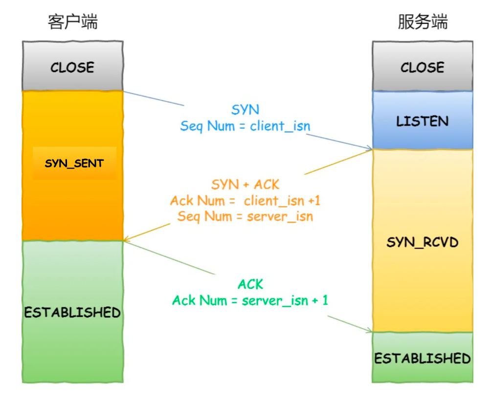
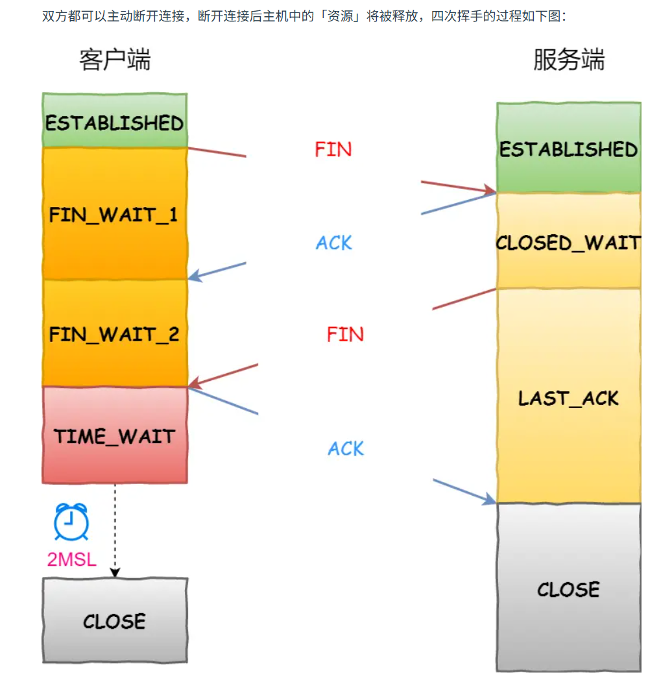

[参考文献-小林coding-TCP](https://xiaolincoding.com/network/3_tcp/tcp_interview.html)

## 一、TCP 基础认识
TCP（Transmission Control Protocol，传输控制协议）是互联网传输层的核心协议之一，它为应用层提供了一套**面向连接、可靠的、基于字节流**的传输服务。

### TCP 的三大核心特征
* **面向连接**：通信前必须先完成三次握手建立连接，通信结束后四次挥手断开。这是一对一的关系——不能像 UDP 那样一对多广播。
* **可靠传输**：保证数据**不丢、不乱、不重、不损坏**。通过序列号、确认应答、重传机制等手段实现。
* **基于字节流**：发送方发的是一串字节，TCP 会自己切分成合适大小的报文段；接收方收到后再按序重组。应用层不需要关心底层分片逻辑。

### TCP 头部格式
TCP 头部**固定 20 字节**（通过可选项最多扩展到 60 字节（首部长度有4位），包含以下关键字段：
| 字段 | 长度 | 作用 |
|------|------|------|
| **源端口 / 目的端口** | 各 16 位 | 标识发送方和接收方的应用进程 |
| **序列号(Sequence Number)** | 32 位 | 标识所发送数据的第一个数据字节的**编号**。用于解决**乱序**和**重复**问题。 |
| **确认应答号(ACK Number)** | 32 位 | 告诉对方"我期望下一个收到的数据字节的序号"，用于确认数据已成功接收，解决**丢包**问题 |
| **首部长度(Data Offset)** | 4 位 | 指出TCP首部共有多少个32位字（4字节）。 |
| 保留(Reserved) | 6 位 | 保留供未来使用，目前置为 0。 |
| **控制位(Flags)** | 6 位 | URG、ACK、PSH、RST、SYN、FIN 等，用于控制 TCP 状态机 |
| **窗口大小(Window)** | 16 位 | 接收方通告自己目前可用的缓冲区大小，用于**流量控制** |
| **校验和(Checksum)** | 16 位 | 检测头部和数据在传输过程中是否损坏 |
| **紧急指针(Urgent Pointer)** | 16 位 | 只有 URG 位为 1 时才有效，指出本报文段中紧急数据的结束位置。 |
| **选项 (Options)** | 可变 | 最常见的选项是 **MSS**（最大报文段长度）、窗口扩大因子、时间戳等。 |

### TCP 如何计算负载数据长度
`TCP数据的长度` = `IP总长度` - `IP头部长度` - `TCP头部长度`

其中 IP总长度 和 IP首部长度 可以在 IP首部格式 中得知；TCP首部长度可以在 TCP首部格式 中得知。所以就可以求得 TCP 数据的长度。

### TCP 连接的唯一标识：四元组
一条 TCP 连接由**四元组**唯一确定：*（源 IP，源端口，目的 IP，目的端口）*

这四个值中任何一个不同，就是不同的连接。

> 💡：这就是为什么"端口耗尽"通常不是服务器端口的问题，而是客户端端口的问题。一台机器最多约 65535 个端口，所以单机到同一目标 IP:Port 的并发 TCP 连接理论上限约 6.5 万个（实际受系统配置限制）。

---

## 二、TCP 三次握手
TCP 三次握手是建立可靠连接的基础。整个过程交换了三个报文，完成了双向序列号的同步。
### 握手过程
用一句话描述每一步：
* **第一次握手**：客户端发 SYN="我想连你"，附带自己的初始序列号 `seq=x`
* **第二次握手**：服务端回 SYN+ACK="收到，我也连你"，附带自己的初始序列号 `seq=y`，确认号 `ack=x+1`
* **第三次握手**：客户端发 ACK="好的，连接建立"，确认号 `ack=y+1`

第三次握手时，客户端可以**携带数据**——不是空跑的。

### 为什么是"三次"？
**原因一：防止历史连接初始化**
假设只有两次握手(指LISTEN状态收到SYN就直接建立连接established)，客户端超时重传(比如说网络拥塞)发送的延迟的 SYN 可能在新连接建立后才到达服务端，服务端会误以为是新连接请求，导致无效连接建立。

**原因二：同步双方的序列号**
TCP 是全双工通信，双方都需要告诉对方自己的初始序列号，并确保得到可靠的同步。这最少需要三次报文才能完成双向确认。

**原因三：避免资源浪费**
如果只有两次握手，服务端一收到 SYN 就建立连接、分配资源。攻击者可以伪造大量 SYN 报文，让服务端为大量不存在的连接分配内存——这就是 **SYN Flood 攻击**。

#### `SYN Flood` 攻击与防范
*   **正常流程**：客户端发送 `SYN`，服务器接收并进入 `SYN_RECV` 状态，将连接放入**半连接队列(SYN Queue)**，并回复 `SYN-ACK`，等待客户端的 `ACK`。（之后接收到 ACK 报文，从 SYN 队列取出一个半连接对象，然后创建一个新的连接对象放入到全连接队列(Accept Queue)。应用通过调用 `accpet()` socket 接口，从 Accept 队列取出连接对象。）
*   **攻击原理**：SYN Flood 是一种典型的 **DoS** 攻击。攻击者伪造大量源 IP，疯狂发 SYN 报文。服务端每次都回复 SYN-ACK 并分配半连接资源，但永远收不到第三次 ACK，半连接队列被撑爆。
*   **防范手段**：主要从“队列扩容”、“加速回收”和“不占用队列”三个思路入手
    ##### (1) 开启 syncookies（最有效的方法）
    这是目前防御 SYN 攻击最主流的手段。
    *   **原理**：当半连接队列溢出时，服务器不再将连接放入队列。而是根据 `(源IP, 目的IP, 源端口, 目的端口, 时间戳)` 等信息计算出一个 `cookie`（特殊的序列号），放到第二次握手报文的序列号字段发给客户端。
    *   **效果**：服务器**不需要在本地分配内存**来存储这个半连接。直到客户端回了 `ACK`，服务器再根据 `ACK` 里的序列号逆运算，如果合法，才正式建立连接。
    *   **内核参数**：`net.ipv4.tcp_syncookies = 1`（默认值）。当半连接队列溢出时启用 syncookies。`net.ipv4.tcp_syncookies = 2`。无条件启用 syncookies。
    ##### (2) 增大半连接队列(SYN Queue)
    适当调大内核参数，让队列能容纳更多的连接。
    *   **注意**：单纯增大队列只是“延缓”死亡，如果攻击流量巨大，队列终究会被填满。
    *   **内核参数**：`net.ipv4.tcp_max_syn_backlog`。（默认值 1024）
    ##### (3) 减少 SYN-ACK 重传次数
    服务器发出的 `SYN-ACK` 如果收不到回应，默认会进行多次重传（默认值 5）。
    *   **原理**：每多重传一次，这个半连接就在队列里多占几秒钟。减少重传次数可以加快这些无效连接的关闭。
    *   **内核参数**：`net.ipv4.tcp_synack_retries`。调小响应 SYN-ACK 报文的重传次数（如 1 或 2）。（P.S. `tcp_syn_retries`: 发送 SYN 报文的重传次数（默认值 6）
    ##### (4) 缩短 SYN Timeout 时间
    *   通过调整内核代码（确信X），缩短半连接在 `SYN_RECV` 状态下的存活时间，让过期的连接更早地被系统回收。（默认写死了#define TCP_TIMEOUT_INIT ((unsigned)(1*HZ))；第 $n$ 次重传的等待时间 = $2^{(n-1)} \times 1$ 秒）
    ##### (5) 配置防火墙或 IPS
    在服务器前端部署防火墙（如 Linux 的 `iptables/nftables`）或专业的抗 DDoS 设备：
    *   **限制 SYN 包的频率**：限制单个 IP 的 SYN 请求速率。
    ```sh
    # 1. 允许平均每秒10个新的SYN连接，突发上限为20个
    iptables -A INPUT -p tcp --syn -m limit --limit 10/s --limit-burst 20 -j ACCEPT
    # 2. 超过限制的 SYN 包直接丢弃
    iptables -A INPUT -p tcp --syn -j DROP
    ```
    *   **SYN Proxy**：硬件防火墙或高级负载均衡器拦截SYN并伪装成服务器回复SYN-ACK，只有当客户端完成了三次握手，防火墙确认这是一个真实合法的连接，才会由防火墙**代替客户端**与真正的服务器建立连接。
    *   **首包丢弃策略(First-Packet Drop)**：针对某些固定模式的攻击包进行拦截。（如防火墙记录下每一个新来的 SYN 包的源 IP，但直接丢弃这个首包，利用 TCP 重传机制来识别人机。）


### 为什么每次建立 TCP 连接时，初始化的序列号都要求不一样呢？
在建立 TCP 连接时，双方需要通过 `SYN` 报文交换各自的初始序列号ISN(Initial Sequence Number)（RFC 793 指出 ISN 应该随时间而变化，通常每 4 微秒加 1（现在各操作系统的实现更复杂）
#### 1. 防止“历史报文”被下一个相同四元组的连接错误接收
在复杂的网络环境中，报文可能会因为路由跳数过多或网络拥堵，导致当报文最终到达目的地时，原来的 TCP 连接可能已经关闭，且**恰好有一个相同四元组（源IP、源端口、目的IP、目的端口）的新连接**建立了。
*   **如果 ISN 相同：**
    新连接的序列号范围可能与旧连接的序列号范围重叠。如果旧连接的一个“迟到”报文此时到达，且它的序列号刚好落在新连接的接收窗口内，接收方会认为这是合法的数据而接收。这会导致**数据篡改**或**连接错乱**。
*   **如果 ISN 不同（随时间增加）：**
    通过让 ISN 随时间变化，可以保证在一个 MSL（最大报文生存时间）内，新老连接的序列号范围大概率是**不重叠**的。这样，即使旧报文飘到了新连接面前，也会因为序列号校验不通过而被丢弃。
#### 2. 防止黑客伪造的“序列号预测攻击”被错误接收
如果 ISN 是固定的（比如每次都从 0 开始）或者是非常容易预测的（比如线性递增），黑客就可以利用这个漏洞进行攻击。
*   **攻击原理（TCP序列号预测攻击）：**
    黑客可以伪造发送方的 IP 地址，并预测出接收方（服务器）当前的序列号。由于黑客知道序列号，他可以不需要真正接收到服务器的响应包，就能直接构造出一个合法的 `ACK` 报文（甚至带有恶意载荷的数据包）发给服务器。
*   **后果：**
    黑客可以借此建立伪装连接、篡改数据或者进行会话劫持(Session Hijacking)，从而跳过身份验证。
*   **解决方案：**
    现代操作系统通常采用**伪随机算法**来生成 ISN。通常结合了：四元组的哈希值 + 一个随时间递增的计时器 + 系统的一个随机密钥。    
    这样生成的 ISN 对于每个连接都是独立且不可预测的，极大地增加了黑客伪造包的难度。

### 既然 IP 层会分片，为什么 TCP 层还需要 MSS 呢？
要理解这个问题，我们先看两个关键概念：
*   **MTU (Maximum Transmission Unit)**：数据链路层（以太网）能通过的最大数据包大小，通常是 **1500 字节**。
*   **MSS (Maximum Segment Size)**：传输层 TCP 允许发送的最大**净载荷**（Data）大小。为了不触发 IP 分片，通常 $MSS = MTU - IP首部 - TCP首部$（即 $1500 - 20 - 20 = 1460$ 字节）。
#### 1. IP 分片的致命缺陷：一损俱损
如果 TCP 不限制发送大小（比如一次性发 5000 字节），那么 IP 层就会根据 MTU 进行(被动)分片（分成 4 个片段）。
**致命问题在于：IP 层本身没有重传机制。**
*   **场景**：假设一个 IP 报文被分成了 4 个分片（Fragment 1~4）。
*   **意外**：在传输过程中，Fragment 2 丢了。
*   **结果**：
    1.  接收方的 IP 层由于收不齐所有的分片，**无法组装**出完整的 IP 报文。
    2.  接收方的 IP 层会直接**丢弃**已经收到的 Fragment 1, 3, 4。
    3.  发送方的 TCP 层因为迟迟收不到确认，会触发**超时重传**，重新发送那整个 5000 字节的 TCP 段。
    4.  这导致了极大的带宽浪费和重传开销。
#### 2. TCP MSS 的解决方案：源头切分，精准补发
为了避免 IP 分片带来的低效，TCP 协议在握手阶段会通过 **MSS** 字段协商出一个“安全大小”。
*   **策略**：TCP 在发送数据前，就按照 MSS 把应用层数据**主动切分**成一个个小的报文段。
*   **效果**：
    1.  经过 TCP 封装后的整个 IP 报文大小**小于等于 MTU**。
    2.  这样到了 IP 层，IP 发现：“哎呀，这个包正好能装进以太网帧里，不用分片了，直接发！”
*   **优势**：
    如果网络中丢了一个 TCP 报文段，**TCP 只需要重传这一个报文段即可**。其他顺利到达的报文段会被接收方暂存在缓冲区，不需要像 IP 分片那样全盘重来。

---

## 三、TCP 四次挥手
TCP 连接的断开过程叫"四次挥手"。
### 挥手过程

> 被动关闭连接的，直接进入 CLOSE_WAIT 状态，等待应用调用 close() 关闭连接
> 主动关闭连接的，才有 TIME_WAIT 状态

### 为什么是"四次"而不是"三次"？
因为 TCP 是全双工通信，被动方收到 FIN 后可能还有数据要发送，不能立即关闭，故先回 ACK，再发 FIN。
*   关闭连接时，客户端向服务端发送 FIN 时，仅仅表示客户端不再发送数据了但是还能接收数据。
*   服务端收到客户端的 FIN 报文时，先回一个 ACK 应答报文，而服务端可能还有数据需要处理和发送，等服务端不再发送数据时，才发送 FIN 报文给客户端来表示同意现在关闭连接。
### TIME-WAIT 状态
主动关闭方进入 TIME-WAIT 后，会等待 **2MSL**（Maximum Segment Lifetime，报文在网络中的最大寿命 通常 60 秒）才关闭。
**为什么要等待 2MSL？**
* **确保对方收到最后的 ACK**：如果 ACK 丢失，服务端会重传 FIN，客户端还在 TIME-WAIT 可以再次回 ACK
* **防止旧报文被新连接误收**：等待2MSL确保旧报文已全部失效、网络环境已干净，防止新连接在使用相同四元组时接收到的是旧数据

### 服务器出现大量的 CLOSE-WAIT
这发生在被动关闭连接的一方。生产环境中如果经常看到大量 CLOSE-WAIT 连接，这通常是**应用APP的bug**的表现——应用层收到 FIN 后没有正确调用`close()`。如连接池/资源池泄露、业务处理死循环/死锁未执行到`close()`、异常路径未正确释放socket连接等。
（用 `netstat -an | grep CLOSE_WAIT` 找到对应的端口，从应用日志反向追踪。）
### 服务器出现大量的 TIME_WAIT
这发生在主动关闭连接的一方。如果服务端作为客户端去请求第三方接口（如爬虫或调用API），会产生大量 TIME_WAIT。
（开启**端口复用**（一般只在客户端）：内核参数 net.ipv4.tcp_tw_reuse = 1，允许将 TIME_WAIT 状态的端口重新用于新连接。调整短连接为**长连接**：减少频繁的拆建。）
#### net.ipv4.tcp_tw_reuse = 1 通过 TCP Timestamps时间戳 代替 “等待 2MSL”
*   **第四次挥手ACK丢失问题**：
ACK丢失，并复用了端口来请求同一个服务器。服务器服务器会根据新 SYN 包的时间戳，知晓上一个连接最后的ACK丢失了，然后直接释放掉之前那个处于 `LAST_ACK` 的旧Socket对象，创建一个处于 `SYN_RECV` 状态的新Socket对象。
*   **旧报文问题**：`PAWS`(Protection Against Wrapped Sequence Numbers): 
内核会记录来自同一IP的连接上一次收到的报文的时间戳。TCP 协议栈一旦发现收到的报文时间戳“过期”了，就会直接丢弃该报文。

### 为什么 Wireshark 抓包有时看到只有“三次挥手”
*   TCP `捎带确认`(Piggybacking)机制：（“数据 + ACK”）如果接收方收到了数据，理应立刻回一个 ACK 包。但如果此时接收方正好也有数据要发给对方，那么它就可以把这个 ACK 放入要发送的数据报文段中，一次性发过去。
    *   `延迟确认`(Delayed ACK)：通过定时器等待，如果这期间应用层有数据要回就触发“捎带确认”，减少纯ACK小包，提高带宽利用率。
        *   延迟确认定时器：防止“等得太久”导致发送方重传（`RTO`超时重传时间）
        *   报文数量限制：每收到 2 个满MSS长度的报文段，必须发送一个 ACK。（维持发送方的**拥塞窗口**`cwnd`增长速度）
        *   存在缺失(乱序)报文：立即发送 `Duplicate ACK`，以触发快速重传。

### close() 与 shutdown() 的区别
*   `close()`函数是**通用的文件操作**函数，会同时关闭 socket 的发送方向和接收方向。如果有多进程/多线程共享同一个socket，一个进程调用了close()仅会让 socket 引用计数 -1，只有当引用计数减为 0 时，操作系统才会真正销毁socket，并向对方发送 FIN 报文
*   `shutdown()`是专为网络编程设计的函数，是**优雅的关闭方式**，其核心逻辑是**切断 TCP 连接的状态**，而不顾及引用计数。有SHUT_RD、SHUT_WR、SHUT_RDWR精细化控制关闭的方向。如在四次挥手客户端主动调用shutdown(fd, SHUT_WR)触发“半关闭”状态，内核强制发送 FIN 报文，然后正常完成四次挥手。

---

## 四、TCP 重传机制
TCP 通过重传丢失的数据包来保证可靠性，主要有以下四种方式:
### 超时重传(Retransmission Timeout)
发送数据后启动定时器，若在 RTO（超时重传）内未收到 ACK，则重传数据。（RTO 必须动态调整，因为它依赖于RTT(Round-Trip Time 往返时延)
**RTO 计算**：$ RTO = SRTT + 4 × RTTVAR $ 
*   SRTT 是 平滑RTT 反映平均网络延迟；RTTVAR 是 RTT偏差 反映网络波动的剧烈程度。
*   指数退避：若连续重传仍超时，RTO 会翻倍（如：1s -> 2s -> 4s...）。这能避免在网络拥塞严重时，频繁重传导致网络压力进一步增大。
### 快速重传(Fast Retransmit)
收到**3个重复的 ACK**时，发送方立即重传对方期望的这个序号的数据包，而**不必等待超时**。（局限性：它只解决了“重传”的时机问题，但面临“重传多少”的困境）
### SACK(Selective Acknowledgment)
在 TCP 头部选项字段中告知发送方**已正确接收的不连续数据块**，发送方仅重传真正丢失的数据段，**避免冗余重传**。(sysctl net.ipv4.tcp_sack  # Linux 默认开启)
### D-SACK(Duplicate SACK)
D-SACK 是 SACK 的扩展，利用 SACK 块告知发送方**哪些数据被重复接收了**。其核心作用是**让发送方区分是“丢包”还是“延迟”**。
*   1. **判断 ACK 丢失**：如果因 ACK 丢失触发了**超时重传**，接收方通过 D-SACK 告知“你重传的包我之前就收到了”，ACK已经到10086了。然后发送方就知道是 ACK(10086) 丢了，不需要撤回拥塞窗口的减小操作，继续正常发送。
*   2. **判断网络延迟/乱序**：如果是网络拥塞等触发了**快速重传**，结果旧包又到了，D-SACK 告知发送方这是**虚假重传**。
*   **意义**：帮助发送方判断是否需要撤回拥塞窗口的减小操作，从而**优化拥塞控制策略**，提升传输性能。(sysctl net.ipv4.tcp_dsack  # Linux 默认开启)

---

> 💡 TCP 是"流"式传输，这意味着没有消息边界——你 `send()` 了 1000 字节，对方可能分两次 `recv()` 收到，也可能和下一次发送的数据粘在一起。这就是经典的"粘包"问题根源。

---

## 五、滑动窗口与流量控制
### 滑动窗口(`Sliding Window`)
为了提高吞吐量，TCP 引入了滑动窗口。
窗口大小是指**无需等待ACK确认应答就可以继续发送数据的最大值**。本质是操作系统开辟的一块缓存空间，发送方在收到ACK应答之前，必须在缓冲区保留已发送的数据，以便在丢包时重传。
#### 1. 发送方的滑动窗口
```text
窗口大小 = 8 时：
    已确认   已发未确认  未发可发   未发不可发
  ┌───────┬───────────┬─────────┬─────────────┐
  │ 1 2 3 │ 4 5 6 7 8 │ 9 10 11 │ 12 13 14 ...│
  └───────┴───────────┴─────────┴─────────────┘
            ↑           ↑     ↑
         SND.UNA     SND.NXT  窗口右边界
```
*   **SND.UNA(Send Unacknowledged)**：指向已发送但未收到确认的第一个字节（窗口左边界的绝对指针）
*   **SND.NXT(Send Next)**：指向下一个待发送字节的序列号的绝对指针
*   SND.WND(Send Window)：发送窗口的大小（它由接收方在 ACK 中通告，同时也受自身拥塞窗口cwnd的制约）
*   窗口右边界：计算公式为 `SND.UNA + SND.WND`（即 4 + 8 = 12，指向 12 号字节）
收到 ACK 后，窗口向右滑动，释放新的可用空间。
#### 2. 接收方的滑动窗口
已收且确认**但应用未取走** + **未收但可收** + 未收且不可收
*   **RCV.NXT(Receive Next)**：指向期望从发送方收到的下一个字节的序列号
*   RCV.WND(Receive Window)：接收窗口的大小，通告给发送方
*   窗口右边界：计算公式为 `RCV.NXT + RCV.WND`
#### 滑动窗口与OS内核缓冲区的关系
滑动窗口是基于**操作系统内核缓冲区**实现的，而操作系统的内核缓冲区大小是**有限的**且**动态变化**的。
*   **接收方**：`接收窗口rwnd = 接收缓冲区大小 - 已接收但未被应用进程读取的大小`。
*   **发送方**：`发送窗口swnd = min(接收窗口rwnd, 拥塞窗口cwnd)`。

P.S. 发送窗口和接收窗口并不完全相等。由于网络传输存在**时延RTT**，发送方接收到的“窗口通告”是接收方过去某一时刻的状态快照。此外，发送方还要考虑网络拥塞程度`cwnd`。

### 流量控制(`Flow Control`)
如果发送方发送数据过快，接收方来不及接收（处理速度跟不上），就会导致接收缓冲区溢出，报文被丢弃，从而触发重传，浪费网络资源。
所以**流量控制**的目的就是：**让发送方的发送速率不要超过接收方的读取能力。**
#### 1. 流量控制的实现：窗口通告
TCP 利用**滑动窗口**实现流量控制。在 TCP 首部中有一个16位的 `Window` 字段，接收方在每次 ACK 中都会填入自己当前**接收窗口rwnd**大小的这个信息，告诉发送方：“我这儿还有多少空位，你最多还能发这么多。”
#### 2. 内核缓冲区缩减
若接收方操作系统压力过大，决定把缓冲区缩减，TCP 规定不允许同时收缩窗口(窗口右边界左移)和减少缓存，而是采用**先收缩窗口，过段时间再减少缓存**，这样就可以避免了 收缩窗口的ACK报文还在路上飞的时候，发送方的大包已经发出来，最终接收方因存不下而丢弃包情况。（若发送方收到收缩窗口ACK后发现发送窗口为负数，视为零窗口Block阻塞）
#### 3. 零窗口(`Zero Window`)死锁与窗口探测(`Window Probe`)
若接收方处理极其缓慢，导致接收方缓冲区被填满时，会通告**窗口为 0**。此时发送方Block阻塞，停止发送数据。
**死锁风险：**
若随后接收方应用处理了数据，空出了窗口并向发送方发送了「窗口更新」报文(ACK确认号没变但窗口变大[TCP Window Update])，但如果这个**报文在网络中丢失了**，则：发送方在等窗口更新；接收方在等新数据。双方陷入无限等待，即**死锁**。

**解决方案：窗口探测(`Window Probe`)**
*   当发送方收到零窗口通告时，会启动**持续计时器(Persist Timer)**。（指数退避上限120s）
*   计时器超时后，发送方会主动发送一个**1字节**的**窗口探测报文**。
*   接收方必须对此报文给出 ACK，并通告当前最新的窗口大小。
*   如果窗口仍为 0，发送方会**重置计时器**并重复此过程；如果窗口大于 0，则死锁解除，恢复传输。

如果没收到回复的ACK，重传次数计数器++，等待重传时间指数退避上限120s。

sysctl net.ipv4.tcp_retries1 (= 3):  重传达到tcp_retries1次后，内核会尝试更新路由缓存，但不会断开连接。

sysctl net.ipv4.tcp_retries2 (= 15): 重传达到tcp_retries2次后，内核会直接释放连接。

#### 4. 糊涂窗口综合征(`SWS`, Silly Window Syndrome)
如果接收方处理太慢，或者发送方发送的数据太碎，会导致网络中充斥着大量“小包”（40字节首部 + 只传几个字节数据），这种现象叫**糊涂窗口综合征**。

**A. 接收方的策略（延迟窗口通告）**：
*   **`Clark` 策略**：如果空掉的缓冲区小于 `min(MSS, 接收缓冲区/2)`，接收方就继续通告 **窗口为 0**。等攒够了大的空位，再一次性开放窗口。

**B. 发送方的策略（Nagle 算法）**：
*   **`Nagle` 算法**的核心是：(窗口大小和数据量均达到**MSS** || 收到了之前发出所有的数据的**ACK**)，在网络中没收到确认之前，先把应用层的小数据攒在发送缓存里。

> Nagle 算法虽然能减少小包、保护网络，但会带来额外的延迟（因为在等 ACK 或等数据攒够）。
> 对于网游、SSH远程登录、实时交互等对延迟敏感的应用，必须通过设置 `TCP_NODELAY` 选项来**禁用 Nagle 算法**。

```c
// 在 Socket 层面禁用 Nagle 算法，实现高实时性
int on = 1;
setsockopt(sock, IPPROTO_TCP, TCP_NODELAY, &on, sizeof(on));
```

---

## 六、拥塞控制(`Congestion Control`)
拥塞控制防止发送方数据**灌满整个网络**，避免全局性拥塞崩溃。核心变量是**拥塞窗口cwnd(congestion window)**。（实际发送窗口swnd = min(cwnd, rwnd)）
### 拥塞控制四大算法
#### 慢启动(Slow Start)
*   初始 cwnd = 1 MSS
*   每收到一个 ACK: cwnd += 1 MSS （等价于 cwnd 翻倍）
*   1 → 2 → 4 → 8 → 16 → ...   （指数增长）
*   当 cwnd 达到 **ssthresh** 慢启动门限(slow start threshold =65535)后，转入**拥塞避免**。
#### 拥塞避免(Congestion Avoidance)
*   每收到一个 ACK: cwnd += 1/cwnd MSS （等价于增加 1 MSS）
*   16 → 17 → 18 → 19 → 20 → ...（线性增长）
#### 拥塞发生
| 触发条件 | 处理策略 |
|---------|---------|
| **超时重传**（严重拥塞） | `ssthresh = cwnd / 2`，`cwnd = 初始化值`(比如 1 MSS)，重新**慢启动** |
| **3ACK快速重传**（轻度拥塞） | `ssthresh = cwnd / 2`，`cwnd = ssthresh + 3`，进入**快速恢复** |
#### 快速恢复(Fast Recovery)
*   快速重传丢失的包
*   每收到一个重复 ACK：cwnd += 1 (因为 每多收到一个重复 ACK，其本质意味着是一个包离开了网络。我们要维持网络的负载平衡，所以每离开一个包，就把 cwnd 膨胀 1，让发送方能继续“挤”出新数据，保持管道的吞吐。)
*   收到新数据的 ACK 后：cwnd = ssthresh，回到**拥塞避免**
